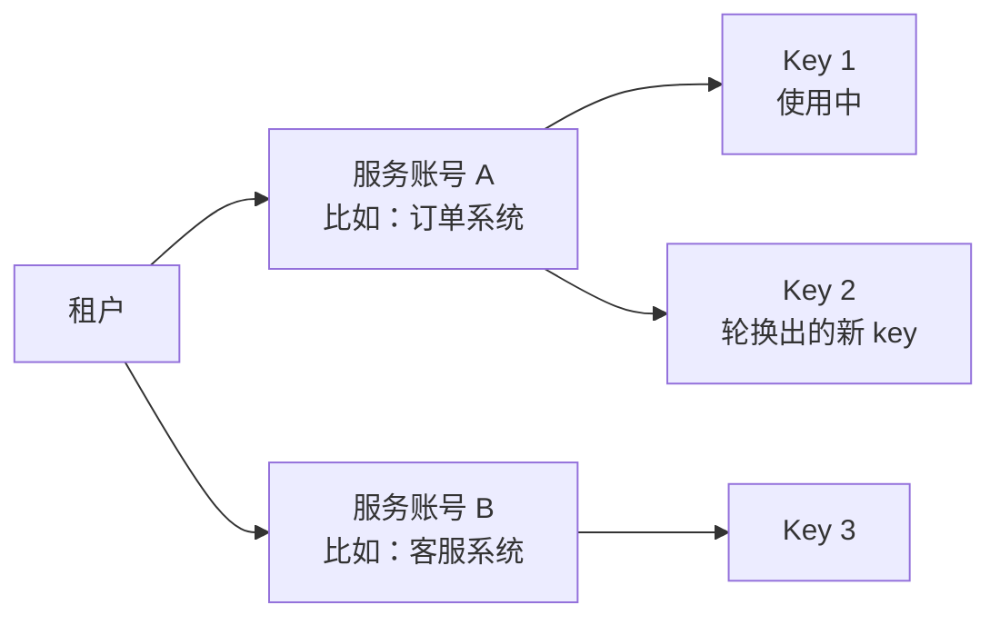
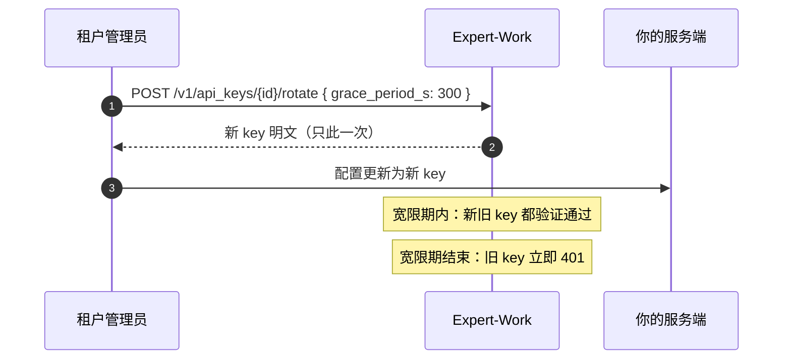

# 6 认证与 Key

所有对外接口都用 `Authorization: Bearer <key>` 认证。本篇讲清楚：key 从哪来、长什么样、三档权限怎么选、怎么轮换和吊销。

## 6.1 服务账号与 API Key

**服务账号**（service account）是租户下一个长期存在的程序身份，代表"哪个系统在调用"。**API Key** 是它的凭证。



服务账号本身不能直接发请求，必须靠 key。一个服务账号可以同时挂多把有效的 key（比如一把旧 key 和一把刚轮换出来的新 key），吊销其中一把不影响同一账号下的其它 key。

## 6.2 Key 的格式

``` [Key 的格式]
aforge_pat_<hex>_<random>
```

例如 `aforge_pat_a1b2c_XXXXXXXXXXXXXXXXXXXXXXXXXXXXXXXX`（示例，非真实值）——`<hex>` 是 5 位十六进制，取自租户 id 的前 5 个字符，方便在日志或审计面板里快速识别这把 key 属于哪个租户，但不会泄露完整租户 id；`<random>` 是 32 位随机字符串。

::: warning 明文只在创建（或轮换）时返回一次
服务端只存 key 的前 25 位字符（用于查找）加上完整明文的 argon2id 哈希，数据库里从来没有完整明文。

拿到明文后立刻存进你自己的密钥管理系统。之后只能靠 `POST /v1/api_keys/{id}/reveal` 重新查看，且仅对创建或轮换时已支持回显的 key 有效——更早创建的 key 拿不回明文，只能轮换出一把新的。
:::

## 6.3 三档权限怎么选

创建 key 时选 0 个或多个权限档位（`read` / `write` / `admin`）：

| 档位 | 能做什么 | 什么时候给 |
|---|---|---|
| `read` | 只读——查会话、查 run 状态、回放事件、拉配额信息 | 纯只读集成：只轮询状态、不发起新 run |
| `write` | 在 `read` 之上，可以创建会话、发起 run、取消、审批决策、重命名归档 | **给外部对接方的默认选择。** [发起对话](./chat)、[取消与审批](./run-control) 都要求它 |
| `admin` | 在 `write` 之上，多出租户内资源的删除权 | 内部用途。比对接方需要的宽，别发给第三方 |

**实操建议：给外部对接方的 key 只给 `write` 一档就够**，它已经包含了 `read` 的全部只读能力。纯只读的集成给 `read`。`admin` 只多出删除权，**管不了 key 本身**（那需要管理员登录凭证），没有理由发给对接方。

### API Key 到不了租户管理面

Key 只能访问第三方对接接口（`/v1/agents/{agent_code}/…` 与 `/v1/agent-catalog`）。租户管理面——**管理 key 本身、成员名册、审计流水、租户配置与配额、MCP 注册表、长期记忆**——一律拒绝 API Key，返回 403：

```json [响应 403]
{"detail": {"code": "FORBIDDEN",
            "message": "console API is not available to API keys; use /v1/agents/{agent_code}/…"}}
```

**这与权限档位无关**——`admin` 档的 key 一样被拒。档位只在对接接口内部区分能做什么。上面这些操作需要**租户管理员本人登录后的凭证**（在控制台里做，或拿管理员 JWT 调），不能用对接方的 key。

## 6.4 创建一把 Key

由租户管理员执行；`{admin_jwt}` 是租户管理员登录后取得的凭证，不能用 API Key 代替：

```bash [请求]
curl -X POST https://<your-domain>/v1/service_accounts/{service_account_id}/api_keys \
  -H "Authorization: Bearer {admin_jwt}" \
  -H "Content-Type: application/json" \
  -d '{"scopes": ["write"], "expires_at": null}'
```

```json [响应 200]
{
  "success": true,
  "data": {
    "api_key": {
      "id": "...",
      "prefix": "aforge_pat_a1b2c_...",
      "scopes": ["write"],
      "expires_at": null,
      "created_at": "..."
    },
    "plaintext": "aforge_pat_a1b2c_XXXXXXXXXXXXXXXXXXXXXXXXXXXXXXXX"
  },
  "error": null
}
```

`plaintext` 就是要放进 `Authorization: Bearer` 的那个值，只显示这一次。

## 6.5 过期时间

`expires_at` 可以不传或传 `null`，含义是**永不过期**。

除非有明确理由，否则建议显式设一个过期时间，到期前轮换。长期不过期的 key 一旦泄露，暴露窗口是无限的。

## 6.6 轮换与吊销

**轮换**是给同一个服务账号换一把新 key，同时给旧 key 留一段两者都有效的宽限期，让你不停机切换配置。



```bash [请求]
curl -X POST https://<your-domain>/v1/api_keys/{api_key_id}/rotate \
  -H "Authorization: Bearer {admin_jwt}" \
  -H "Content-Type: application/json" \
  -d '{"grace_period_s": 300}'
```

- `grace_period_s` 默认 300 秒（5 分钟），最大 3600 秒。
- 宽限期一过，旧 key 立刻失效（401）。
- 想立即作废、不留宽限期，直接调 `DELETE /v1/api_keys/{api_key_id}` 吊销，不走轮换。**怀疑 key 泄露时用这条，不要等宽限期。**

## 6.7 Key 失效时会发生什么

不合法、已吊销、已过期、或宽限期已过的旧 key，调用任何接口都返回 `401`。具体错误码和文案见 [8 错误码总表](./errors)。
