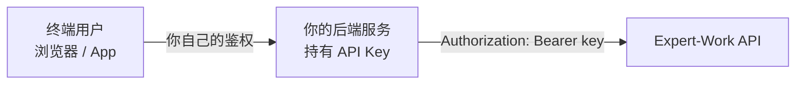

# 9 对接注意事项与 FAQ

几条容易踩坑的对接建议、常见问题，以及上线前的联调自测清单。

## 9.1 只在服务端调用，别把 key 放进前端

API Key 是持有者凭证：谁拿到它，谁就能以你的服务账号身份发起调用、创建终端用户、消耗你的配额。**永远不要把 key 打包进浏览器 JS、移动端 App，或任何终端用户能反编译、抓包拿到的地方。**

正确的架构是：

补充一句：Expert-Work 后端没有为浏览器跨域访问开放 CORS 白名单，这套 API 设计上就不是给浏览器直连的。就算开了 CORS 也解决不了 key 泄露给终端用户的问题——CORS 管的是浏览器放不放行跨域请求，不是密钥保密。

## 9.2 `user_id` 怎么取

`user_id` 是你自己业务里终端用户的标识，第一次出现时会自动创建一个对应的终端用户。长期记忆、工作区文件、按用户维度的用量计费都挂在它上面。

取值要满足三条：

| 要求 | 说明 |
|---|---|
| **稳定** | 同一个终端用户每次都传同一个值。别用会变的值（一次性 session token、每次登录都换的 id）——换了值等于新建了一个用户，之前的记忆和会话历史全接不上 |
| **每个终端用户唯一** | 不要多个真实用户共用一个 `user_id`（比如图省事全用 `"default"`），否则他们的记忆和工作区文件会串在一起 |
| 不必是 PII | 用你系统里本来就唯一且不变的标识即可——内部用户 id、稳定的第三方账号 id 都行，不需要是真实姓名或邮箱 |

## 9.3 Key 的保管与轮换

- 明文只在创建或轮换时返回一次——存进你自己的密钥管理系统（环境变量、secret manager），不要写进代码仓库、日志、错误上报。
- 给外部对接方的 key 只给 `write`（纯只读集成给 `read`），不要给 `admin`。见 [6.3 三档权限怎么选](./auth#_6-3-三档权限怎么选)。
- 设置 `expires_at`，别留永久 key。到期前轮换，宽限期内新旧 key 都能用，不用停机切换。
- **一旦怀疑 key 泄露，别等轮换的宽限期，直接吊销**再创建新的。

## 9.4 Stream 断线怎么处理

流式调用是一条长连接，中间可能因为网络抖动或代理超时断掉。完整的重连策略——怎么找回 `run_id`、怎么用事件回放接口续上、多久没收到数据就判定连接已死——见 [3.6 断线重连](./sse-events#_3-6-断线重连)。

## 9.5 常见问题

**`agent_code` 从哪拿？**

两个途径：调 [5.1 Agent 目录](./query#_5-1-agent-目录) 查（推荐，不用把名字写死在客户端），或者由租户管理员直接告诉你。

注意 `GET /v1/agents`（Agent 列表接口）是管理面接口，只对租户管理员登录后的凭证开放，API Key 调用一律 403——查目录要用 `/v1/agent-catalog` 那条。

**key 轮换期间，旧 key 还能用多久？**

由发起轮换时的 `grace_period_s` 决定，默认 300 秒，最长 3600 秒。宽限期内新旧 key 都验证通过，一过立刻 401。见 [6.6 轮换与吊销](./auth#_6-6-轮换与吊销)。

**`session_id` 从哪来？不传会怎样？**

不传就是开一段全新会话；传了但不属于这个 `user_id` / `agent_code` 组合，返回 404。

拿 `session_id` 的位置**按模式不同，别混用**：

| 场景 | 从哪读 |
|---|---|
| 发起对话，`mode: "stream"` | 响应头 `X-Expert-Work-Session-Id` |
| 发起对话，`mode: "queue"` | **没有响应头**，读 202 响应体的 `data.thread_id`（字段名叫 `thread_id`，与 `session_id` 是同一个值，下次续接时仍填进请求体的 `session_id`） |
| 会话绑定 `POST /v1/agents/{agent_code}/sessions` | 响应体 `data.session_id` |
| 文件上传 `POST /v1/agents/{agent_code}/uploads` | 响应体 `data.session_id` |

别假设所有端点用同一个字段名，或者都走响应头。

**run 失败了，`error` 字段能用来做错误分类吗？**

不能。它是一段诊断文本，不是结构化错误码，不要按文案做模式匹配。见 [5.4 run 列表](./query#_5-4-run-列表) 的说明。

## 9.6 联调自测清单

上线前照这份清单逐项跑一遍，而不是只测"发起对话能拿到回答"这一条：

- [ ] 拿到一把带 `write` 权限的 key —— [6 认证与 Key](./auth)
- [ ] 查 Agent 目录，确认要对接的 `agent_code` 在列表里且 `available: true` —— [5.1](./query#_5-1-agent-目录)
- [ ] 发起一次 `stream` 模式的对话，读到完整的 SSE 事件流 —— [2](./chat)、[3](./sse-events)
- [ ] 发起一次 `queue` 模式的对话，轮询到最终状态 —— [2.4](./chat#_2-4-stream-还是-queue)
- [ ] 上传一个文件（图片或文档），拿到 `upload_id` 后发起一次带附件的对话 —— [2.6](./chat#_2-6-带图片和文档)
- [ ] 用上一次响应给的 `session_id` 续接同一段会话 —— [2.5](./chat#_2-5-多轮会话)
- [ ] 模拟一次断线，用事件回放接口接回同一个 run —— [3.6](./sse-events#_3-6-断线重连)
- [ ] 取消一次正在执行的 run —— [4.1](./run-control#_4-1-取消-run)
- [ ] 对一个待审批的 run 下达决策（至少覆盖 `approve` 与 `reject`）—— [4.2](./run-control#_4-2-审批决策)
- [ ] 拉取会话列表与某段会话的历史消息 —— [5.2](./query#_5-2-会话列表)、[5.3](./query#_5-3-历史消息)
- [ ] 列出并下载工作区里的一个文件 —— [5.6](./query#_5-6-工作区文件)
- [ ] 列出、下载、删除一个 Agent 产物 —— [5.7](./query#_5-7-产物)
- [ ] 带 `Idempotency-Key` 重发同一个请求，确认没有跑成两次 —— [2.8](./chat#_2-8-防重复下发-idempotency-key)
- [ ] 用一个错误的 `user_id` / `session_id` 组合，确认拿到的是 404 而不是你自己代码里判错 —— [8 错误码总表](./errors)
