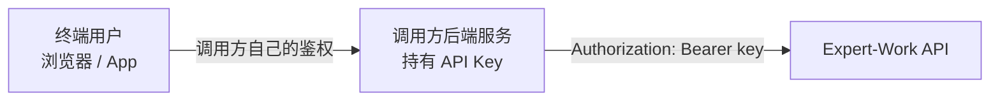

# 9 对接注意事项与常见问题

本章给出对接前需要确认的几条约定、常见问题的答复，以及上线前的联调自测清单。

## 9.1 只在服务端持有 API Key

API Key 是持有者凭证：拿到它的任何一方都能以调用方的服务账号身份发起调用、创建终端用户、消耗调用方的配额（配额的含义见 [7.6 限流与配额](./conventions#_7-6-限流与配额)）。**不要把 key 打包进浏览器 JS、移动端 App，或任何终端用户能反编译、抓包取得的地方。**

推荐的架构是由调用方后端持有 key，终端用户只与调用方自己的服务通信：

平台没有为浏览器跨域访问开放 CORS 白名单，这套 API 在设计上就不供浏览器直连。开放 CORS 也解决不了 key 泄露给终端用户的问题：CORS 决定的是浏览器放不放行跨域请求，不是密钥保密。

## 9.2 user_id 的取值要求

`user_id` 是终端用户在调用方业务里的标识，首次出现时会自动创建一个对应的终端用户。长期记忆、工作区文件（Agent 在这个终端用户名下读写的文件，见 [5.6 工作区文件](./query#_5-6-工作区文件)）、按用户维度统计的用量都归属于这个终端用户。

取值要满足三条：

| 要求 | 说明 |
|---|---|
| 稳定 | 同一个终端用户每次都传同一个值。不要用会变化的值，例如一次性 session token、每次登录都更换的 id；换了值等于新建了一个终端用户，之前的记忆和会话历史都接不上 |
| 每个终端用户唯一 | 不要让多个真实用户共用一个 `user_id`，例如全部填 `"default"`；共用会让他们的记忆和工作区文件混在一起 |
| 不必是 PII | 用调用方系统里本来就唯一且不变的标识即可，例如内部用户 id、稳定的第三方账号 id，不需要是真实姓名或邮箱 |

## 9.3 Key 的保管与轮换

- 把 key 的明文存进调用方自己的密钥管理系统（环境变量、secret manager），不要写进代码仓库、日志、错误上报。明文只在创建或轮换时返回一次。
- 给外部对接方的 key 只给 `write` 一档，纯只读集成给 `read`，不要给 `admin`。权限档位越低，key 泄露时的影响面越小，三档的差别见 [6.3 权限档位](./auth#_6-3-权限档位)。
- 创建 key 时设置 `expires_at`，不要留永久 key，并在到期前轮换。宽限期内新旧 key 都能通过验证，因此轮换不需要停机切换。
- 怀疑 key 泄露时直接吊销，再创建新的。吊销不留宽限期，轮换则会留出一段新旧 key 都有效的时间。

## 9.4 流式连接断开后的处理

流式调用是一条长连接，中间可能因为网络抖动或代理超时断开。**「多久没收到任何数据算连接已断」由客户端自行设定**，服务端没有规定这个时长。

建议把读超时设为 45 秒：服务端每空闲 15 秒发一行心跳，45 秒相当于连续三个心跳周期没有任何数据。这个建议值以及完整的重连步骤，包括如何找回 `run_id`、如何用事件接口续上，见 [3.6 断线重连](./sse-events#_3-6-断线重连与续传)。

重连时要带上与首次发起时相同的 `stream_format`：漏传会退回默认形态，客户端的列表里会出现一段形状不同的内容。

用条目模式（`stream_format=items`）时，重连还多一条要求。续传不重发逐字预览，服务端只把每条内容的最终状态以 `item.done` 发一次，其中包含断线之前已经收到过的那些。

::: warning 条目模式下 item.done 必须按插入或更新处理
收到一个 `id` 已经在列表里的 `item.done` 是正常情况，按 `id` 整条替换即可。把它当成新内容追加，界面上会出现重复的气泡。

同样不能假设每条内容都先有 `item.added`：续传路径上一条内容只会有一个 `item.done`。按「先 `added` 再 `done`」严格配对实现的客户端，会在续传时丢掉全部内容。详见 [3.7 条目模式](./sse-events#_3-7-条目模式)。
:::

## 9.5 常见问题

### agent_code 的取得方式

有两个途径：调用 [5.1 Agent 目录](./query#_5-1-agent-目录) 查询，或由租户管理员直接告知。推荐前者，客户端不必把 Agent 名字写死。

`GET /v1/agents`（Agent 列表接口）是管理面接口，只对租户管理员登录后的凭证开放，用 API Key 调用统一返回 403。查目录要用 `/v1/agent-catalog` 这一条。

### 轮换期间旧 key 的有效时长

由发起轮换时的 `grace_period_s` 决定，默认 300 秒，最长 3600 秒。宽限期内新旧 key 都验证通过，宽限期一过，旧 key 立刻返回 401。见 [6.6 轮换与吊销](./auth#_6-6-轮换与吊销)。

### session_id 的来源与省略后的行为

不传 `session_id` 就是开一段全新会话；传了但它不属于这个 `user_id` 与 `agent_code` 的组合，返回 404。

`session_id` 的读取位置按接口不同，不要假设所有端点都用同一个字段名或都走响应头：

| 取得方式 | 读取位置 |
|---|---|
| 发起对话，`mode: "stream"` | 响应头 `X-Expert-Work-Session-Id` |
| 发起对话，`mode: "queue"` | 没有响应头，读 202 响应体的 `data.thread_id`。字段名叫 `thread_id`，与 `session_id` 是同一个值，下次续接时仍填进请求体的 `session_id` |
| [预先创建会话](./chat#预先创建会话) `POST /v1/agents/{agent_code}/sessions` | 响应体 `data.session_id` |
| 上传附件 `POST /v1/agents/{agent_code}/uploads` | 响应体 `data.session_id` |

### run 列表里的 error 字段不能用于错误分类

这个字段是一段诊断文本，不是结构化错误码，不要按它的文案做模式匹配。字段的完整说明见 [5.4 run 列表](./query#_5-4-run-列表)。

## 9.6 联调自测清单

上线前照这份清单逐项跑一遍，覆盖的不只是「发起对话能拿到回答」这一条：

- [ ] 取得一把带 `write` 权限的 key —— [6 认证与 Key](./auth)
- [ ] 查 Agent 目录，确认要对接的 `agent_code` 在列表里且 `available: true` —— [5.1](./query#_5-1-agent-目录)
- [ ] 发起一次 `stream` 模式的对话，读到完整的 SSE 事件流 —— [2](./chat)、[3](./sse-events)
- [ ] 发起一次 `queue` 模式的对话，轮询到最终状态 —— [2.4](./chat#_2-4-stream-还是-queue)
- [ ] 上传一个文件（图片或文档），取得 `upload_id` 后发起一次带附件的对话 —— [2.6](./chat#_2-6-带图片和文档)
- [ ] 用上一次响应给出的 `session_id` 续接同一段会话 —— [2.5](./chat#_2-5-多轮会话)
- [ ] 模拟一次断线，用事件接口接回同一个 run —— [3.6](./sse-events#_3-6-断线重连与续传)
- [ ] 界面可能中途切走的客户端：确认走的是 `queue` 加事件接口，而不是 `stream`——断开 `stream` 那条连接会取消 run —— [3.6](./sse-events#_3-6-断线重连与续传)
- [ ] 渲染对话界面的客户端：发起一次 `stream_format: "items"` 的对话，确认三个条目事件都能处理 —— [3.7](./sse-events#_3-7-条目模式)
- [ ] 渲染对话界面的客户端：对同一个 run 断线重连一次，确认重复到达的 `item.done` 按更新处理、界面上没有出现重复气泡 —— [9.4](#_9-4-流式连接断开后的处理)
- [ ] 取消一次正在执行的 run —— [4.1](./run-control#_4-1-取消-run)
- [ ] 对一个待审批的 run 下达决策，至少覆盖 `approve` 与 `reject` —— [4.2](./run-control#_4-2-审批决策)
- [ ] 拉取会话列表，再取回其中一段会话的对话条目并翻一次页 —— [5.2](./query#_5-2-会话列表)、[5.8](./query#_5-8-对话条目)
- [ ] 只做纯文本记录、搜索或导出时，改为拉取历史消息 —— [5.3](./query#_5-3-历史消息)
- [ ] 列出并下载工作区里的一个文件 —— [5.6](./query#_5-6-工作区文件)
- [ ] 列出、下载、删除一个 Agent 产物 —— [5.7](./query#_5-7-产物)
- [ ] 带 `Idempotency-Key` 重发同一个请求，确认没有执行成两次 run —— [2.8](./chat#_2-8-防重复下发-idempotency-key)
- [ ] 用一个错误的 `user_id` 与 `session_id` 组合，确认得到的是 404，而不是客户端自己判错 —— [8 错误码总表](./errors)
