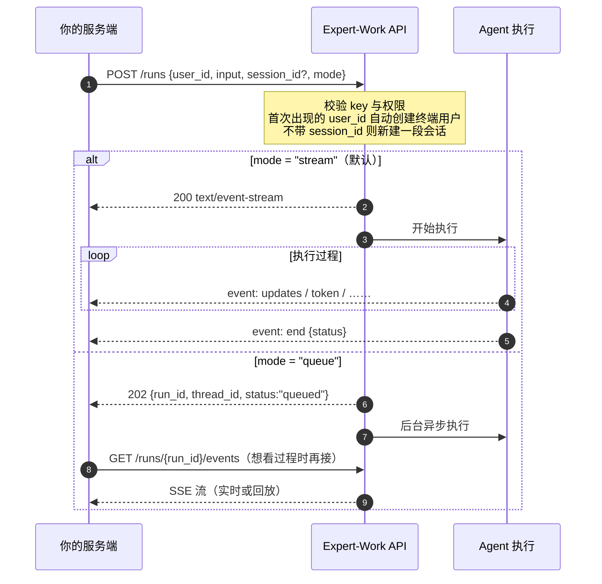
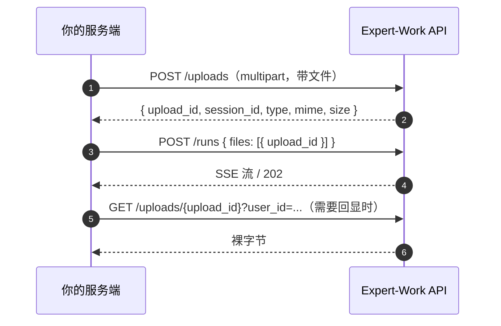

# 2 跟 Agent 对话

发起一次对话是整套 API 的核心动作，只有一个端点：`POST /v1/agents/{agent_code}/runs`。

本篇讲清楚：这个端点怎么调、每个参数什么含义、两种执行模式怎么选、怎么带附件、怎么避免网络重试导致重复执行。

## 2.1 一次对话是怎么走的

一次调用会依次完成四件事：确认终端用户身份 → 绑定或续接一段会话 → 执行一次 Agent → 返回结果。这一次执行在文档里称作一个 **run**。



执行结束时 run 会落到一个最终状态：`success` / `error` / `timeout` / `interrupted` / `paused`。其中 `paused` 表示停在人工审批节点等待决策，需要你调审批接口推进，见 [4 对话过程中的控制](./run-control)。

## 2.2 发起对话

```
POST /v1/agents/{agent_code}/runs
Authorization: Bearer <key>   # 需要 write 权限，见「认证与 Key」
Content-Type: application/json
```

`{agent_code}` 是你租户里已发布、状态为 ACTIVE 的 Agent 名字。同一个名字只有一个 ACTIVE 版本会被使用；这个名字下没有 ACTIVE 版本时返回 404（`AGENT_NOT_FOUND`）。

不确定有哪些 `agent_code` 可用，先查 [5.1 Agent 目录](./query#_5-1-agent-目录)。

最小请求：

```bash [请求]
curl -N -X POST https://<your-domain>/v1/agents/{agent_code}/runs \
  -H "Authorization: Bearer <key>" \
  -H "Content-Type: application/json" \
  -d '{"user_id": "u-123", "input": "你好"}'
```

## 2.3 请求参数详解

| 字段 | 类型 | 必填 | 说明 |
|---|---|---|---|
| `user_id` | string，1–255 字符 | 是 | 你自己系统里终端用户的标识。见下方「`user_id` 的作用」。 |
| `session_id` | UUID | 否 | 续接一段已有会话。省略则新建一段。传了但这段会话不属于这个 `user_id` / `agent_code`，返回 404（`SESSION_NOT_FOUND`）。 |
| `input` | string，≤65536 字符 | 否 | 这一轮用户说的话或任务描述。 |
| `mode` | `"stream"` \| `"queue"` | 否 | 默认 `"stream"`。见 [2.4](#_2-4-stream-还是-queue)。 |
| `untrusted_content` | string[]，最多 16 项 | 否 | 来自外部、不可信任的文本内容。见 [2.7](#_2-7-外部内容与模板变量)。 |
| `inputs` | object | 否 | 提示词模板变量。见 [2.7](#_2-7-外部内容与模板变量)。 |
| `files` | 数组，最多 64 项 | 否 | 附件。每项 `{ "upload_id": "…" }`，值来自上传接口。见 [2.6](#_2-6-带图片和文档)。 |

### `user_id` 的作用

第一次出现的 `user_id` 会自动创建一个对应的终端用户。这个终端用户是长期记忆、工作区文件、按用户维度的用量计费的归属对象——它们挂在终端用户身上，不是挂在你的 API Key（服务账号）上。

同一个 `user_id` 后续调用复用同一个终端用户，不会重复创建。取值要求见 [9.2 `user_id` 怎么取](./best-practices#_9-2-user-id-怎么取)。

## 2.4 stream 还是 queue

| | `mode: "stream"`（默认） | `mode: "queue"` |
|---|---|---|
| 响应 | `200`，`Content-Type: text/event-stream`，响应体就是 SSE 流 | `202`，立即返回 JSON，由后台异步执行 |
| 响应头 | 带 `X-Expert-Work-Session-Id` 和 `X-Expert-Work-Run-Id` | **不带**这两个头 |
| 怎么拿 session_id | 响应头 `X-Expert-Work-Session-Id` | 响应体的 `data.thread_id` 字段 |
| 适合 | 需要实时展示生成过程 | 长任务、不需要盯着看、或者你的架构不方便维持长连接 |

`queue` 模式的响应：

```json [响应 202]
{
  "success": true,
  "data": {
    "run_id": "...",
    "thread_id": "...",
    "status": "queued"
  },
  "error": null
}
```

`queue` 模式下想看执行过程或拿最终结果，有两条路：

**接事件流**：`GET /v1/agents/{agent_code}/runs/{run_id}/events?user_id=<同一个 user_id>`。run 还在跑就实时接进去，跑完了就把存下来的事件按顺序回放一遍，结尾补一条带最终状态的 `end`。

- `user_id` 是必填查询参数，且必须是发起这次 run 的那个。对不上一律 404（`RUN_NOT_FOUND`），响应不会透露这个 run 是否存在。
- 需要 `read` 权限（`write` key 含读，可直接用）。
- run 没结束时这是一条长连接，会一直挂到 run 走到最终状态才返回，服务端不设上限。**客户端必须自己设读超时**，超时后重连，重连时带上 `since_seq=<已见过的最大 seq>`，服务端只发这个序号之后的事件。不带 `since_seq` 不会报错，但会从 `seq` 为 `0` 的那个事件起把整个 run 重发一遍。
- 事件多到一页装不下时，这一页以 `truncated` 事件收尾而**不发** `end`，要带它给的 `next_seq` 再拉一次。细节见 [3 读懂 SSE 流](./sse-events)。

**只看状态**：调 [5.4 run 列表](./query#_5-4-run-列表) 看这次 run 的 `status`；或调 [5.2 会话列表](./query#_5-2-会话列表) 看每段会话的 `running` 字段，粗粒度判断"还有没有在跑的任务"。

## 2.5 多轮会话

不传 `session_id` 就是新开一段会话；把上次拿到的 session id 传回去就是同一段会话的下一轮。同一个 `user_id` 下可以并存多段互不相干的会话。

拿 session id 的位置**按模式不同**：


`queue` 模式响应体里那个字段叫 `thread_id` 而不是 `session_id`，两个名字指的是同一个值——下次请求时仍然填进请求体的 `session_id` 字段。

会话的重命名、归档、历史消息查询见 [5 查询与管理](./query)。

## 2.6 带图片和文档

附件三步：上传拿 `upload_id` → 放进 `files[]` 发起对话 →（需要回显时）用同一个 `upload_id` 下载。



`files[]` 每一项的字段：

| 字段 | 类型 | 说明 |
|---|---|---|
| `upload_id` | string | 上传接口返回的 `data.upload_id`，**原样回传**。 |

### 第一步：上传

```
POST /v1/agents/{agent_code}/uploads
Authorization: Bearer <key>   # 需要 write 权限
Content-Type: multipart/form-data
```

#### 上传文档

```bash [请求]
curl -X POST https://<your-domain>/v1/agents/{agent_code}/uploads \
  -H "Authorization: Bearer <key>" \
  -F "user_id=u-123" \
  -F "file=@report.pdf;type=application/pdf"
```

```json [响应 201]
{
  "success": true,
  "data": {
    "upload_id": "upl_3f2c9a1e-7b44-4d3e-9c1a-2f6d0e8b5a17",
    "session_id": "9f2c1a44-6d3b-4f18-9a70-2b5c8e1d0c37",
    "type": "document",
    "mime": "application/pdf",
    "size": 235112
  },
  "error": null
}
```

同名文档会覆盖同一份工作区文件：同一个用户重复上传同一个文件名后，两个 `upload_id` 下载到的都是最后一次上传的内容。

#### 上传图片

```bash [请求]
curl -X POST https://<your-domain>/v1/agents/{agent_code}/uploads \
  -H "Authorization: Bearer <key>" \
  -F "user_id=u-123" \
  -F "file=@photo.png;type=image/png"
```

```json [响应 201]
{
  "success": true,
  "data": {
    "upload_id": "upl_9b7d2c40-1e5a-4f88-b3c6-7a0d4e2f9c11",
    "session_id": "9f2c1a44-6d3b-4f18-9a70-2b5c8e1d0c37",
    "type": "image",
    "mime": "image/png",
    "size": 88213
  },
  "error": null
}
```

`session_id` 不传时接口顺手给你新建一段会话并在响应里带回来；已经有一段在跑的会话时，把它传进 `session_id` 表单字段，附件就落在同一段会话下。

### 第二步：带进对话

```bash [请求]
curl -X POST https://<your-domain>/v1/agents/{agent_code}/runs \
  -H "Authorization: Bearer <key>" \
  -H "Content-Type: application/json" \
  -d '{
    "user_id": "u-123",
    "session_id": "9f2c1a44-6d3b-4f18-9a70-2b5c8e1d0c37",
    "input": "帮我看看这份文件和这张图",
    "mode": "queue",
    "files": [
      { "upload_id": "upl_3f2c9a1e-7b44-4d3e-9c1a-2f6d0e8b5a17" },
      { "upload_id": "upl_9b7d2c40-1e5a-4f88-b3c6-7a0d4e2f9c11" }
    ]
  }'
```

`session_id` 用的是上一步上传响应里返回的那个值——原因见下方「容易踩的地方」第二条。

### 第三步：下载 / 回显

需要把附件内容拿回来（比如在你自己的界面上预览用户刚上传的图片）时，原样拿 `upload_id` 去调下载接口：

```bash [请求]
# 需要 read 权限（write key 含读）
curl -X GET "https://<your-domain>/v1/agents/{agent_code}/uploads/upl_3f2c9a1e-7b44-4d3e-9c1a-2f6d0e8b5a17?user_id=u-123" \
  -H "Authorization: Bearer <key>" \
  -o report.pdf
```

``` [响应头]
Content-Type: application/pdf
Content-Disposition: attachment; filename="report.pdf"; filename*=UTF-8''report.pdf
X-Content-Type-Options: nosniff
```

成功响应是**裸文件字节**，不套 `{success, data, error}` 信封。`Content-Type` 是上传时记录的 MIME；`Content-Disposition` 按扩展名分类：图片 / 纯文本 / CSV 这类走 `inline`，PDF / DOCX / XLSX / PPTX 以及一切可执行内容（HTML、SVG 等）一律 `attachment`（附件上传只收 PDF / DOCX / XLSX / PPTX / TXT / MD / CSV 这几种，JSON 走不到这条 `inline` 分支）。这条接口不计配额、不写审计。

`Content-Disposition` 的 `filename` 两种附件取值方式不同：文档保留净化后的原始文件名（如上例的 `report.pdf`）；图片用的是服务端生成的图片 id 加扩展名（形如 `{image_id}.png`），不是上传时用的原始文件名——拿它当展示名会文不对题。

图片可以直接喂给 `` 显示——但这个地址需要带 `Authorization` 头才能访问，浏览器没法直接当图片 URL 用，通常做法是由你的服务端转发一层，再把字节交给前端。

### 三个容易踩的地方

**一、`upload_id` 原样回传，不要解析或改写。** 拿到的值是一个不透明字符串（形如 `upl_3f2c9a1e-7b44-4d3e-9c1a-2f6d0e8b5a17`），内部形状可能变化，只需要原样存下来、原样传给 `files[]` 或下载接口。改写或截断它会被拒绝：

```json [响应 422]
{
  "success": false,
  "data": null,
  "error": {
    "code": "INVALID_UPLOAD_ID",
    "message": "upload_id must be the value returned by POST /v1/agents/{agent_code}/uploads"
  }
}
```

**二、图片必须与发起对话的会话是同一段。** 上传接口返回的 `session_id` 要原样传回发起 run 请求体的 `session_id`；传去了另一段会话，这张图片就会因为「不属于这次会话」而 404：

```json [响应 404]
{
  "success": false,
  "data": null,
  "error": { "code": "UPLOAD_NOT_FOUND", "message": "upload not found" }
}
```

**三、未知的、别人的、已删除的 `upload_id`，一律是同一个 404，不区分原因。** 这是刻意的存在性隐藏，和 `SESSION_NOT_FOUND` / `RUN_NOT_FOUND` 同一模式——完整规则见 [8 错误码总表](./errors)。

`files` 最多 64 项只是请求体字段层面的合计上限（图片和文档一起算）；图片还有一道更严的单次 run 处理上限（默认 8 张），撞上是没有 `error.code` 的裸 `detail` 422，完整规则见 [8.10 422 —— 请求参数不合法](./errors#_8-10-422-——-请求参数不合法)。

## 2.7 外部内容与模板变量

### `untrusted_content` —— 来自外部的文本

把外部来源的文本（一封邮件正文、一段工单描述）放进这个字段，而不是拼进 `input`。Agent 会把这部分当作**数据**而不是指令处理，避免外部内容里夹带的指令被当成用户意图执行。

条数和单块长度是两条互相独立的限制：

| 限制 | 超限时的 `error.code` |
|---|---|
| 最多 16 项（**正好 16 项合法**，第 17 项才拒） | `INVALID_REQUEST`（走请求体字段校验） |
| 单块最多 8192 字符（**正好 8192 字符合法**，第 8193 个字符才拒） | `UNTRUSTED_CONTENT_BLOCK_TOO_LONG` |

```json [响应 422]
{ "success": false, "data": null, "error": { "code": "UNTRUSTED_CONTENT_BLOCK_TOO_LONG", "message": "untrusted_content[0] 超过 8192 字符" } }
```

一段文本超过 8192 字符时，在客户端切成多块放进数组的多个元素（仍要留在 16 项以内），不要拼成一个超长字符串塞进单个元素。

### `inputs` —— 提示词模板变量

只对"系统提示词开启了 Jinja 模板、并声明了变量"的 Agent 有意义（在管理控制台配置）。

```bash [请求]
curl -X POST https://<your-domain>/v1/agents/{agent_code}/runs \
  -H "Authorization: Bearer <key>" \
  -H "Content-Type: application/json" \
  -d '{
    "user_id": "u-123",
    "input": "你好",
    "mode": "queue",
    "inputs": { "lang": "zh" }
  }'
```

三种情况会 422，且响应形状**不是** `{success, data, error}`，而是只有一个 `detail` 字段的简易格式（比如 `{"detail": "unknown input variable: <key>"}`）：

- Agent 没声明任何模板变量，却传了非空 `inputs`。
- `inputs` 里出现了 Agent 没声明过的键。
- Agent 声明的某个 `required` 变量，`inputs` 里没给。

另外还有三条容量限制，**这三条能读到 `error.code`**，互相独立：

| 限制 | 超限时的 `error.code` |
|---|---|
| 键最多 64 个（**正好 64 个合法**，第 65 个才拒） | `TOO_MANY_INPUT_KEYS` |
| 单个字符串值最多 8192 字符（**正好 8192 合法**，第 8193 个字符才拒）；只检查字符串值，数字 / 数组 / 对象类型的值不受此限 | `INPUT_VALUE_TOO_LONG` |
| 整体序列化后最多 65536 字节（**正好 65536 合法**，第 65537 字节才拒）；按 UTF-8 **字节数**算，不是字符数——一个中文字约占 3 字节，同样字符数的中文比英文更容易超；数字 / 数组 / 对象类型的值也计入 | `TOO_MANY_INPUT_BYTES` |

```json [响应 422]
{ "success": false, "data": null, "error": { "code": "TOO_MANY_INPUT_KEYS", "message": "inputs 最多 64 个键" } }
```

## 2.8 防重复下发 Idempotency-Key

同一次业务操作（比如"用户点了一次下单按钮"）在网络重试时，不应该在服务端跑成两次 run。带上这个请求头即可，`stream` / `queue` 两种模式都支持：

```
Idempotency-Key: order-8899
```

判定规则：**key + 请求体 + `agent_code` 三者的组合**。

| 情况 | 结果 |
|---|---|
| 同一个 key + 同一个请求体 + 同一个 `agent_code` | 不新建 run，直接返回原来那次的结果 |
| 同一个 key，但请求体变了 | 422，`IDEMPOTENCY_KEY_REUSED` |
| 同一个 key，请求体一样但打给了另一个 `agent_code` | 422，`IDEMPOTENCY_KEY_REUSED`。**key 要按 agent 维度保证唯一**，只在租户维度唯一不够 |
| key 本身不合法（去掉首尾空白后为空，或超过 255 字符） | 422，`INVALID_IDEMPOTENCY_KEY` |

```json [响应 422]
{ "success": false, "data": null, "error": { "code": "IDEMPOTENCY_KEY_REUSED", "message": "this Idempotency-Key was already used with a different request" } }
```

这份"key → run"的绑定关系**永久保留，没有过期时间**，不会因为时间久了就允许同一个 key 再绑定另一个请求体。

### 重试时拿到什么

**`queue` 模式**：和首次请求完全同形状的 202 响应体，`data.run_id` 与首次一致。

```bash [请求]
curl -X POST https://<your-domain>/v1/agents/{agent_code}/runs \
  -H "Authorization: Bearer <key>" \
  -H "Content-Type: application/json" \
  -H "Idempotency-Key: order-8899" \
  -d '{"user_id": "u-123", "input": "帮我下单", "mode": "queue"}'
```

**`stream` 模式**：`200`，一条 SSE 流，重新接上**原来那次 run** 的事件（不是报错，也不会静默忽略这个请求头）。`X-Expert-Work-Run-Id` 与首次一致，并且多一个首次请求没有的响应头：

| `X-Expert-Work-Stream-Mode` | 含义 |
|---|---|
| `live` | 原 run 还没跑完，实时接上 |
| `replay` | 原 run 已经跑完，把存下来的事件按顺序回放一遍再收尾 |

这一段的行为和断线重连用的 `GET .../runs/{run_id}/events` 是同一份实现，包括事件太多时以 `truncated` 收尾的分页行为。

::: warning 重放以 `truncated` 收尾时，不能靠重发 POST 翻页
`POST .../runs` 的请求体和查询参数里都没有 `since_seq`，原样重发只会永远拿回同一个第一页。

翻页要换成 `GET /v1/agents/{agent_code}/runs/{run_id}/events?user_id=…&since_seq=<next_seq>`，其中 `run_id` 从 `X-Expert-Work-Run-Id` 响应头取。见 [3 读懂 SSE 流](./sse-events)。
:::
