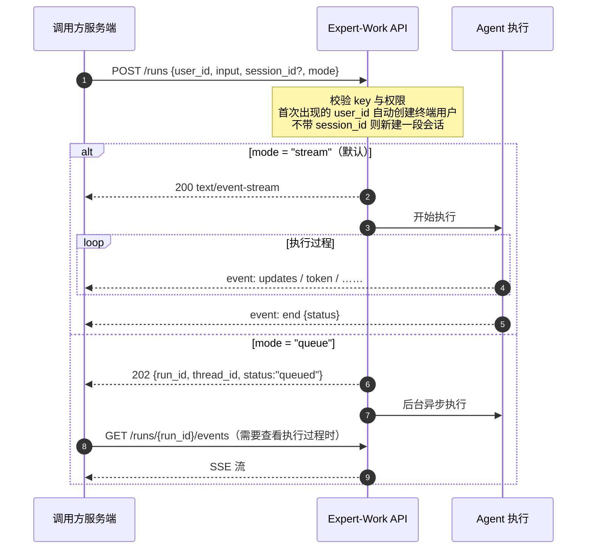
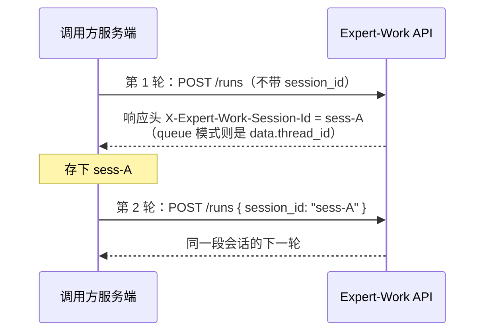
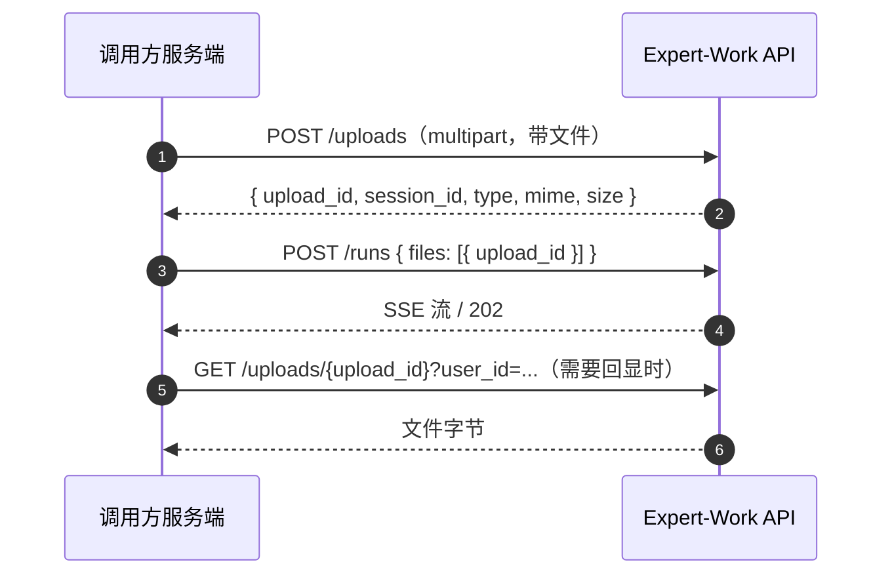

# 2 跟 Agent 对话

发起一次对话是整套 API 的核心动作，只有一个端点：`POST /v1/agents/{agent_code}/runs`。

本章说明这个端点的调用方式、每个参数的含义、两种执行模式的差别、附件的携带方式，以及如何避免网络重试导致同一次操作被执行两次。

## 2.1 一次对话的执行过程

一次调用依次完成四件事：确认终端用户身份、绑定或续接一段会话、执行一次 Agent、返回结果。这一次执行在文档里称作一个 run。



run 结束时会处于一个最终状态：`success`、`error`、`interrupted` 或 `paused`（枚举中另有一个保留值 `timeout`，当前不会出现）。其中 `paused` 表示 run 停在人工审批处等待决策，需要调用方调用审批接口推进，见 [4 对话过程中的控制](./run-control)。run 全部八个状态值的含义见 [5.4 run 列表](./query#_5-4-run-列表)。

## 2.2 发起对话

``` [端点]
POST /v1/agents/{agent_code}/runs
Authorization: Bearer <key>   # 需要 write 权限，见「6 认证与 Key」
Content-Type: application/json
```

`{agent_code}` 是租户下已发布且当前生效的 Agent 名称。同一个名称同时只有一个版本生效；该名称下没有生效版本时返回 404（`AGENT_NOT_FOUND`）。

可用的 `agent_code` 通过 [5.1 Agent 目录](./query#_5-1-agent-目录) 查询。示例里的 `https://<your-domain>` 按对接的环境替换，接口地址见 [7.1 环境地址](./conventions#_7-1-环境地址)。

```bash [请求]
curl -N -X POST https://<your-domain>/v1/agents/{agent_code}/runs \
  -H "Authorization: Bearer <key>" \
  -H "Content-Type: application/json" \
  -d '{"user_id": "u-123", "input": "你好"}'
```

## 2.3 请求参数详解

请求体只有 `user_id` 必填，其余字段均可省略（不带 `input` 也是合法请求）。请求体不接受下表以外的字段。

| 参数 | 必填 | 说明 |
|---|---|---|
| `user_id` | 是 | string，长度 1–255 字符。终端用户在调用方系统里的标识，作用见下文「`user_id` 的作用」 |
| `session_id` | 否 | UUID。续接一段已有会话；省略时新建一段。这段会话不属于该 `user_id` 与 `agent_code` 时返回 404（`SESSION_NOT_FOUND`） |
| `input` | 否 | string，不超过 65536 字符。这一轮终端用户说的话或任务描述 |
| `mode` | 否 | string。执行模式，取值：`stream`（默认，同步返回 SSE 流）/ `queue`（后台异步执行）。见 [2.4](#_2-4-stream-还是-queue) |
| `stream_format` | 否 | string。事件流的形态，取值：`legacy`（默认，按执行步骤推送）/ `items`（按对话条目推送，客户端只需要一个列表）。见 [3.7 条目模式](./sse-events#_3-7-条目模式)。`mode` 为 `queue` 时不产生事件流，这个字段随后由续传接口的同名参数决定 |
| `untrusted_content` | 否 | string 数组，最多 16 项。来自外部、不可信任的文本内容。见 [2.7](#_2-7-外部内容与模板变量) |
| `inputs` | 否 | object。提示词模板变量。见 [2.7](#_2-7-外部内容与模板变量) |
| `files` | 否 | 数组，最多 64 项，每项形如 `{ "upload_id": "…" }`。附件列表。见 [2.6](#_2-6-带图片和文档) |

### `user_id` 的作用

首次出现的 `user_id` 会自动创建一个对应的终端用户。长期记忆、工作区文件（Agent 在这个终端用户名下读写的文件，见 [5.6 工作区文件](./query#_5-6-工作区文件)）、按用户维度统计的用量都归属于这个终端用户，不归属于 API Key 所属的服务账号。

同一个 `user_id` 在后续调用中复用同一个终端用户，不会重复创建。取值要求见 [9.2 user_id 的取值要求](./best-practices#_9-2-user-id-的取值要求)。

### 发起对话的常见错误

| 状态码 | 错误码 | 触发条件 |
|---|---|---|
| 403 | `AGENT_DISABLED` | 这个 Agent 已被管理员下线 |
| 404 | `AGENT_NOT_FOUND` | `{agent_code}` 在该租户下没有已发布版本 |
| 422 | `INVALID_REQUEST` | 请求体未通过基础校验：缺少 `user_id`、`user_id` 超过 255 字符、带了未声明的字段、`input` 超过 65536 字符 |

发起对话的完整失败清单见 [8 错误码总表](./errors)。

## 2.4 stream 还是 queue

`mode` 省略时按 `stream` 处理。

| 对比维度 | `mode: "stream"` | `mode: "queue"` |
|---|---|---|
| 响应 | `200`，`Content-Type: text/event-stream`，响应体是 SSE 流 | `202`，立即返回 JSON，Agent 在后台执行 |
| 响应头 | 带 `X-Expert-Work-Session-Id` 与 `X-Expert-Work-Run-Id` | 不带这两个头；每种响应都有的 `X-Expert-Work-Trace-Id`（见 [7.4 响应头](./conventions#_7-4-响应头)）仍然存在 |
| 会话 id 的位置 | 响应头 `X-Expert-Work-Session-Id` | 响应体的 `data.thread_id` 字段 |
| 断开连接的后果 | 无影响，run 继续跑；带 `since_seq` 重连即可接回，见 [3.6 断线重连](./sse-events#_3-6-断线重连与续传) | 无影响，本来就没有连接 |
| 适用情形 | 想在发起那一刻就拿到流，少一次往返 | 执行时间长、调用方不便维持长连接，或者由后台任务去读结果 |

```json [响应 202]
{
  "success": true,
  "data": {
    "run_id": "...",
    "thread_id": "...",
    "status": "queued"
  },
  "error": null
}
```

`queue` 模式下查看执行过程或取得最终结果有两种方式。

### 接入事件流

``` [端点]
GET /v1/agents/{agent_code}/runs/{run_id}/events?user_id={user_id}
```

run 仍在执行时，这条连接实时推送后续事件；run 已经结束时，服务端把记录下来的事件按顺序重新发送一遍，并在结尾补一条带最终状态的 `end` 事件。

- `{user_id}` 是必填查询参数，取值为发起这次 run 时使用的那个值。与这次 run 不匹配时统一返回 404（`RUN_NOT_FOUND`），响应不区分这个 run 是否存在。
- 需要 `read` 权限；`write` 权限包含读，可以直接使用。
- run 未结束时这是一条长连接，会保持到 run 进入最终状态才返回，服务端不设时长上限。
- **客户端需要自行设置读超时**，超时后重连。
- 重连时带上 `since_seq={max_seq}`，`{max_seq}` 是客户端已收到的最大 `seq`。`seq` 是事件的序号，取自事件 `id:` 行连字符后面的那一段。服务端只发送这个序号之后的事件，这一过程称为续传，完整步骤见 [3.6 断线重连](./sse-events#_3-6-断线重连与续传)。
- 不带 `since_seq` 不会报错，但服务端会从 `seq` 为 `0` 的那个事件起把整个 run 重新发送一遍。
- 一次响应装不下全部事件时，这一页以 `truncated` 事件结束，不发 `end`；翻页要带上 `truncated` 给出的 `next_seq` 再请求一次。事件的完整说明见 [3 读懂 SSE 流](./sse-events)。

### 只查询状态

不需要事件流时，调用 [5.4 run 列表](./query#_5-4-run-列表) 查看这次 run 的 `status`；或调用 [5.2 会话列表](./query#_5-2-会话列表) 读取每段会话的 `running` 字段，粗粒度判断这段会话里是否还有 run 在执行。

## 2.5 多轮会话

不传 `session_id` 表示新开一段会话；把上一次得到的会话 id 传回去表示同一段会话的下一轮。同一个 `user_id` 下可以并存多段互不相干的会话。

会话 id 的读取位置按模式不同：



`queue` 模式响应体里的字段名是 `thread_id` 而不是 `session_id`，两个名字指的是同一个值；下一次请求仍然把它填进请求体的 `session_id` 字段。

会话的重命名、归档与历史消息查询见 [5 查询与管理](./query)。

### 预先创建会话

需要在发起第一次对话之前就得到一个 `session_id` 时，调用下面这个端点。最常见的用途是先把附件绑定到这段会话，再发起携带这些附件的 run。

``` [端点]
POST /v1/agents/{agent_code}/sessions
Authorization: Bearer <key>   # 需要 write 权限
Content-Type: application/json
```

请求体只有 `user_id` 必填。

| 参数 | 必填 | 说明 |
|---|---|---|
| `user_id` | 是 | string，长度 1–255 字符。终端用户在调用方系统里的标识，与发起对话用的是同一个值 |
| `session_id` | 否 | UUID。传入时只校验这段会话属于该 `user_id` 与 `agent_code`，不新建；省略时新建一段 |

```bash [请求]
curl -X POST https://<your-domain>/v1/agents/{agent_code}/sessions \
  -H "Authorization: Bearer <key>" \
  -H "Content-Type: application/json" \
  -d '{"user_id": "u-123"}'
```

```json [响应 201]
{
  "success": true,
  "data": {
    "session_id": "9f2c1a44-6d3b-4f18-9a70-2b5c8e1d0c37",
    "agent_code": "my-agent",
    "agent_version": "1.0.0",
    "user_id": "3b0c7f26-51ad-4a92-8f0e-1c7d9b6e4a35"
  }
}
```

这个端点的成功响应不含 `error` 这个键，见 [7.5 统一响应格式](./conventions#_7-5-统一响应格式) 的第一条例外。

| 字段 | 类型 | 说明 |
|---|---|---|
| `session_id` | UUID | 这次新建或续接的会话 id。原样填进后续请求体的 `session_id` |
| `agent_code` | string | 请求路径里的 `agent_code`，原样回显 |
| `agent_version` | string | 这段会话绑定的 Agent 版本号，取值为该 Agent 当前已发布版本的版本号字符串 |
| `user_id` | UUID | 平台为这个终端用户自动创建的内部标识。这个字段的值不是请求里传入的 `user_id`，后续请求仍然传调用方自己的值 |

这个端点特有的失败响应，都能读到 `error.code`：

| 状态码 | 错误码 | 触发条件 |
|---|---|---|
| 403 | `AGENT_DISABLED` | 这个 Agent 已被管理员下线 |
| 404 | `AGENT_NOT_FOUND` | `{agent_code}` 在该租户下没有已发布版本 |
| 404 | `SESSION_NOT_FOUND` | 传入了 `session_id`，但它不属于该 `user_id` 与 `agent_code` |
| 422 | `INVALID_REQUEST` | 请求体未通过基础校验：缺少 `user_id`、`user_id` 超过 255 字符、带了未声明的字段、`session_id` 不是合法 UUID |
| 422 | `INVALID_USER_ID` | `user_id` 去掉首尾空白后是空字符串 |

认证失败、权限不足这类与具体端点无关的失败见 [8 错误码总表](./errors)。

这个端点只创建会话，不发起 run；发起对话时不传 `session_id` 同样会新建一段会话，因此不需要在每一轮对话之前先调用这个端点。

## 2.6 带图片和文档

附件的使用分三步：上传得到 `upload_id`，把它放进 `files[]` 发起对话，需要回显时再用同一个 `upload_id` 下载。



`files[]` 每一项的字段：

| 字段 | 类型 | 说明 |
|---|---|---|
| `upload_id` | string | 上传接口返回的 `data.upload_id`，原样回传 |

### 第一步 上传

``` [端点]
POST /v1/agents/{agent_code}/uploads
Authorization: Bearer <key>   # 需要 write 权限
Content-Type: multipart/form-data
```

表单字段：

| 参数 | 必填 | 说明 |
|---|---|---|
| `file` | 是 | 文件本体。这份文件声明的 `Content-Type` 决定它按文档还是按图片处理，见下文「允许的文件类型」 |
| `user_id` | 是 | string，长度 1–255 字符。终端用户在调用方系统里的标识，与发起对话用的是同一个值 |
| `session_id` | 否 | UUID。这份附件绑定的会话；省略时接口新建一段会话并在响应里返回 |

#### 允许的文件类型

服务端按 `multipart` 里声明的 `Content-Type` 判断按文档还是按图片处理，不看文件名后缀。后缀写对了但 `Content-Type` 不在下表里的文件同样会被拒绝（400 `INVALID_UPLOAD`）。

| 类别 | 允许的 `Content-Type` | 单个文件大小上限 |
|---|---|---|
| 文档 | `application/pdf`、`application/vnd.openxmlformats-officedocument.wordprocessingml.document`（.docx）、`application/vnd.openxmlformats-officedocument.spreadsheetml.sheet`（.xlsx）、`application/vnd.openxmlformats-officedocument.presentationml.presentation`（.pptx）、`text/plain`、`text/markdown`、`text/csv` | 25 MiB |
| 图片 | `image/png`、`image/jpeg`、`image/webp`、`image/gif` | 10 MiB |

两条大小上限以实际部署的配置为准。超出上限返回 413 `UPLOAD_TOO_LARGE`，见 [8.9](./errors#_8-9-413-超过大小上限)。

#### 上传文档

```bash [请求]
curl -X POST https://<your-domain>/v1/agents/{agent_code}/uploads \
  -H "Authorization: Bearer <key>" \
  -F "user_id=u-123" \
  -F "file=@report.pdf;type=application/pdf"
```

```json [响应 201]
{
  "success": true,
  "data": {
    "upload_id": "upl_3f2c9a1e-7b44-4d3e-9c1a-2f6d0e8b5a17",
    "session_id": "9f2c1a44-6d3b-4f18-9a70-2b5c8e1d0c37",
    "type": "document",
    "mime": "application/pdf",
    "size": 235112
  },
  "error": null
}
```

文档类附件按文件名保存到这个 `user_id` 的工作区。同一个 `user_id` 再次上传同名文件时，上一次的内容被覆盖，此后两个 `upload_id` 下载到的都是最后一次上传的内容。

- 覆盖只发生在同一个 `user_id` 的工作区内，不同 `user_id` 之间互不影响。
- 需要同时保留两份内容时，上传前先修改文件名，例如加上时间戳。
- 图片类附件不进入工作区，不会互相覆盖。

#### 上传图片

```bash [请求]
curl -X POST https://<your-domain>/v1/agents/{agent_code}/uploads \
  -H "Authorization: Bearer <key>" \
  -F "user_id=u-123" \
  -F "file=@photo.png;type=image/png"
```

```json [响应 201]
{
  "success": true,
  "data": {
    "upload_id": "upl_9b7d2c40-1e5a-4f88-b3c6-7a0d4e2f9c11",
    "session_id": "9f2c1a44-6d3b-4f18-9a70-2b5c8e1d0c37",
    "type": "image",
    "mime": "image/png",
    "size": 88213
  },
  "error": null
}
```

不传 `session_id` 时，上传接口会新建一段会话并在响应里带回来。已经有一段会话在使用时，把这段会话的 id 填进 `session_id` 表单字段，这份附件就绑定到同一段会话。

#### 上传响应的字段

文档和图片的 201 响应是同一个形状。

| 字段 | 类型 | 说明 |
|---|---|---|
| `upload_id` | string | 这份附件的标识，形如 `upl_<uuid>`。原样存下来，原样回传 |
| `session_id` | UUID | 这份附件绑定的会话。请求里传了 `session_id` 时是传入的那个值，没传时是这次新建的那一段 |
| `type` | string | 这份附件的类别。取值：`document`（文档，内容保存到这个终端用户的工作区，Agent 执行时能读到它）/ `image`（图片，内容由平台单独保存，拍摄参数等 EXIF 信息已被移除） |
| `mime` | string | 服务端记下来的 `Content-Type`，取值见上文「允许的文件类型」 |
| `size` | integer | 这份附件的字节数，非负整数，不超过对应类别的大小上限 |

### 第二步 在对话中携带

```bash [请求]
curl -X POST https://<your-domain>/v1/agents/{agent_code}/runs \
  -H "Authorization: Bearer <key>" \
  -H "Content-Type: application/json" \
  -d '{
    "user_id": "u-123",
    "session_id": "9f2c1a44-6d3b-4f18-9a70-2b5c8e1d0c37",
    "input": "帮我看看这份文件和这张图",
    "mode": "queue",
    "files": [
      { "upload_id": "upl_3f2c9a1e-7b44-4d3e-9c1a-2f6d0e8b5a17" },
      { "upload_id": "upl_9b7d2c40-1e5a-4f88-b3c6-7a0d4e2f9c11" }
    ]
  }'
```

请求体里的 `session_id` 用的是上一步上传响应返回的那个值，原因见下文 [图片与 run 必须属于同一段会话](#图片与-run-必须属于同一段会话)。

列在 `files[]` 里的文档，平台会把它的文件名附在本轮消息里告知 Agent；文档内容本身在这个终端用户的工作区里，Agent 按文件名读取。

`files` 最多 64 项是请求体字段层面的合计上限，图片和文档一起计算。图片另有一条更严的限制：单次 run 处理的图片数量上限默认为 8 张，超出时返回只有 `detail` 字段的 422 响应，读不到 `error.code`，完整规则见 [8.10](./errors#_8-10-422-请求参数不合法)。需要处理更多图片时，拆成多次对话。

### 第三步 下载与回显

需要把附件内容取回来时（例如在调用方界面上预览终端用户刚上传的图片），用同一个 `upload_id` 调用下载接口。`user_id` 是必填查询参数，取值与上传这份附件时使用的值相同；路径里的 `{agent_code}` 不参与附件归属判定，填上传时用的那个即可。

```bash [请求]
# 需要 read 权限，write 权限包含读
curl -X GET "https://<your-domain>/v1/agents/{agent_code}/uploads/upl_3f2c9a1e-7b44-4d3e-9c1a-2f6d0e8b5a17?user_id=u-123" \
  -H "Authorization: Bearer <key>" \
  -o report.pdf
```

``` [响应头]
Content-Type: application/pdf
Content-Disposition: attachment; filename="report.pdf"; filename*=UTF-8''report.pdf
X-Content-Type-Options: nosniff
```

成功响应是文件字节，不套 `{success, data, error}` 信封。`Content-Type` 是上传时记录的 MIME。这条接口不计入配额（配额的含义见 [7.6 限流与配额](./conventions#_7-6-限流与配额)）。

`Content-Disposition` 只由文件扩展名决定，与响应里的 `type` 无关。附件只可能是下表里的扩展名：

| 附件的扩展名 | `Content-Disposition` |
|---|---|
| `.png` / `.jpg` / `.jpeg` / `.webp` / `.gif` | `inline` |
| `.txt` / `.md` / `.csv` | `inline` |
| `.pdf` / `.docx` / `.xlsx` / `.pptx` | `attachment` |

HTML、SVG 这类可执行内容在平台上强制为 `attachment`；上传接口不接收这些类型，附件下载不会走到这条分支。

`Content-Disposition` 里 `filename` 的取值按附件类型不同：文档保留净化后的原始文件名（如上例的 `report.pdf`）；图片用的是服务端生成的图片 id 加扩展名（形如 `{image_id}.png`），不是上传时的原始文件名，因此不适合直接当作展示名。

图片可以作为 `` 的来源显示，但这个地址需要带 `Authorization` 请求头，浏览器无法直接把它当图片 URL 使用；通常的做法是由调用方服务端转发一层，再把字节交给前端。

### 使用附件的三条规则

#### upload_id 原样回传

`upload_id` 是服务端生成的标识（形如 `upl_3f2c9a1e-7b44-4d3e-9c1a-2f6d0e8b5a17`），它的组成方式可能变化，客户端不要解析或改写它。原样存下来，原样传给 `files[]` 或下载接口；改写或截断后的值会被拒绝：

```json [响应 422]
{
  "success": false,
  "data": null,
  "error": {
    "code": "INVALID_UPLOAD_ID",
    "message": "upload_id must be the value returned by POST /v1/agents/{agent_code}/uploads"
  }
}
```

#### 图片与 run 必须属于同一段会话

上传图片得到的 `session_id` 要原样填进发起 run 的请求体的 `session_id`。填成另一段会话时，这张图片不属于本次会话，返回 404：

```json [响应 404]
{
  "success": false,
  "data": null,
  "error": { "code": "UPLOAD_NOT_FOUND", "message": "upload not found" }
}
```

#### 未知的 upload_id 统一返回 404

未知的、属于其他终端用户的、已删除的 `upload_id` 返回同一个 404，响应不区分原因。这与 `SESSION_NOT_FOUND`、`RUN_NOT_FOUND` 是同一种处理方式，完整规则见 [8 错误码总表](./errors)。

## 2.7 外部内容与模板变量

### untrusted_content 外部文本

把外部来源的文本（一封邮件正文、一段工单描述）放进 `untrusted_content`，而不是拼进 `input`。Agent 会把这部分内容当作数据而不是指令处理，避免外部内容里夹带的指令被当成终端用户的意图执行。

条数与单块长度是两条互相独立的限制，两者都取闭区间：等于上限值合法，超过才拒绝。

| 限制项 | 上限值 | 超限时的错误码 |
|---|---|---|
| 数组条数 | 16 项 | `INVALID_REQUEST`（走请求体字段校验） |
| 单块字符数 | 8192 字符 | `UNTRUSTED_CONTENT_BLOCK_TOO_LONG` |

```json [响应 422]
{ "success": false, "data": null, "error": { "code": "UNTRUSTED_CONTENT_BLOCK_TOO_LONG", "message": "untrusted_content[0] 超过 8192 字符" } }
```

一段文本超过 8192 字符时，在客户端切成多块放进数组的多个元素（总数仍要在 16 项以内），不要拼成一个超长字符串放进单个元素。

### inputs 模板变量

`inputs` 只对「系统提示词启用了 Jinja 模板并声明了变量」的 Agent 生效，模板与变量由租户管理员在管理控制台配置。

```bash [请求]
curl -X POST https://<your-domain>/v1/agents/{agent_code}/runs \
  -H "Authorization: Bearer <key>" \
  -H "Content-Type: application/json" \
  -d '{
    "user_id": "u-123",
    "input": "你好",
    "mode": "queue",
    "inputs": { "lang": "zh" }
  }'
```

三种情况返回 422，并且响应体不是 `{success, data, error}` 形状，而是只有一个 `detail` 字段的简易格式（例如 `{"detail": "unknown input variable: <key>"}`）：

- Agent 没有声明任何模板变量，却传了非空的 `inputs`。
- `inputs` 里出现了 Agent 没有声明过的键。
- Agent 声明的某个 `required` 变量，`inputs` 里没有给出。

另有三条容量限制，超限时的响应能读到 `error.code`。三条互相独立，同样取闭区间：等于上限值合法，超过才拒绝。

| 限制项 | 上限值 | 超限时的错误码 |
|---|---|---|
| 键数量 | 64 个 | `TOO_MANY_INPUT_KEYS` |
| 单个字符串值的字符数 | 8192 字符 | `INPUT_VALUE_TOO_LONG` |
| 整体序列化后的字节数 | 65536 字节 | `TOO_MANY_INPUT_BYTES` |

其中两条容易计算错误：

- 单值字符数只检查字符串类型的值，数字、数组、对象类型的值不受这一条限制。
- 整体字节数按 UTF-8 字节数计算，不是按字符数（一个中文字约占 3 字节，同样字符数的中文更容易超限），并且数字、数组、对象类型的值也计入。

```json [响应 422]
{ "success": false, "data": null, "error": { "code": "TOO_MANY_INPUT_KEYS", "message": "inputs 最多 64 个键" } }
```

## 2.8 防重复下发 Idempotency-Key

同一次业务操作（例如终端用户点了一次下单按钮）在网络重试时，不应该在服务端执行成两次 run。在请求里带上 `Idempotency-Key` 请求头即可，`stream` 与 `queue` 两种模式都支持。

``` [请求头]
Idempotency-Key: order-8899
```

幂等的判定依据是 key、请求体、`agent_code` 三者的组合。

| 与首次请求的关系 | 结果 |
|---|---|
| key、请求体、`agent_code` 三者都相同 | 不新建 run，直接返回首次那一次的结果 |
| key 相同，请求体不同 | 422，`IDEMPOTENCY_KEY_REUSED` |
| key 与请求体都相同，`agent_code` 不同 | 422，`IDEMPOTENCY_KEY_REUSED` |
| key 本身不合法（去掉首尾空白后为空，或超过 255 字符） | 422，`INVALID_IDEMPOTENCY_KEY` |

**Idempotency-Key 需要按 agent 维度保证唯一**，只在租户维度唯一不够。

`stream_format` 也是请求体的一部分。同一个 key 只改这一个字段、其余都不变，落进上表第二行，返回 422。要换事件流的形态就换一个新的 key。

```json [响应 422]
{ "success": false, "data": null, "error": { "code": "IDEMPOTENCY_KEY_REUSED", "message": "this Idempotency-Key was already used with a different request" } }
```

key 与 run 的绑定关系永久保留，没有过期时间，不会因为时间久了就允许同一个 key 绑定另一个请求体。

### 重复请求的响应

#### queue 模式

返回与首次请求同形状的 202 响应，`data.run_id` 与首次一致。`data.status` 与首次不同：首次请求恒为 `queued`，重复请求返回的是原 run 当时的真实状态，可能是 [5.4 run 列表](./query#_5-4-run-列表) 那八个值里的任意一个（例如已经执行完成的 `success`）。

**因此轮询的判断条件应当是「状态不是最终状态」，不是「状态等于 `queued`」。**

```bash [请求]
curl -X POST https://<your-domain>/v1/agents/{agent_code}/runs \
  -H "Authorization: Bearer <key>" \
  -H "Content-Type: application/json" \
  -H "Idempotency-Key: order-8899" \
  -d '{"user_id": "u-123", "input": "帮我下单", "mode": "queue"}'
```

#### stream 模式

返回 `200` 和一条 SSE 流，重新接上首次那一次 run 的事件，既不会报错，也不会忽略 `Idempotency-Key`。`X-Expert-Work-Run-Id` 与首次一致，并且多出一个首次请求没有的响应头 `X-Expert-Work-Stream-Mode`。

`X-Expert-Work-Stream-Mode` 恰好有两个取值：

| 取值 | 含义 |
|---|---|
| `live` | 首次那一次 run 还没有结束，实时接上后续事件 |
| `replay` | 首次那一次 run 已经结束，服务端把记录下来的事件按顺序重新发送一遍再收尾 |

重复请求返回的这条流，行为与断线重连用的 `GET .../runs/{run_id}/events` 相同，包括事件过多时以 `truncated` 结束的分页方式。

::: warning 重新发送的事件以 truncated 结束时不能靠重发 POST 翻页
`POST .../runs` 的请求体和查询参数里都没有 `since_seq`，原样重发只会一直取回同一个第一页。

翻页要改用 `GET /v1/agents/{agent_code}/runs/{run_id}/events?user_id=…&since_seq={next_seq}`，其中 `run_id` 取自 `X-Expert-Work-Run-Id` 响应头。见 [3 读懂 SSE 流](./sse-events)。
:::
