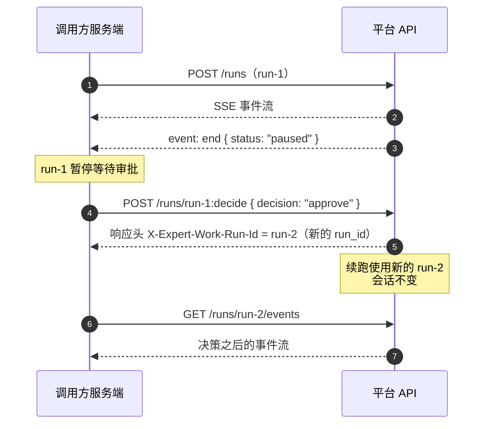

# 4 对话过程中的控制

run 开始执行之后，调用方有两种介入方式：中途取消，或者对暂停等待人工审批的 run 下达决策。本章的两个端点都要求 key 带 `write` 权限。

通用响应格式与 `user_id` 规则见 [7 通用约定](./conventions)，权限档位见 [6 认证与 Key](./auth)。

## 4.1 取消 run

请求服务端中止一次正在执行的 run。`stream` 与 `queue` 两种模式发起的 run 都可以取消；这个操作是幂等的，重复取消同一个 run 不会报错。

### 请求

``` [端点]
POST /v1/agents/{agent_code}/runs/{run_id}:cancel
Content-Type: application/json
```

`agent_code` 与 `run_id` 在路径里，`user_id` 在请求体里。请求体只接受 `user_id` 这一个字段，多传一个未知字段会返回 422 `INVALID_REQUEST`。

| 参数 | 必填 | 说明 |
|---|---|---|
| `agent_code` | 是 | 要取消的 run 所属的 Agent 标识，与发起这次 run 时用的是同一个值 |
| `run_id` | 是 | 要取消的 run，UUID |
| `user_id` | 是 | 必须是发起这次 run 的那个终端用户，长度 1–255 字符 |

### 响应

200 响应体里的 `stopped` 有两个取值：

| 取值 | 含义 |
|---|---|
| `true` | 这次调用真的触发了取消：run 当时确实在执行中，中断请求已经送达 |
| `false` | 这个 run 已经处于最终状态，端点不做任何操作，也不报错 |

`stopped` 为 `false` 覆盖的最终状态包括正常结束（`success`）、失败（`error`）、已被取消（`interrupted`），**也包括暂停等待人工审批（`paused`）**。对一个等待审批的 run 调用取消，它的状态不会改变，仍然停在原地等待决策。

中断请求生效之后，这次 run 最终会落到 `interrupted` 状态，可以在 [5.4 run 列表](./query#_5-4-run-列表) 的 `status`，或者事件流末尾 `end` 事件的 `status` 里看到。

### 示例

```bash [请求]
curl -X POST https://<your-domain>/v1/agents/{agent_code}/runs/{run_id}:cancel \
  -H "Authorization: Bearer <key>" \
  -H "Content-Type: application/json" \
  -d '{"user_id": "u-123"}'
```

```json [响应 200]
{ "success": true, "data": { "run_id": "67262572-5470-41a4-800d-592762ec679d", "stopped": true }, "error": null }
```

### 取消的生效方式

::: warning stopped 为 true 不代表这次 run 一定以 interrupted 收场
取消是尽力而为的：中断请求在 Agent 的两个步骤之间生效。如果这个 run 在下一次步骤之间的检查到来之前就自己跑完了（例如它正处在最后一步的生成过程中），它会照常以 `success` 收尾，尽管取消调用返回的是 `stopped: true`。

要知道这次 run 到底怎么结束，以 `end` 事件的 `status` 为准，不要用取消接口的返回值推断。
:::

run 从收到中断请求，到最终状态被服务端记录下来，中间有一段异步收尾的时间。这段时间内连续调用两次取消，第二次仍然可能返回 `stopped: true`。

确认这次 run 已经结束，要看它的最终状态：事件流的收尾，或者 [5.2 会话列表](./query#_5-2-会话列表) 的 `running` 字段。不要靠轮询取消接口、等 `stopped` 变成 `false` 来判断。

取消生效之后事件流怎么收尾，见 [3 读懂 SSE 流](./sse-events)。

### 错误

| 状态码 | 错误码 | 触发条件 | 处理方式 |
|---|---|---|---|
| 404 | `RUN_NOT_FOUND` | `run_id` 不存在，或者存在但不属于这个 `user_id` 与 `agent_code` 的组合，两种情况不区分 | 核对 `run_id`、`user_id`、`agent_code` 三个值；三者都正确时，重试不会得到不同的结果 |
| 422 | `INVALID_REQUEST` | `user_id` 缺失、超过 255 字符，或者请求体带了未知字段 | 补全或截短 `user_id`，去掉多余的字段 |
| 403 | `FORBIDDEN` | key 权限不足，缺少 `write`。这个码在 `detail.code` 里，不在 `error.code` 里 | 换一把带 `write` 权限的 key |

关于这里的 404，还有两点：

- 收到它不表示「这次 run 还没有创建好、稍后重试就会有」。
- `user_id` 传了、但去掉首尾空白后为空（整串都是空格）时，同样归到这个 404，不会单独报参数错误。

key 失效相关的 401 见 [8 错误码总表](./errors)。

## 4.2 审批决策

Agent 执行到需要人工确认的一步时会暂停，这次 run 停在 `paused` 状态，并在事件流里发出一个 `approval` 事件（见 [3 读懂 SSE 流](./sse-events)）。这个端点用来下达决策：同意、拒绝，或者改掉参数之后继续。

条目模式（`stream_format=items`）下没有 `approval` 事件，同样的内容以 `type` 为 `approval` 的条目送出，字段一一对应，见 [3.7 条目模式](./sse-events#_3-7-条目模式)。本节凡是提到 `approval` 事件某个字段的地方，条目模式下都读同名字段。



::: danger 续跑使用新的 run_id
无论 `mode` 是 `stream` 还是 `queue`，响应头 `X-Expert-Work-Run-Id` 给出的都是续跑的新 `run_id`。路径参数 `{run_id}` 只用来定位要对哪一个待审批的 run 下达决策。

用原来的 `{run_id}` 去调事件接口，读到的是审批之前的那一段，看不到决策之后发生的事。客户端必须切换到响应头给出的新 `run_id`。
:::

### 请求

``` [端点]
POST /v1/agents/{agent_code}/runs/{run_id}:decide
Content-Type: application/json
```

`agent_code` 与 `run_id` 在路径里，其余字段在请求体里。请求体只接受下表列出的字段，多传一个未知字段会返回 422 `INVALID_REQUEST`。

| 参数 | 必填 | 说明 |
|---|---|---|
| `agent_code` | 是 | 路径参数。这次 run 所属的 Agent 标识，与发起这次 run 时用的是同一个值 |
| `run_id` | 是 | 路径参数。暂停等待审批的那个 run，UUID |
| `user_id` | 是 | 必须是发起这次 run 的那个终端用户，长度 1–255 字符 |
| `decision` | 是 | 取值：`approve` / `reject` / `modify`，三者的区别见下文 |
| `modified_args` | `decision` 为 `modify` 时必填 | 覆盖这次工具调用参数的对象，形状见下文。`decision` 不是 `modify` 时传它会返回 422 |
| `reason` | 否 | 拒绝理由，最长 2048 字符。只在 `decision` 为 `reject` 时生效，见下文 |
| `idempotency_key` | 否 | 这次决策的幂等键，最长 255 字符。它与发起对话用的 `Idempotency-Key` 请求头是两套独立的幂等，按这次决策计算，不按 run 的创建计算 |
| `mode` | 否 | 取值：`stream`（默认，响应正文直接是续跑的事件流）/ `queue`（响应正文是 202 JSON，不建立事件流连接），两者的差异见下文「响应」 |
| `stream_format` | 否 | 取值：`legacy`（默认）/ `items`。续跑事件流的形态，与发起对话端点同名参数同义，见 [3.7 条目模式](./sse-events#_3-7-条目模式)。`mode` 为 `queue` 时不产生事件流，这个字段不起作用 |

审批之前与审批之后是两条独立的事件流。要让终端用户看到的是一个连续的列表，这两条流以及后续的续传请求都要传同一个 `stream_format`。

事件流里 `approval` 事件携带的 `request_id`，只是那次审批请求自身的标识，这个端点不接受它：请求体里带上 `request_id` 同样返回 422 `INVALID_REQUEST`。条目模式下这个字段在 `approval` 条目上，结论相同。

#### decision 的取值

| 取值 | 适用情形 | 续跑时的行为 |
|---|---|---|
| `approve` | 同意这次工具调用 | 按 Agent 原本提出的参数执行这次调用，然后继续往下跑 |
| `modify` | 同意执行，但要先改掉这次调用的参数，例如去掉一个危险选项或纠正一个路径 | 用 `modified_args` 整体替换这次调用的参数后执行，然后继续往下跑 |
| `reject` | 不同意这次工具调用 | 不执行这次调用；整个 run 是否终止，取决于这次审批的类型 |

`reject` 之后 run 是否终止，取决于这次审批是怎么触发的。`approval` 事件里的 `reason_kind` 字段说明这次审批的来源，客户端在下达决策之前就能据此区分两条路径（五个取值见 [3.4 的 `approval`](./sse-events#approval)；条目模式下这个字段在 `approval` 条目上，取值相同）：

- `reason_kind` 为 `policy_gate`：这是 Agent 配置里声明的强制审批点，常见于高风险工具，拒绝会终止整个 run。
- `reason_kind` 为其余四个取值：这是 Agent 在执行过程中自己发起的确认请求，拒绝只是把一条「审批被拒绝」的结果交回给 Agent，run 会继续往下跑，Agent 可能换一种方式重试或者调整计划。

强制审批点被拒绝、run 就此终止时，`end` 事件的 `status` 仍然是 `success`，平台没有单独的「已拒绝」最终状态。**要确认这次工具调用是否被拒绝，看事件流里这次调用对应的结果消息。** 条目模式下看的是同一次调用的 `tool_result` 条目，靠 `call_id` 找到它。

#### modified_args 的形状

`modified_args` 是一个对象，键名与这个工具本身的参数名相同，值是新的参数值。它整体替换原参数，不是在原参数上打补丁：原参数会被完全丢弃，因此要把这个工具需要的全部参数都写进去，包括没有改动的那些。

服务端不校验 `modified_args` 的键是否与这个工具的参数定义匹配。键名写错不会在这一步报错，而是在工具执行时才会出问题。

下面的例子对应一次 `write_file` 工具调用：Agent 原本提出的参数是 `{"path": "probe_note.txt", "content": "hello-probe"}`，审批时把 `content` 换成了审核之后的文本。

```json [请求体片段]
{
  "user_id": "u-123",
  "decision": "modify",
  "modified_args": { "path": "probe_note.txt", "content": "hello-probe（已审核，替换敏感内容）" }
}
```

#### reason 的作用范围

`reason` 只在 `decision` 为 `reject` 时生效：它的文本会被放进交回给 Agent 的那条工具结果消息里（形如 `[approval rejected] {reason}`），Agent 能看到这句话并据此调整。`decision` 为 `approve` 或 `modify` 时传 `reason` 不会报错，但也不会被使用。省略 `reason` 时，平台使用的默认文案是 `approval rejected by reviewer`。

::: danger reason 会被终端用户看到
`reject` 的 `reason` 会出现在续跑事件流的 `updates` 事件里：它是交回给 Agent 的那条工具结果的一部分，而 [3.4 的 `updates`](./sse-events#updates) 正是客户端用来渲染工具结果的事件。条目模式下它在同一次调用的 `tool_result` 条目的 `content` 里，同样是要渲染的内容。这段文字会一路流到界面上；断线重连之后服务端会把客户端未收到的事件重新发送，它还会再出现一次。

不要在 `reason` 里写不希望终端用户看到的内容，例如内部工单号或者风控判据。
:::

对外 API 没有查询历史审批记录的接口。需要让拒绝理由可追溯时，请在调用方自己的系统里留一份记录。

### 响应

响应的形态取决于 `mode`，以及这次决策是不是一次幂等重放（带着与某次已完成决策相同的 `idempotency_key` 重试）。

| 情况 | 状态码 | 响应正文 |
|---|---|---|
| `mode` 为 `stream`，不是重放 | 200 | 续跑的事件流本身，`Content-Type: text/event-stream` |
| `mode` 为 `queue` | 202 | JSON，形状见下面的示例 |
| `mode` 为 `stream`，命中幂等重放 | 200 | 与 `queue` 相同的 JSON，此时没有正在执行的续跑可以接流 |

三种情况的响应头都带 `X-Expert-Work-Run-Id`，**它是续跑的新 `run_id`，不是路径里的那个**。拿到之后用 `GET /v1/agents/{agent_code}/runs/{run_id}/events?user_id={user_id}` 接上它的事件流，其中 `{user_id}` 与发起这次 run 时相同。用条目模式时这个请求要一并带上 `&stream_format=items`，否则接回来的是默认形态。

使用 [3.5 的接收器骨架](./sse-events#_3-5-建议的接收器骨架) 时，从它循环里 `consume(await fetch(url))` 那一步进入即可：换成新的 `run_id`，续传位置从头开始计算（`maxSeq` 需要清零）。条目模式下**列表不清零**：新 run 的条目追加到同一个列表里，这正是这种形态存在的意义。

`stream` 模式的幂等重放，与发起对话端点的幂等重放不是一回事：这里重放的是这次决策，不是这次 run。

### 示例

```bash [请求 stream 模式]
curl -X POST "https://<your-domain>/v1/agents/{agent_code}/runs/67262572-5470-41a4-800d-592762ec679d:decide" \
  -H "Authorization: Bearer <key>" \
  -H "Content-Type: application/json" \
  -d '{"user_id": "u-123", "decision": "approve"}'
```

不是重放时，上面这个请求的响应是 200，`Content-Type: text/event-stream`，响应头 `X-Expert-Work-Run-Id: 7c9e6679-7425-40de-944b-e07fc1f90ae7`，响应正文就是续跑的事件流，事件格式见 [3 读懂 SSE 流](./sse-events)。

```bash [请求 queue 模式]
curl -X POST "https://<your-domain>/v1/agents/{agent_code}/runs/67262572-5470-41a4-800d-592762ec679d:decide" \
  -H "Authorization: Bearer <key>" \
  -H "Content-Type: application/json" \
  -d '{"user_id": "u-123", "decision": "approve", "mode": "queue"}'
```

```json [响应 202]
{
  "success": true,
  "data": { "run_id": "7c9e6679-7425-40de-944b-e07fc1f90ae7" },
  "error": null
}
```

这个响应的响应头同样带 `X-Expert-Work-Run-Id: 7c9e6679-7425-40de-944b-e07fc1f90ae7`。

### 错误

| 状态码 | 错误码 | 触发条件 | 处理方式 |
|---|---|---|---|
| 404 | `RUN_NOT_FOUND` | `run_id` 不存在，或者不属于这个 `user_id` 与 `agent_code` 的组合。归属校验先于审批逻辑执行，`user_id` 为纯空白时同样归到这个 404 | 核对三个值是否匹配；确认无误后不要重试 |
| 404 | `APPROVAL_NOT_FOUND` | 归属校验通过，但这个 `run_id` 名下没有任何审批记录 | 确认这个 run 确实在等待审批，例如它没有被上一次调用决策过 |
| 409 | `APPROVAL_CONFLICT` | 这条审批已经被决定过，或者与另一次并发决策竞争后落败，且这次请求的 `idempotency_key` 与已记录的那次决策对不上 | 不要重复决策；要重放上一次的结果，带上当时用的 `idempotency_key` 重新请求 |
| 409 | `SESSION_NOT_BOUND` | 这个 run 所在的会话没有绑定 Agent 名称与版本，属于服务端状态异常，正常对接流程不会遇到 | 联系租户管理员 |
| 403 | `AGENT_DISABLED` | 这个 `agent_code` 已被管理员下线。这个码在 `error.code` 里，与 key 的权限无关 | 联系租户管理员启用该 Agent，或者换一个 `agent_code` |
| 403 | `TENANT_SUSPENDED` | 租户被暂停。这个码在 `error.code` 里，与 key 的权限无关 | 联系租户管理员 |
| 404 | `AGENT_NOT_FOUND` | Agent 的定义记录已不存在 | 联系租户管理员 |
| 410 | `AGENT_DELETED` | Agent 已被软删除 | 不可恢复，换一个 `agent_code` |
| 422 | `AGENT_BUILD_FAILED` | Agent 的定义构建失败，属于服务端配置问题 | 联系租户管理员 |
| 422 | `INVALID_REQUEST` | 请求体没有通过基础校验，例如 `decision` 为 `modify` 却没传 `modified_args`、`decision` 不是 `modify` 却传了 `modified_args`、`decision` 或 `mode` 不是允许的取值、`user_id` 缺失或超长、带了未知字段 | 对照上文的字段表逐项检查请求体 |
| 403 | `FORBIDDEN` | key 权限不足，缺少 `write`。这个码在 `detail.code` 里，不在 `error.code` 里 | 换一把带 `write` 权限的 key |

key 失效相关的 401 见 [8 错误码总表](./errors)。
