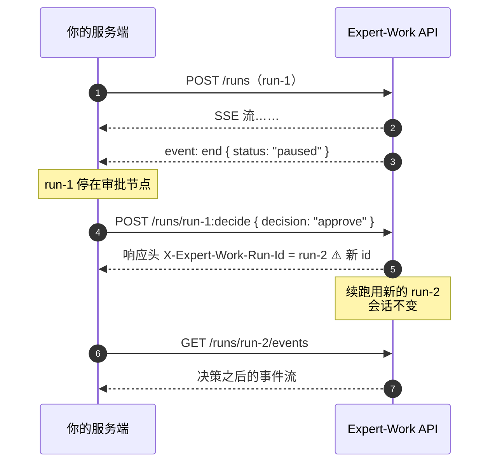

# 4 对话过程中的控制

run 跑起来之后有两种介入方式：中途取消，或者对停在人工审批节点的 run 下达决策。

两个端点都要求 `write` 权限。通用响应格式、`user_id` 规则见 [7 通用约定](./conventions)；权限档位见 [6 认证与 Key](./auth)。

## 4.1 取消 run

``` [端点]
POST /v1/agents/{agent_code}/runs/{run_id}:cancel
Authorization: Bearer <key>   # 需要 write 权限
Content-Type: application/json
```

`stream` 与 `queue` 两种模式都能取消。取消是幂等的，重复取消同一个 run 不会报错。

### 请求参数

| 字段 | 位置 | 类型 | 必填 | 取值/默认 | 说明 |
|---|---|---|---|---|---|
| `agent_code` | 路径 | string | 是 | — | 要取消的 run 所属的 Agent 代码——与发起这次 run 时用的同一个 `agent_code` |
| `run_id` | 路径 | UUID | 是 | — | 要取消的 run |
| `user_id` | 请求体 | string | 是 | 1–255 字符 | 归属校验——必须是发起这次 run 的那个 `user_id` |

请求体只接受 `user_id` 这一个字段；多传一个不认识的字段会 422（`INVALID_REQUEST`）。

```bash [请求]
curl -X POST https://<your-domain>/v1/agents/{agent_code}/runs/{run_id}:cancel \
  -H "Authorization: Bearer <key>" \
  -H "Content-Type: application/json" \
  -d '{"user_id": "u-123"}'
```

### 响应

```json [响应 200]
{ "success": true, "data": { "run_id": "67262572-5470-41a4-800d-592762ec679d", "stopped": true }, "error": null }
```

| `stopped` | 含义 |
|---|---|
| `true` | 这次调用真的触发了取消——run 当时确实在执行中，中断信号已送达 |
| `false` | 这个 run 已经处于最终状态，取消端点不做任何操作，也不报错 |

`stopped: false` 覆盖的最终状态包括：正常结束（`success`）、失败（`error` / `timeout`）、已被取消（`interrupted`），**也包括暂停等待审批（`paused`）**。换句话说，对一个等待审批的 run 调用取消，它不会消失也不会改变状态，仍然停在原地等决策。

`stopped: true` 且中断信号真正生效时，这次 run 最终会落到 `interrupted` 状态（能在 [5.4 run 列表](./query#_5-4-run-列表) 的 `status`，或 SSE `end.status` 里看到）——但请看下面的 warning，`stopped: true` 不保证一定会走到这一步。

::: warning `stopped: true` 不等于"这次 run 一定以 interrupted 收场"
取消是**尽力而为**的：中断信号在 Agent 的**步与步之间**生效。如果这个 run 在下一个检查点到来之前就自己跑完了（比如它正处在最后一步的生成过程中），它会**照常以 `success` 收尾**，尽管取消调用返回的是 `stopped: true`。

真实环境实测过这两种结果：同一段代码、同一个提示词，一次拿到 `end.status = "interrupted"`，一次拿到 `end.status = "success"`（那次 run 在中断生效前 12 秒就答完了）。

**要知道这次 run 到底怎么结束的，一律以 `end` 事件的 `status` 为准**，别用取消接口的返回值推断。
:::

另外，run 从"收到中断信号"到"最终状态落库"需要一点时间（后台异步收尾）。这个窗口内连续调用两次取消，第二次仍可能返回 `stopped: true`——不要把 `stopped: false` 当作"取消已确认生效"的信号去轮询等待，确认结束要看 run 的最终状态（SSE 流的收尾，或会话列表的 `running` 字段）。

取消生效后 SSE 流怎么收尾，见 [3 读懂 SSE 流](./sse-events)。

### 失败情况

| 状态码 | `error.code` | 触发条件 | 你该怎么办 |
|---|---|---|---|
| 404 | `RUN_NOT_FOUND` | `run_id` 不存在，或存在但不属于这个 `(user_id, agent_code)` 组合——**两种情况返回同一个 404，不区分**。收到这个 404 **不代表"run 还没创建好、稍后重试就有"**。`user_id` 传了但去掉首尾空白后为空（整串都是空格）时，也折叠进这个 404，而不是单独报参数错 | 核对 `run_id` / `user_id` / `agent_code` 三者是否都对（含 `user_id` 是不是纯空白）；如果确信三个值都对，它的含义就是"这不是你的 run"，重试不会有不同结果 |
| 422 | `INVALID_REQUEST` | `user_id` 缺失，或超过 255 字符，或请求体带了未知字段 | 补全或截短 `user_id`；去掉多余字段 |
| 403 | `FORBIDDEN`（码在 `detail.code`，不是 `error.code`） | key 权限不足（缺 `write`） | 换一个带 `write` 权限的 key |

401 相关的 key 失效情况见 [8 错误码总表](./errors)。

## 4.2 审批决策

``` [端点]
POST /v1/agents/{agent_code}/runs/{run_id}:decide
Authorization: Bearer <key>   # 需要 write 权限
Content-Type: application/json
```

Agent 执行到需要人工确认的节点时会暂停，run 落在 `paused` 状态。这个端点用来下达决策：同意、拒绝、或改参数后继续。



::: danger 续跑用的是新 run_id，不是路径里那个
无论 `mode` 是 `stream` 还是 `queue`，响应头 `X-Expert-Work-Run-Id` 给的都是**续跑的新 run_id**。路径参数 `{run_id}` 只用来定位"要决策哪一个待审批的 run"。

拿旧的 `{run_id}` 去调事件回放端点，读到的是审批之前那一段，看不到决策之后发生的事——必须切到响应头给的新 `run_id`。
:::

### 请求参数

| 字段 | 位置 | 类型 | 必填 | 取值/默认 | 说明 |
|---|---|---|---|---|---|
| `agent_code` | 路径 | string | 是 | — | 要调用的 Agent 的代码——与发起这次 run 时用的同一个 `agent_code` |
| `run_id` | 路径 | UUID | 是 | — | 暂停等待审批的那个 run |
| `user_id` | 请求体 | string | 是 | 1–255 字符 | 归属校验——必须是发起这次 run 的那个 `user_id` |
| `decision` | 请求体 | string（枚举） | 是 | `"approve"` \| `"reject"` \| `"modify"` | 三个值分别什么时候用、之后 run 会怎样，见下文「decision 的三个取值」 |
| `modified_args` | 请求体 | object | 仅 `decision: "modify"` 时必填 | 无默认；`decision` 非 `modify` 时**禁止**传，传了会 422 | 覆盖审批节点原参数的对象，形状见下文「modified_args 的形状」 |
| `reason` | 请求体 | string | 否 | ≤2048 字符，无默认 | 只在 `decision: "reject"` 时有实际效果，见下文「reason 的作用范围」 |
| `idempotency_key` | 请求体 | string | 否 | ≤255 字符，无默认 | **独立于发起对话用的 `Idempotency-Key` 请求头**，是另一套幂等域，按这次决策计算而非按 run 创建 |
| `mode` | 请求体 | string（枚举） | 否 | `"stream"` \| `"queue"`，默认 `"stream"` | `stream`：响应体直接是续跑的 SSE 事件流；`queue`：响应体是 202 JSON，不建立 SSE 连接。两种差异见下文「响应」一节 |

请求体只接受上面这些字段；多传一个不认识的字段会 422（`INVALID_REQUEST`）。

SSE `approval` 事件（见 [3 读懂 SSE 流](./sse-events)）里带的 `request_id`，只是那次审批请求自身的标识——**这个接口不接受它**：请求体只认上表列出的字段，多传任何字段（包括 `request_id`）都会 422 `INVALID_REQUEST`。

#### decision 的三个取值

| 值 | 什么时候用 | 之后 run 会怎样（概要） |
|---|---|---|
| `approve` | 同意这次工具调用 | 续跑按 Agent 原本提出的参数原样执行这次调用，然后继续往下跑 |
| `modify` | 同意执行，但要先改掉工具调用的参数（比如砍掉一个危险选项、纠正一个路径） | 续跑用 `modified_args` **整体替换**这次调用的参数后执行，然后继续往下跑 |
| `reject` | 不同意这次工具调用 | 续跑不执行这次调用；是否终止整个 run 取决于审批节点的类型，见下 |

`reject` 之后 run 是否终止，取决于这次审批是怎么触发的：

- **Agent 的策略里配置的强制审批点**（在 Agent 配置(manifest)里声明，常见于高风险工具；对应 SSE `approval` 事件里 `reason_kind: policy_gate`）：拒绝会终止整个 run。**但 `end.status` 依然是 `success`**——目前没有专门的"已拒绝"终态，要判断这次调用是否被拒绝，得看事件流里这次工具调用对应的结果消息。
- **Agent 在执行过程中自己发起的确认请求**（内置的 `ask_for_approval`）：拒绝只是把一条"审批被拒绝"的结果喂给 Agent，run 会继续往下跑，Agent 可能换个方式重试或调整计划。

#### modified_args 的形状

`modified_args` 是**覆盖这次审批节点原参数的对象**：键名和这个工具本身的参数名相同，值是新的参数值。它是**整体替换**，不是往原参数上打补丁——原参数会被完全丢弃，所以要把这个工具需要的全部参数都写进去，即使某个值没变。

服务端不会校验 `modified_args` 里的键是否真的匹配这个工具的参数 schema，键名写错不会在这一步报错，而是在工具执行时才会出问题。

示例（拿一次 `write_file` 工具调用举例：Agent 原本提出的参数是 `{"path": "probe_note.txt", "content": "hello-probe"}`，审批时把 `content` 换成了审核后的文本）：

```json [请求体片段]
{
  "user_id": "u-123",
  "decision": "modify",
  "modified_args": { "path": "probe_note.txt", "content": "hello-probe（已审核，替换敏感内容）" }
}
```

#### reason 的作用范围

`reason` 只在 `decision: "reject"` 时有实际效果：它的文本会被塞进这次工具调用返回给 Agent 的结果消息里（类似 `[approval rejected] {reason}`），Agent 能看到这句话并据此调整。

`approve` / `modify` 下传 `reason` 不会报错，但也不会被使用。想让拒绝理由可追溯，记在你自己的系统里——**它不会写进审计日志**。

::: danger `reason` 会被终端用户看到
`reject` 的 `reason` **会出现在续跑流的 `updates` 事件里**——它是喂回给 Agent 的那条工具结果的一部分（`[approval rejected] {reason}`），而 [3.4 的 `updates`](./sse-events#updates) 正是让前端把工具结果渲染到工具卡上。也就是说，这段文字会顺着 SSE 一路流到界面上，重连回放时同样会再来一遍。

**别在 `reason` 里写不想让终端用户看到的内容**（内部工单号、风控判据、同事的评价……）。省略 `reason` 时平台用的默认文案是 `approval rejected by reviewer`。
:::

```bash [请求]
curl -X POST https://<your-domain>/v1/agents/{agent_code}/runs/67262572-5470-41a4-800d-592762ec679d:decide \
  -H "Authorization: Bearer <key>" \
  -H "Content-Type: application/json" \
  -d '{"user_id": "u-123", "decision": "approve", "mode": "queue"}'
```

### 响应

行为取决于 `mode`，以及这次决策是不是一次**幂等重放**（带着和某次已完成决策相同的 `idempotency_key` 重试）：

#### stream 模式（默认）

```bash [请求]
curl -X POST "https://<your-domain>/v1/agents/{agent_code}/runs/67262572-5470-41a4-800d-592762ec679d:decide" \
  -H "Authorization: Bearer <key>" \
  -H "Content-Type: application/json" \
  -d '{"user_id": "u-123", "decision": "approve"}'
```

非重放时，响应是 200，`Content-Type: text/event-stream`，响应头 `X-Expert-Work-Run-Id: 7c9e6679-7425-40de-944b-e07fc1f90ae7`（续跑的新 run_id），响应体就是续跑的 SSE 事件流本身，事件格式见「3 读懂 SSE 流」。

命中幂等重放时（没有正在执行的续跑可接流），退化成 200 JSON，形状和下面 queue 模式的响应体一样。

#### queue 模式

```bash [请求]
curl -X POST "https://<your-domain>/v1/agents/{agent_code}/runs/67262572-5470-41a4-800d-592762ec679d:decide" \
  -H "Authorization: Bearer <key>" \
  -H "Content-Type: application/json" \
  -d '{"user_id": "u-123", "decision": "approve", "mode": "queue"}'
```

```json [响应 202]
{
  "success": true,
  "data": { "run_id": "7c9e6679-7425-40de-944b-e07fc1f90ae7" },
  "error": null
}
```

响应头同样带 `X-Expert-Work-Run-Id: 7c9e6679-7425-40de-944b-e07fc1f90ae7`。

三种情况汇总：

| 情况 | 状态码 | 响应体 |
|---|---|---|
| `mode: "stream"`，非重放 | 200 | 续跑的 SSE 流本身（`Content-Type: text/event-stream`） |
| `mode: "queue"` | 202 | 上面 `queue` 标签页里那样的 JSON |
| `mode: "stream"` 但命中幂等重放 | 200 | 同上的 JSON；此时没有正在执行的续跑可接流 |

三种情况的响应头都带 `X-Expert-Work-Run-Id`——**这是续跑的新 `run_id`，不是原来那个**。拿到之后用 `GET /v1/agents/{agent_code}/runs/{run_id}/events?user_id={user_id}` 接上它的事件流（`{user_id}` 与发起这次 run 时相同）。

用 [3.5 的接收器骨架](./sse-events#_3-5-建议的接收器骨架) 的话，从它那个循环里 `consume(await fetch(url))` 那一步进入即可——换成新 `run_id`，游标从头算（`maxSeq` 记得清）。

`stream` 模式的幂等重放和发起对话端点的 stream 幂等重放不是一回事：这里重放的是"决策"本身，不是"run"本身。

### 失败情况

| 状态码 | `error.code` | 触发条件 | 你该怎么办 |
|---|---|---|---|
| 404 | `RUN_NOT_FOUND` | `run_id` 不存在，或不属于这个 `(user_id, agent_code)` 组合——归属校验先于审批逻辑执行，与 [4.1](#_4-1-取消-run) 同一条规则。`user_id` 为纯空白时同样折叠进这个 404 | 核对三者是否匹配（含 `user_id` 是不是纯空白）；确认无误后不要重试 |
| 404 | `APPROVAL_NOT_FOUND` | 归属校验通过，但这个 `run_id` 名下没有任何审批记录 | 确认这个 run 真的处于等待审批状态（比如没有已经被上一次调用决策过） |
| 409 | `APPROVAL_CONFLICT` | 这条审批已经被决定过（重复决策，或与另一次并发决策竞争后落败），且这次请求的 `idempotency_key` 对不上已落库的那次决策（对得上则不是失败，走幂等重放） | 不要重复决策；要重放上次结果，带上当时用的 `idempotency_key` 重新请求 |
| 409 | `SESSION_NOT_BOUND` | 这个 run 所在的会话没有绑定 Agent 名称/版本——内部状态异常，正常对接流程不会遇到 | 联系租户管理员 |
| 403 | `AGENT_DISABLED`（**能读到 `error.code`**，与权限无关） | 这个 `agent_code` 已被管理员禁用 | 联系租户管理员启用该 Agent，或换一个 `agent_code` |
| 403 | `TENANT_SUSPENDED`（**能读到 `error.code`**，与权限无关） | 租户被暂停 | 联系租户管理员 |
| 404 | `AGENT_NOT_FOUND` | Agent 的定义记录本身已不存在 | 联系租户管理员 |
| 410 | `AGENT_DELETED` | Agent 已被软删除 | 不可恢复，换一个 `agent_code` |
| 422 | `AGENT_BUILD_FAILED` | Agent 定义构建失败——服务端配置问题，不是你这边能解决的 | 联系租户管理员 |
| 422 | `INVALID_REQUEST` | 请求体没通过基础校验，比如 `decision: "modify"` 却没传 `modified_args`、非 `modify` 却传了 `modified_args`、`decision` / `mode` 不是允许的枚举值、`user_id` 缺失或超长、带了未知字段 | 对照上方参数表逐项检查请求体 |
| 403 | `FORBIDDEN`（码在 `detail.code`，不是 `error.code`） | key 权限不足（缺 `write`） | 换一个带 `write` 权限的 key |

401 相关的 key 失效情况见 [8 错误码总表](./errors)。
