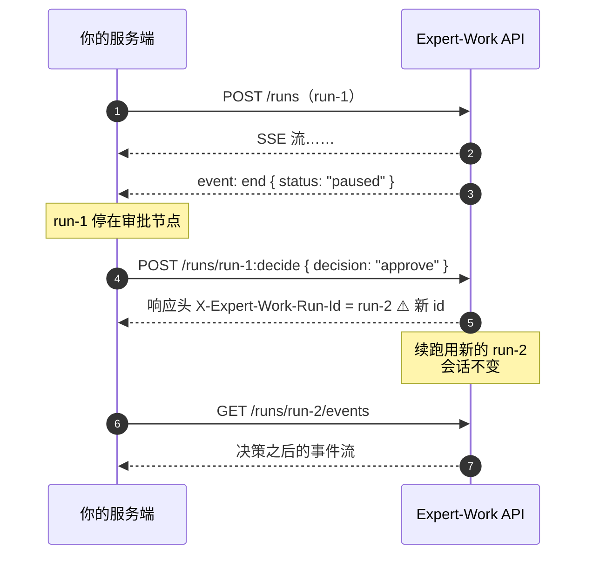

# 4 对话过程中的控制

run 跑起来之后有两种介入方式：中途取消，或者对停在人工审批节点的 run 下达决策。

两个端点都要求 `write` 权限。通用响应格式、`user_id` 规则见 [7 通用约定](./conventions)；权限档位见 [6 认证与 Key](./auth)。

## 4.1 取消 run

```
POST /v1/agents/{agent_code}/runs/{run_id}:cancel
Authorization: Bearer <key>   # 需要 write 权限
Content-Type: application/json
```

`stream` 与 `queue` 两种模式都能取消。取消是幂等的，重复取消同一个 run 不会报错。

### 请求参数

| 字段 | 位置 | 类型 | 必填 | 说明 |
|---|---|---|---|---|
| `agent_code` | 路径 | string | 是 | |
| `run_id` | 路径 | UUID | 是 | 要取消的 run |
| `user_id` | 请求体 | string，1–255 字符 | 是 | 归属校验——必须是发起这次 run 的那个 `user_id` |

```bash
curl -X POST https://<your-domain>/v1/agents/{agent_code}/runs/{run_id}:cancel \
  -H "Authorization: Bearer <key>" \
  -H "Content-Type: application/json" \
  -d '{"user_id": "u-123"}'
```

### 响应

```json
{ "success": true, "data": { "run_id": "...", "stopped": true }, "error": null }
```

| `stopped` | 含义 |
|---|---|
| `true` | 这次调用真的触发了取消——run 当时确实在执行中，中断信号已送达 |
| `false` | 这个 run 已经处于最终状态，取消端点不做任何操作，也不报错 |

`stopped: false` 覆盖的最终状态包括：正常结束（`success`）、失败（`error` / `timeout`）、已被取消（`interrupted`），**也包括暂停等待审批（`paused`）**。换句话说，对一个等待审批的 run 调用取消，它不会消失也不会改变状态，仍然停在原地等决策。

::: warning `stopped: true` 不等于"这次 run 一定以 interrupted 收场"
取消是**尽力而为**的：中断信号在 Agent 的**步与步之间**生效。如果这个 run 在下一个检查点到来之前就自己跑完了（比如它正处在最后一步的生成过程中），它会**照常以 `success` 收尾**，尽管取消调用返回的是 `stopped: true`。

真实环境实测过这两种结果：同一段代码、同一个提示词，一次拿到 `end.status = "interrupted"`，一次拿到 `end.status = "success"`（那次 run 在中断生效前 12 秒就答完了）。

**要知道这次 run 到底怎么结束的，一律以 `end` 事件的 `status` 为准**，别用取消接口的返回值推断。
:::

另外，run 从"收到中断信号"到"最终状态落库"需要一点时间（后台异步收尾）。这个窗口内连续调用两次取消，第二次仍可能返回 `stopped: true`——不要把 `stopped: false` 当作"取消已确认生效"的信号去轮询等待，确认结束要看 run 的最终状态（SSE 流的收尾，或会话列表的 `running` 字段）。

取消生效后 SSE 流怎么收尾，见 [3 读懂 SSE 流](./sse-events)。

### 失败情况

| 状态码 | `error.code` | 触发条件 |
|---|---|---|
| 404 | `RUN_NOT_FOUND` | `run_id` 不存在，或存在但不属于这个 `(user_id, agent_code)` 组合——**两种情况返回同一个 404，不区分**。收到这个 404 **不代表"run 还没创建好、稍后重试就有"**；如果你确信三个值都对，它的含义就是"这不是你的 run"，重试不会有不同结果 |
| 422 | `INVALID_REQUEST` | `user_id` 缺失，或超过 255 字符 |
| 422 | `INVALID_USER_ID` | `user_id` 传了但去掉首尾空白后为空（比如整串都是空格）——能过字段长度校验，过不了后面的归属解析 |
| 403 | `FORBIDDEN`（码在 `detail.code`，不是 `error.code`） | key 权限不足（缺 `write`） |

401 相关的 key 失效情况见 [8 错误码总表](./errors)。

## 4.2 审批决策

```
POST /v1/agents/{agent_code}/runs/{run_id}:decide
Authorization: Bearer <key>   # 需要 write 权限
Content-Type: application/json
```

Agent 执行到需要人工确认的节点时会暂停，run 落在 `paused` 状态。这个端点用来下达决策：同意、拒绝、或改参数后继续。



::: danger 续跑用的是新 run_id，不是路径里那个
无论 `mode` 是 `stream` 还是 `queue`，响应头 `X-Expert-Work-Run-Id` 给的都是**续跑的新 run_id**。路径参数 `{run_id}` 只用来定位"要决策哪一个待审批的 run"。

拿旧的 `{run_id}` 去调事件回放端点，读到的是审批之前那一段，看不到决策之后发生的事——必须切到响应头给的新 `run_id`。
:::

### 请求参数

| 字段 | 位置 | 类型 | 必填 | 说明 |
|---|---|---|---|---|
| `agent_code` | 路径 | string | 是 | |
| `run_id` | 路径 | UUID | 是 | 暂停等待审批的那个 run |
| `user_id` | 请求体 | string，1–255 字符 | 是 | 归属校验 |
| `decision` | 请求体 | `"approve"` \| `"reject"` \| `"modify"` | 是 | |
| `modified_args` | 请求体 | object | 仅 `modify` | `decision: "modify"` 时必填；另外两种 `decision` 下**禁止**传，传了会 422 |
| `reason` | 请求体 | string，≤2048 字符 | 否 | |
| `idempotency_key` | 请求体 | string，≤255 字符 | 否 | **独立于发起对话用的 `Idempotency-Key` 请求头**，是另一套幂等域，按这次决策计算而非按 run 创建 |
| `mode` | 请求体 | `"stream"` \| `"queue"` | 否 | 默认 `"stream"` |

```bash
curl -X POST https://<your-domain>/v1/agents/{agent_code}/runs/{run_id}:decide \
  -H "Authorization: Bearer <key>" \
  -H "Content-Type: application/json" \
  -d '{"user_id": "u-123", "decision": "approve", "mode": "queue"}'
```

### 响应

行为取决于 `mode`，以及这次决策是不是一次**幂等重放**（带着和某次已完成决策相同的 `idempotency_key` 重试）：

| 情况 | 状态码 | 响应体 |
|---|---|---|
| `mode: "stream"`，非重放 | `200` | 续跑的 SSE 流本身（`Content-Type: text/event-stream`） |
| `mode: "queue"` | `202` | JSON，见下 |
| `mode: "stream"` 但命中幂等重放 | `200` | JSON，见下。此时没有正在执行的续跑可接流 |

```json
{ "success": true, "data": { "run_id": "..." }, "error": null }
```

三种情况的响应头都带 `X-Expert-Work-Run-Id`（续跑的新 run_id）。拿到之后用 `GET /v1/agents/{agent_code}/runs/{run_id}/events?user_id=...` 接上它的事件流。

`stream` 模式的幂等重放和发起对话端点的 stream 幂等重放不是一回事：这里重放的是"决策"本身，不是"run"本身。

### 失败情况

| 状态码 | `error.code` | 触发条件 |
|---|---|---|
| 404 | `RUN_NOT_FOUND` | `run_id` 不存在，或不属于这个 `(user_id, agent_code)` 组合——归属校验先于审批逻辑执行，与 [4.1](#_4-1-取消-run) 同一条规则 |
| 404 | `APPROVAL_NOT_FOUND` | 归属校验通过，但这个 `run_id` 名下没有任何审批记录 |
| 409 | `APPROVAL_CONFLICT` | 这条审批已经被决定过（重复决策，或与另一次并发决策竞争后落败），且这次请求的 `idempotency_key` 对不上已落库的那次决策（对得上则不是失败，走幂等重放） |
| 409 | `SESSION_NOT_BOUND` | 这个 run 所在的会话没有绑定 Agent 名称/版本——内部状态异常，正常对接流程不会遇到 |
| 403 | `AGENT_DISABLED`（**能读到 `error.code`**，与权限无关） | 这个 `agent_code` 已被管理员禁用 |
| 403 | `TENANT_SUSPENDED`（**能读到 `error.code`**，与权限无关） | 租户被暂停 |
| 404 | `AGENT_NOT_FOUND` | Agent 的定义记录本身已不存在 |
| 410 | `AGENT_DELETED` | Agent 已被软删除 |
| 422 | `AGENT_BUILD_FAILED` | Agent 定义构建失败——服务端配置问题，不是你这边能解决的 |
| 422 | `INVALID_REQUEST` | 请求体没通过基础校验，比如 `decision: "modify"` 却没传 `modified_args`、非 `modify` 却传了 `modified_args`、`user_id` 缺失或超长 |
| 422 | `INVALID_USER_ID` | `user_id` 去掉首尾空白后为空——与 [4.1](#_4-1-取消-run) 同一条规则 |
| 403 | `FORBIDDEN`（码在 `detail.code`，不是 `error.code`） | key 权限不足（缺 `write`） |

401 相关的 key 失效情况见 [8 错误码总表](./errors)。
