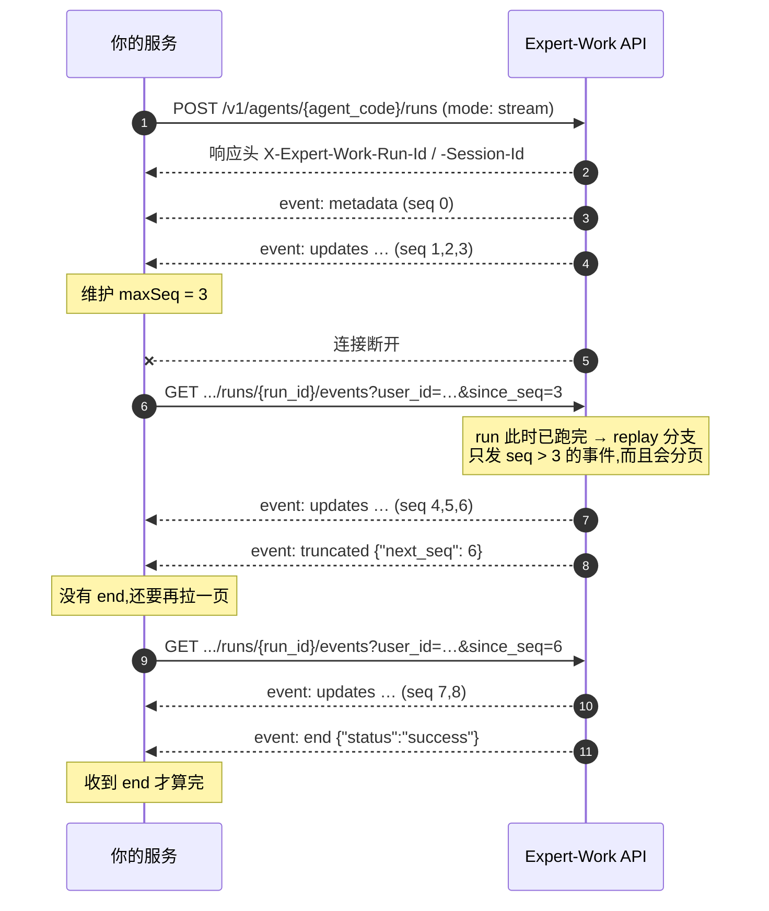

# 3 读懂 SSE 流

这一章是给写前端 / 写对接程序的人看的:一次 Agent run 会推给你哪些事件、每个事件里有什么、界面拿到它该做什么，以及连接断了怎么接回去。

读完这一章，你应该能独立写出一个能跑完整 run 的接收器。3.5 给了一份可以直接抄的骨架。

全章示例统一用这几个值:

| 占位 | 本章统一用的值 | 说明 |
|---|---|---|
| `{agent_code}` | `{agent_code}` | 本章一律原样保留这个占位符;实际调用时换成你的 Agent 编码 |
| `{user_id}` | `u-123` | 发起这次 run 的终端用户 id |
| `{run_id}` | `67262572-5470-41a4-800d-592762ec679d` | 这次 run 的 id |
| 会话 id | `9f2c1a44-6d3b-4f18-9a70-2b5c8e1d0c37` | 请求体里叫 `session_id`、SSE 事件里叫 `thread_id`，**是同一个值** |

## 3.1 先看一眼:一次 run 的事件流长什么样

`mode: "stream"` 的 `POST /v1/agents/{agent_code}/runs`，**响应体本身就是这条 SSE 流**——不用再调别的接口。

下面是一次真实 run 的事件顺序。为了一眼看清顺序，这里**只保留了 `event:` 行**——每个事件的 `data` 里有什么，是 3.4 的内容。

``` [事件流片段]
event: metadata      ← run 开始了。记下 run_id 和会话 id
event: updates       ← 一个节点跑完了(记忆召回)。这一步的权威结果
event: updates       ← 又一个节点跑完了(工作区读入)
event: token         ← agent 节点开始了,模型正在逐字生成。几十到上千个
event: token
event: token
event: updates       ← agent 节点跑完:模型这一步要调一个工具
event: updates       ← tools 节点跑完:工具的执行结果
event: token         ← 下一步又开始生成了
event: token
event: updates       ← agent 节点跑完:这次是最终答案
event: updates       ← 最后一个节点跑完(记忆回写)
event: end           ← 流结束。data 里带这次 run 的最终状态
```

注意 `token` 出现的位置:它只在 `agent` 节点跑的时候产生，`agent` 之前的准备节点只发 `updates`。

不过**准备节点有几个、有没有，取决于这个 Agent 怎么配**:上面这个示例配了记忆召回和工作区读入,所以流的开头是 `metadata` 加两个 `updates`;两样都没配的 Agent 直接从 `agent` 节点开始跑，第一个 `token` 可以紧跟在 `metadata` 后面。**别按「开头一定有几个 `updates`」写代码。**

整条流是三段:

1. **开场**——一个 `metadata`，告诉你这次 run 的身份。
2. **中间**——`token` 和 `updates` 反复交替，交替几轮取决于 Agent 要走几步。中途还可能插进 `worker` / `guard` / `compaction` / `approval` / `retry` / `error`。
3. **收尾**——一个 `end`，带最终状态。

::: tip 只有两种事件是每次都有的
`metadata` 和 `end` 一定出现(`end` 只有一个例外，见 3.6 的回放分页)。其余全部取决于这次 run 实际发生了什么——没调工具就没有 `tools` 节点的 `updates`，没触发护栏就没有 `guard`。**不要把「某个事件一定会来」写进代码。**
:::

## 3.2 事件的格式

### 一个事件三行

每个事件都是标准 SSE 格式:一行 `id:`、一行 `event:`、一行 `data:`，最后一个空行作为结束标记。

``` [事件流片段]
id: 1755229352138-0
event: metadata
data: {"run_id":"67262572-5470-41a4-800d-592762ec679d","thread_id":"9f2c1a44-6d3b-4f18-9a70-2b5c8e1d0c37"}

```

- `id:`——**不是每个事件都有**，见下面那张表。
- `event:`——事件名。就是 3.3 表里那一列。
- `data:`——一个 JSON 对象。**永远是一行**，不会跨行。

### 心跳是注释行，不是事件

**谁发给谁**:服务端的 SSE 端点发给**当前这条打开着的连接**。两条路径都发——`mode: "stream"` 的 `POST /v1/agents/{agent_code}/runs` 响应流，以及 run 还没跑完时的 `GET /v1/agents/{agent_code}/runs/{run_id}/events`(实时分支)。**run 已经跑完的回放分支不发心跳**:它不挂着等，一页读完就返回。

**什么时候发**:这条连接**空闲 15 秒没有任何事件**时发一行。它是一个空闲计时器，不是固定节拍——任何一个真实事件都会把计时重新归零，所以流很热闹的时候一条心跳都不会有。

``` [事件流片段]
: heartbeat

```

它以冒号开头，是 SSE 规范里的注释行，**没有 `event:` 也没有 `data:`**。

**它不是 run 身上的事件**:不落库、不占序号，断线重连也不会「补发」心跳。

**读者要做什么**,三条:

1. 解析时直接跳过以 `:` 开头的行——不要当事件分发，不要当 `data` 解析。
2. **不要动游标**:心跳不参与 `since_seq` 的计算。
3. 拿它当「连接还活着」的判活信号。

**多久没收到任何数据就算这条连接死了?** 服务端**没有规定**这个阈值，它是客户端自己的事。**建议设 45 秒**——心跳间隔是 15 秒，45 秒就是连着三个心跳周期一个字节都没来。这是本文给的建议值，不是协议约束;你的网络环境更差就往上调。超时之后按 3.6 重连(3.5 的接收器骨架里 `readTimeoutMs` 用的就是这个 45 秒)。

### 哪些事件有 `id:`、能不能回放

每个事件一行，一共 12 个:

| 事件 | 有 `id:` | 断线重连会重发吗 | 参与 `since_seq` 游标吗 | 为什么 |
|---|---|---|---|---|
| `metadata` | 有 | 会 | 是 | 落库的 run 事件 |
| `updates` | 有 | 会 | 是 | 落库的 run 事件 |
| `worker` | 有 | 会 | 是 | 落库的 run 事件 |
| `guard` | 有 | 会 | 是 | 落库的 run 事件 |
| `compaction` | 有 | 会 | 是 | 落库的 run 事件 |
| `approval` | 有 | 会 | 是 | 落库的 run 事件 |
| `retry` | 有 | 会 | 是 | 落库的 run 事件 |
| `error` | 有 | 会 | 是 | 落库的 run 事件 |
| `token` | 无 | **不会**——断连期间的那些永久丢失 | 否 | 一次性预览，不落库、不占序号 |
| `end` | 无 | 每条流各自新发一个 | 否 | 流的终止标记，不是 run 身上被记录下来的事件 |
| `gap` | 无 | 不适用 | 否 | 描述**这条连接**的状况，不是 run 身上发生的事 |
| `truncated` | 无 | 不适用 | 否 | 描述**这条连接**的状况，不是 run 身上发生的事 |

### 从 `id:` 里取 `seq`

`id:` 由两段组成，中间用一个 `-` 连接:前半段是服务端的毫秒时间戳，后半段是 `seq`。

``` [事件流片段]
id: 1755229352138-0
      ↑ 毫秒时间戳    ↑ seq
```

`seq` 是这个事件在这次 run 里的序号，**从 `0` 开始**，也是断线重连时 `since_seq` 参数**唯一合法的取值来源**(见 3.6)。

取 `seq` 请按**最后一个** `-` 切分，别按第一个:

```js [渲染示例]
// 前半段是纯数字时间戳、本身不含 "-",但别赌这一点 —— 按最后一个 "-" 切最稳
function seqOf(id) {
  if (!id) return null;                       // 没有 id: 的事件,不参与游标
  const n = Number(id.slice(id.lastIndexOf("-") + 1));
  return Number.isInteger(n) ? n : null;      // 形状不认识就当没有 seq
}
```

::: warning 不要拿完整的 id 字符串当键
id 里的**毫秒段不保证两次一致**:实时连接和回放是两次独立取的服务端时钟，同一个事件可能相差 1 毫秒(实测约千分之一的事件会这样，机器越忙比例越高)。

要做去重键、幂等键、或者跟自己系统里的记录对应，**一律只用 `seq`**，别用整个 id 字符串——否则同一个事件会被当成两个处理，而且这种问题是间歇性的、很难复现。
:::

## 3.3 事件一览(按出现顺序)

下表按事件在流里**实际出现的先后**排。每一行的详细说明见 3.4 对应小节。

`token` 排在 `updates` 前面是就「一步之内」而言的:模型先逐字吐,这一步才落成 `updates`。但**第一个 `token` 到底出现在流的第几位,取决于这个 Agent 配了几个准备节点**(见 3.1)——准备节点只发 `updates`,它们都排在第一个 `token` 之前。

最后两行**不是 run 身上发生的事**，而是**这条连接**的状况说明，所以排在顺序之外——它们只在断线重连 / 回放时才会遇到。

每个事件的 `data` 里到底有哪些字段，一律以 3.4 对应小节为准，这张表不重复。

| `event:` | 分类 | 什么时候出现 | 前端该做什么 | 详见 |
|---|---|---|---|---|
| `metadata` | run 事件 | run 开始时，一次 | 存下 `run_id` 和会话 id，重连和续聊都要用 | [metadata](#metadata) |
| `token` | 实时预览 | 模型逐字生成时，很多次 | 打字机预览，**别当状态** | [token](#token) |
| `updates` | run 事件 | 每个节点跑完，一次 | 用它重建对话与工具卡 | [updates](#updates) |
| `worker` | run 事件 | Agent 委托子任务时，开始 / 每步 / 结束各一次 | 在对应的工具卡下挂一条子时间线 | [worker](#worker) |
| `guard` | run 事件 | 平台护栏预警或触发时 | 提示「已到上限」，**不是报错** | [guard](#guard) |
| `compaction` | run 事件 | 上下文过长被自动压缩时 | 给一句「已自动整理历史」的提示 | [compaction](#compaction) |
| `approval` | run 事件 | run 停在人工审批节点时 | 立刻存下来，弹审批界面 | [approval](#approval) |
| `retry` | run 事件 | 遇到平台可以自动重试的失败时 | 提示「正在重试」，别中断、别自己重连 | [retry](#retry) |
| `error` | run 事件 | run 失败时 | 按失败展示 | [error](#error) |
| `end` | 流的收尾 | 流正常收尾时，最后一个 | 按 `status` 四选一收尾 | [end](#end) |
| `gap` | 连接状况 | 有一段事件在这条连接上补不到了 | 标记这段缺失，继续处理后面的 | [gap](#gap) |
| `truncated` | 连接状况 | 回放一页装不下 | 拿它翻下一页，**流还没结束** | [truncated](#truncated) |

::: warning 收到不认识的 `event:`,忽略它,不要报错
上面这张表列的是**今天**会遇到的 12 个事件类型;这是一个开集，平台演进会新增新的 `event:`。把「未知事件」写成异常分支的对接程序，会在平台加一种事件的那天集体挂掉。正确做法是查不到处理函数就跳过这一个事件、继续读流。
:::

## 3.4 每个事件怎么处理

十个小节顺序与 3.3 的表一致，每个小节都按同一个节奏走:**什么时候发** → **`data` 字段** → **完整示例** → **前端怎么渲染**。

`updates` 和 `worker` 这两节比别人多几个小节:它们的 `data` 形状分别随节点、随 `kind` 变，所以「`data` 字段」后面按形状各摆一张表;`updates` 在「完整示例」之后还有两节，讲两种消息之间怎么配对、以及工具结果的文本怎么还原。

渲染示例都是原生 JavaScript，共用下面这三样，后面不再重复:

```js [渲染示例的公共约定]
const $ = (sel) => document.querySelector(sel);
const esc = (s) => String(s).replace(/[<&]/g, (c) => (c === "<" ? "&lt;" : "&amp;"));

// 界面自己的状态。每个示例只动其中一部分
const store = {
  runId: null, sessionId: null,
  steps: new Map(),        // step 编号 → 这一步的预览文本
  toolCalls: new Map(),    // tool_call_id → 工具卡的 DOM 节点
  workers: new Map(),      // worker_id  → 子时间线的 DOM 节点
};
```

### metadata

#### 什么时候发

服务端在 run 一创建就把它发给当前这条连接，**整条流的第一个事件**，只发一次。你要做的是**把两个 id 存下来**——取消、提交审批决策、断线重连、下一轮续聊，全都要用它们。

#### `data` 字段

| 字段 | 类型 | 含义 | 取值 |
|---|---|---|---|
| `run_id` | string(UUID) | 这次 run 的 id。取消、查审批、断线重连都要用它 | 任意 UUID 字符串 |
| `thread_id` | string(UUID) | 这段会话的 id。**下一轮对话把它填进请求体的 `session_id`**——两个名字指的是同一个值 | 任意 UUID 字符串 |

#### 完整示例

``` [事件流片段]
id: 1755229352138-0
event: metadata
data: {"run_id":"67262572-5470-41a4-800d-592762ec679d","thread_id":"9f2c1a44-6d3b-4f18-9a70-2b5c8e1d0c37"}
```

#### 前端怎么渲染

这个事件不产生可见内容，但**必须存下来**——后面所有接口都要用这两个 id。

```js [渲染示例]
function onMetadata(data) {
  store.runId = data.run_id;
  store.sessionId = data.thread_id;

  // 存进本地,刷新页面也能接回同一个 run
  localStorage.setItem("lastRunId", data.run_id);
  localStorage.setItem("sessionId", data.thread_id);

  // 现在才可以让「取消」按钮可点 —— 之前没有 run_id 可取消
  $("#cancel-btn").disabled = false;
  $("#status").textContent = "运行中…";
}
```

同样两个值也在响应头 `X-Expert-Work-Run-Id` / `X-Expert-Work-Session-Id` 里。响应头先到，所以**能读响应头就优先读响应头**;读不到(比如跨源调用没 expose)就以这个事件为准。

### token

#### 什么时候发

模型在 `agent` 节点逐字生成答案的过程中，服务端把已脱敏的片段一段段推给当前这条连接，一步之内会发很多次。**只有实时连接才有**——断线重连之后，断连期间的 `token` 不会补发给你。

**什么时候一个 `token` 都没有**——四种情况，决定权分别在四个不同的角色手里:

- **你自己**:这次 run 用的是 `mode: "queue"`——响应是 202、本身不是 SSE 流;要拿逐字预览只能在 run 还没跑完时接上 `GET .../events`，跑完之后回放不发 `token`。
- **平台**:这次回答命中了缓存，没有真的调模型。
- **模型**:这个模型不支持流式输出。
- **租户管理员**:他给这个 Agent 开了「输出结果二次判定」——模型答完要先整体过一遍判定才放行，逐字流就没法先放出去。

开启结构化输出的 run 仍然会为主候选结果发 `token`(只有需要纠错重发的那一次不走流式)。

**所以客户端要做的是**:把打字机效果当**可选增强**，不能当唯一渲染路径。界面必须能在一个 `token` 都收不到的情况下，只靠 `updates` 把整轮对话完整画出来。

#### `data` 字段

`channel` 决定这个事件里带哪几个字段，所以表里多给一列「哪些 `channel` 有」。

| 字段 | 类型 | 含义 | 取值 | 哪些 `channel` 有 |
|---|---|---|---|---|
| `step` | int | 这一小段属于第几步，与 `updates` 里 `agent` 节点的 `step_count` 是同一个编号 | 从 `1` 开始的正整数 | 全部 |
| `channel` | string | 这一小段属于哪条内容通道 | `content`(答案正文)/ `reasoning`(模型的思考过程，只有推理类模型有，走独立的一路)/ `tool_args`(模型开始发起一次工具调用)。只有这三个值 | 全部 |
| `text` | string | 已经过内容安全脱敏的文本片段 | 任意字符串，可能是空串 | `content`、`reasoning` |
| `tool_index` | int | 这是本步里第几个并行工具调用 | 从 `0` 开始的非负整数 | 仅 `tool_args` |
| `name` | string | 工具名。**同一个 `tool_index` 只发一次**(第一次看到这个调用的名字时) | 任意工具名 | 仅 `tool_args` |

::: warning 工具的调用参数不会流式吐出来
`tool_args` 只告诉你「第几个调用、叫什么名字」，**没有参数内容**。完整参数只出现在后面那个权威的 `updates` 里。界面上可以先把工具卡的壳画出来(显示工具名 + 转圈)，参数等 `updates` 到了再填。
:::

#### 完整示例

``` [事件流片段]
event: token
data: {"step":1,"channel":"content","text":"好的,我先"}

event: token
data: {"step":1,"channel":"reasoning","text":"用户要我先写文件再读回来"}

event: token
data: {"step":1,"channel":"tool_args","tool_index":0,"name":"write_file"}
```

#### 前端怎么渲染

把 `token` 当**纯预览**:按 `step` 累积成打字机效果，等同一个 `step` 的 `updates` 到了就整段替换掉。

```js [渲染示例]
function onToken(data) {
  if (data.channel === "tool_args") {
    // 先把工具卡的壳画出来,参数等 updates 到了再填
    $("#timeline").insertAdjacentHTML("beforeend",
      `<div class="tool-card pending" data-idx="${data.tool_index}">
         调用 ${esc(data.name)}<span class="spinner"></span>
       </div>`);
    return;
  }
  // content / reasoning 各攒各的,按 step 分桶
  const key = `${data.step}:${data.channel}`;
  store.steps.set(key, (store.steps.get(key) ?? "") + data.text);

  const box = $(`#step-${data.step}-${data.channel}`) ?? (() => {
    $("#timeline").insertAdjacentHTML("beforeend",
      `<div id="step-${data.step}-${data.channel}" class="${data.channel}"></div>`);
    return $(`#step-${data.step}-${data.channel}`);
  })();
  box.textContent = store.steps.get(key);   // 逐字长出来
}
```

::: danger 别拿 `token` 重建状态
真栈实测里 `token` 占了全部事件的九成以上(最悬殊的一次是 954 个 `token` 对 6 个 `updates`)，而且**断连期间那些一个也补不回来**——重连之后只会收到新产生的。

所以界面的真实状态必须由 `updates` 重建，`token` 只做视觉预览。
:::

::: danger 被安全策略拦下时，`updates` 会直接推翻你攒出来的预览
`updates` 里的内容才是过了完整输出安全审查的最终结果。如果这一步被安全策略拦了，`updates` 里会是一段拒答文案。

拿到 `updates` 时**直接整段覆盖**同一步攒出来的预览，不要把两者拼在一起显示——否则用户会同时看到被拦的内容和拒答文案。
:::

### updates

#### 什么时候发

每当图里的一个节点跑完，服务端就把这一步的写入发给当前这条连接。**这是这一步权威的最终结果**——界面该拿它来重建交互过程:对话气泡、工具卡、步数，全部以它为准。

#### `data` 字段

`data` 的最外层是一个对象:键是**节点名**，值是这个节点这一步的**写入**。

```js [data 的骨架]
{ "agent": { "messages": [ … ], "step_count": 1, "_duration_ms": 2140 } }
//  ↑节点名   ↑节点写入
```

绝大多数事件只有一个节点键;图里有并行分支、同一次推送里有多个节点一起跑完时会有多个。**所以要遍历所有的键，别写成「取第一个」。**

::: danger 节点名对应的值可能整个是 `null`——这是第一天就会踩到的坑
真栈实测三个场景全部出现过:

``` [事件流片段]
event: updates
data: {"workspace_ingest":null}

event: updates
data: {"memory_writeback":null}
```

意思是**这个节点在这一步没有写入**，不是「写入了一个空对象」。客户端**不能**拿到节点名就直接往下取 `.messages`——先判断这个值是不是 `null`，再取 `messages`。真栈三个场景里，`workspace_ingest` 和 `memory_writeback` 每次都是 `null`。
:::

节点写入(不是 `null` 时)里对接方只需要读三个字段:

| 字段 | 类型 | 含义 | 取值 |
|---|---|---|---|
| `messages` | array | 这一步新产出的消息 | 数组，可能是空数组;每一项的形状见下面「`messages[]` 里的两种消息」 |
| `step_count` | int | 这一步的编号 | 从 `1` 开始的正整数。**只有 `agent` 节点的写入有这个字段**，`tools` 等节点没有 |
| `_duration_ms` | int | 距**上一个 `updates`** 过去了多少毫秒(第一个 `updates` 是距 run 开始)。**`token` 和其它事件不会重置这个计时** | 非负整数。平台注入，每个不是 `null` 的节点写入都有 |

节点写入里还有别的键，都是内部调度用的、不保证稳定，**一律忽略**。列在这里只是免得你以为自己漏读了:

- `agent` 节点——`escalate_next`、`last_plan_goal`、`no_progress_streak`、`step_count_refund_pending`、`tool_failures`
- `tools` 节点——`step_count_refund_pending`
- `memory_recall` 节点——`recalled_memories`

这几条是开集，按 Agent 配置还会有别的键;不认识的键一样忽略即可。

#### 会出现哪些节点名

节点名是一个**闭集，一共 7 个**。具体哪几个会出现在你对接的这个 Agent 上，由**租户管理员在管理控制台给它开了哪些功能**决定——对接方改不了，想确认就找管理员。

| 节点名 | 是不是每次都有 | 什么条件下会出现 | 这个节点在做什么 |
|---|---|---|---|
| `agent` | 是 | 总是有 | 调模型，产出这一步的回答或工具调用 |
| `tools` | 是 | 总是有 | 执行 `agent` 这一步发起的工具调用 |
| `memory_recall` | 否 | 这个 Agent 开了长期记忆 | 把相关的历史记忆召回进上下文 |
| `planner` | 否 | 这个 Agent 用的是「先规划再执行」的工作流 | 生成或更新这一轮的计划 |
| `workspace_ingest` | 否 | 这个 Agent 接了工作区 | 把工作区里的文件读进上下文 |
| `memory_writeback` | 否 | 这个 Agent 开了记忆回写 | 把这一轮值得记住的内容写回长期记忆 |
| `reflect` | 否 | 这个 Agent 配了反思环节 | 对已经产出的结果做一次自检 |

**遇到不在这张表里的节点名，忽略这个事件就好，不要报错**——平台演进可能新增节点。

#### `messages[]` 里的两种消息

数组里每一项按 `type` 分两种。

##### `type: "ai"` 的消息

来自 `agent` 节点，是模型这一步的产出。

| 字段 | 类型 | 含义 | 取值 |
|---|---|---|---|
| `content` | string | 这一步的文本产出 | 任意字符串。**空串是正常的**——这一步只发工具调用时就是空，别当异常或「答完了」 |
| `tool_calls` | array | 这一步发起的工具调用，每项是 `{name, args, id}` | 数组，可能是空数组。**空数组才是「这一步不再调工具」的判据** |
| `response_metadata.finish_reason` | string | 模型自己给的停止原因，**厂商原样透传** | **开集**，而且在一部分模型上**整个字段不存在**。今天已知的值见下表 |
| `usage_metadata` | object | 这一步的 token 用量，可以直接拿来做用量展示 | 对象 |
| `additional_kwargs.reasoning_content` | string | 模型的思维链原文 | 任意字符串。**不保证每个模型都有，也不保证长期存在**，别当结构化字段依赖 |

`finish_reason` 今天已知的取值:

| `finish_reason` | 含义 |
|---|---|
| `stop` | 模型认为这一步已经说完了 |
| `tool_calls` | 模型这一步要调工具，还要继续下一步 |
| `length` | 输出被这次调用的最大长度截断了 |
| `content_filter` | 被模型厂商自己的内容策略拦下 |
| `stream_idle_timeout` | 平台补上的值:流式读取长时间没有新内容，平台主动收了这次流式读 |

遇到没见过的值照常展示、不要报错。另外两条判据别记混:

- **判断这一轮对话结束没有**，看 `end` 事件的 `status`，不要看 `finish_reason`(它可能整个不存在)。
- **判断这一步还要不要继续**，看 `tool_calls` 数组是不是空的。

##### `type: "tool"` 的消息

来自 `tools` 节点，是工具的执行结果。

| 字段 | 类型 | 含义 | 取值 |
|---|---|---|---|
| `name` | string | 工具名 | 任意工具名 |
| `tool_call_id` | string | 配对键，见下面「配对」 | 任意字符串，与同一次调用的 `ai.tool_calls[].id` 相等 |
| `content` | string | 工具执行结果的文本。**经过防注入包装，直接渲染是乱码**，还原方法见下 | 任意字符串 |
| `status` | string | 这次工具调用的结果 | `success`(工具正常返回，**这是默认值**)/ `error`(这次调用失败或被平台拦下)。**只有这两个值** |
| `artifact` | object | 工具产出的结构化数据，**形状按工具而定**——有就用，不认识就忽略 | 对象，也可能整个没有 |
| `additional_kwargs.duration_ms` | int | 这个工具本身跑了多久(毫秒) | 非负整数 |

`status` 是 `error` 的成因一共八种。**客户端不需要按成因分支**——一律按「这一步工具失败了」展示;列出来是方便你排查:

1. 平台的动作安全屏拦下了这次调用。
2. 工具自己执行时抛了异常。
3. 这个工具被 Agent 的策略禁用了。
4. 模型给的参数没通过这个工具的参数校验。
5. 平台派发这次调用时出错。
6. 这次调用走了人工审批，被拒绝了。
7. 续跑时发现审批当时的参数摘要对不上(会话状态漂移)，平台拒绝执行。
8. 审批续跑时，平台给那些没有真正执行的调用补上的占位结果。

#### 完整示例

一个 `agent` 节点的 `updates`(真实载荷，B 场景):

```json [updates 里 agent 节点的第一条消息]
{
  "content": "",
  "additional_kwargs": {
    "reasoning_content": "The user wants me to create a file called probe_note.txt in the workspace with content \"hello-probe\", then read it back and tell them what the content is. Let me do both the write and read. Since I want to write then read, these are dependent (I should write first, then read). Actually, the read depends on the write being complete, so I should do them sequentially. But actually, write_file is atomic and returns immediately, so I can do the write and then the read. Let me do the write first.\n\nActually, the instructions say if there are no dependencies between calls, make them in the same block. But here the read depends on the write being done first. So I should do them sequentially.\n\nLet me write the file first.",
    "expert_work_created_at": "2026-08-15T03:42:32.138398+00:00",
    "expert_work_run_id": "67262572-5470-41a4-800d-592762ec679d"
  },
  "response_metadata": {"finish_reason": "tool_calls", "model_name": "glm-5.2"},
  "type": "ai",
  "name": null,
  "id": "19bad813-1cf0-4b2c-8f4a-6c9d0e7a5b31",
  "tool_calls": [
    {"name": "write_file", "args": {"path": "probe_note.txt", "content": "hello-probe"}, "id": "call_de58e676916d442d925bff27", "type": "tool_call"}
  ],
  "invalid_tool_calls": [],
  "usage_metadata": {
    "input_tokens": 6027, "output_tokens": 178, "total_tokens": 6205,
    "input_token_details": {"cache_read": 5952}, "output_token_details": {"reasoning": 156}
  }
}
```

紧接着那个 `tools` 节点的 `updates`(真实载荷，B 场景):

```json [updates 里 tools 节点的第一条消息]
{
  "content": "«UNTRUSTED nonce={random}»\nWrote▁ 11▁ bytes▁ to▁ probe_note.txt\n«/UNTRUSTED nonce={random}»",
  "additional_kwargs": {"duration_ms": 1848},
  "response_metadata": {},
  "type": "tool",
  "name": "write_file",
  "id": "89479877-2a51-4e6b-b0c3-1d8f7a4e2c95",
  "tool_call_id": "call_de58e676916d442d925bff27",
  "artifact": {"path": "probe_note.txt", "content_hash": "aded7388c0f1b2a34d5e6f708192a3b4c5d6e7f8091a2b3c4d5e6f7081920a3b4", "size": 11},
  "status": "success"
}
```

#### 配对:`ai.tool_calls[].id` ↔ `tool.tool_call_id`

界面把「调用」和「结果」连成一条，**只能靠这一对 id**:上面 `ai` 消息里 `tool_calls[].id` 是 `call_de58e676916d442d925bff27`，下面 `tool` 消息里 `tool_call_id` 是同一个值——它们是同一次工具调用的两半。

`tool_calls` 是数组，理论上一次 `agent` 步可以有多个并行调用(真栈三个场景实测都只有一个，没观察到并行的例子)。**配对时按 id 逐个对，不要按数组下标对。**

#### 工具结果的文本要先还原

`tool` 消息的 `content` 是防注入包装过的，直接显示，用户看到的就是夹着围栏和奇怪字形的乱码:

``` [工具结果的原文]
«UNTRUSTED nonce={random}»
Wrote▁ 11▁ bytes▁ to▁ probe_note.txt
«/UNTRUSTED nonce={random}»
```

包装分两部分:

1. **围栏**——前后包一层 `«UNTRUSTED nonce=…»` / `«/UNTRUSTED nonce=…»`。里面那个随机串由平台每次生成，**不要把它写死在代码里，也不要基于它的取值做任何判断**，用正则匹配任意值即可。
2. **空白标记**——每一段连续空白被替换成一个 U+2581 字形(`▁`)加一个空格。所以 `Wrote 11 bytes to probe_note.txt` 变成了 `Wrote▁ 11▁ bytes▁ to▁ probe_note.txt`。

还原是三步，可以直接抄:

```js [渲染示例]
const OPEN = /«UNTRUSTED nonce=[^»]*»\n?/g;
const CLOSE = /\n?«\/UNTRUSTED nonce=[^»]*»/g;

function unwrapToolResult(raw) {
  const wrapped = OPEN.test(raw);              // 围栏在不在,本身是有用信号
  OPEN.lastIndex = 0;                          // test 用了 /g,用完要归零
  const text = raw.replace(OPEN, "").replace(CLOSE, "")
                  .replace(/▁/g, "");          // 只删字形,后面那个空格留着
  return { text, untrusted: wrapped };
}
```

::: warning 还原是有损的,而且「来自外部」这个信号别丢
原文里的换行在标记空白时也变成了 `▁ `，删掉字形之后剩下的是一个空格——**原文的换行拿不回来**。

围栏在不在意味着这段内容来自外部、不可信。建议像上面那样**在还原之前先记一个标志位**，界面上给这类内容加一个「来自外部工具」的角标，而不是只留下还原后的文本。
:::

#### 前端怎么渲染

按 `type` 分流:`ai` 消息渲染成对话气泡，`tool` 消息按 `tool_call_id` 找到对应的工具卡填进去。

```js [渲染示例]
function onUpdates(data) {
  for (const [node, writes] of Object.entries(data)) {
    if (writes === null) continue;                 // 节点写入可能整个是 null
    for (const msg of writes.messages ?? []) {
      if (msg.type === "ai") {
        // 这一步的最终文本 —— 直接覆盖 token 攒的预览
        const step = writes.step_count;
        const box = $(`#step-${step}-content`);
        if (box) box.textContent = msg.content;
        // 每个工具调用先占一张卡,用 id 当键
        for (const call of msg.tool_calls ?? []) {
          $("#timeline").insertAdjacentHTML("beforeend",
            `<div class="tool-card" id="tc-${call.id}">
               <b>${esc(call.name)}</b>
               <pre>${esc(JSON.stringify(call.args, null, 2))}</pre>
               <div class="result">执行中…</div>
             </div>`);
          store.toolCalls.set(call.id, $(`#tc-${call.id}`));
        }
      } else if (msg.type === "tool") {
        // 结果回填到同 id 的那张卡 —— 不要按数组下标配对
        const card = store.toolCalls.get(msg.tool_call_id);
        if (!card) continue;
        const { text, untrusted } = unwrapToolResult(msg.content);
        card.classList.toggle("failed", msg.status !== "success");
        card.querySelector(".result").textContent =
          (untrusted ? "[来自外部工具] " : "") + text;
      }
    }
  }
}
```

### worker

#### 什么时候发

**谁发起委托**:模型自己。它调了一个会派生子任务的工具——要么是 Agent 配置里声明好的静态子 Agent 工具，要么是内建的动态派子任务工具。子任务一跑起来，服务端就把它的**开始 / 每一步 / 结束**各推一次给当前这条连接。

三条读者需要知道的事实:

- **「每一步」是子任务自己的步**——子任务的图每跑完一个节点发一条 `kind: "update"`，跟父 run 走到第几步无关。
- **配对靠 `parent_tool_call_id`**——子任务就是那一次工具调用的执行体，所以这个值和 `updates` 里 `ai.tool_calls[].id` 是同一个值，界面据此把子时间线挂到对应的工具卡下面。
- **能嵌多深**——1 到 3 层，平台的硬上限是 3。

`worker` 不是与 `updates` 平行的另一套结果通道，而是把 Agent 的内部动作暴露出来给界面展示用的。**「这一步的权威结果」仍然只认 `updates`。**

客户端要做的是纯展示，外加两个兜底:

- **`start` 没收到就忽略这个子任务后面的 `update` / `end`**(3.5 的骨架直接 `return`，这是有意的)。
- **`end` 不保证一定来**——子任务异常终止时不发 `end`，那张卡会一直停在「运行中」。父 run 的 `end` 到达时，把所有还没收尾的子任务卡标成「结果未知」。

#### `data` 字段

每个 `worker` 事件都带同一组信封字段，信封里那个 `data` 的形状再按 `kind` 分:

| 字段 | 类型 | 含义 | 取值 |
|---|---|---|---|
| `worker_id` | string | 这个子任务实例的唯一标识 | 任意字符串 |
| `parent_worker_id` | string \| null | 委托出这个子任务的上一级子任务 | `depth` 是 `1` 时**恒为 `null`**(直接挂在主 run 下);`depth` 大于 `1` 时是上一级的 `worker_id` |
| `parent_tool_call_id` | string \| null | 触发这个子任务的那次工具调用的 id。**界面把子时间线挂到对应工具卡下面，靠的就是这个字段** | 与 `updates` 里 `ai.tool_calls[].id` 同值 |
| `label` | string | 这个子任务的人类可读标签 | 随产生路径而定，见下面「两条产生路径」 |
| `agent_ref` | string | 这个子任务用的是哪个 Agent | 随产生路径而定，见下面「两条产生路径」 |
| `depth` | int | 委托层级 | `1` / `2` / `3` —— 直接挂在主 run 下的是 `1`，平台硬上限是 `3`(界面按 `depth` 算缩进时可以照这个上界排版) |
| `kind` | string | 这条事件是子任务的哪个阶段 | `start`(子任务开始)/ `update`(子任务跑完了一步)/ `end`(子任务结束)。**只有这三个值** |
| `wseq` | int | 这个子任务自己的序号 | 从 `0` 开始的非负整数:`0` 是 `start`，中间是 `update`，最后一个是 `end`。**不是 SSE 的 `seq`**，见下面的警告 |
| `data` | object | 随 `kind` 变的部分 | 三种形状，见下面三节 |

`label` / `agent_ref` 和 `start` 里的 `role` 是**成套**的——由子任务的产生路径决定，两条路径的取值不会混着出现:

| 产生路径 | `label` | `agent_ref` | `start` 里的 `role` |
|---|---|---|---|
| 静态子 Agent(Agent 配置里声明好的) | 这个子 Agent 的工具名 | 形如 `名字@版本` | **恒为 `null`** |
| 动态派子任务(模型自己调内建的派子任务工具) | **恒为 `spawn_worker`** | 形如 `dynamic:<角色>`;模型没给角色时是 `dynamic:general` | 模型自己写的一段自由文本(开集);写的是空白则为 `null` |

所以看到 `role` 不是 `null`，就一定是动态派子任务那一条路径。

::: warning `wseq` 不是 SSE 的 `seq`,不能拿它当重连游标
`wseq` 是**这一个子任务自己的序号**，作用域只在这个子任务内部——同一次 run 里不同子任务的 `wseq` 各自独立计数，互不相干。

它和 3.2 讲的、决定 `since_seq` 的那个 `seq` 是两回事:断线重连、去重仍然只认事件的 `seq`，`wseq` 不参与。
:::

#### `kind: "start"` 的 `data`

| 字段 | 类型 | 含义 | 取值 |
|---|---|---|---|
| `task_excerpt` | string | 委托给这个子任务的任务描述(摘要) | 任意字符串，上限 500 字符;被截断时末尾补一个 `…`，所以**最长会是 501 个字符** |
| `role` | string \| null | 这个子任务的角色 | 见上面「两条产生路径」:静态子 Agent 恒为 `null`，动态派子任务是模型自己写的自由文本 |
| `max_steps` | int | 这个子任务允许执行的最大步数 | 正整数 |

#### `kind: "update"` 的 `data`

| 字段 | 类型 | 含义 | 取值 |
|---|---|---|---|
| `node` | string | 触发这次更新的节点名 | 与 `updates` 用的是同一个 7 值闭集，见上面「会出现哪些节点名」 |
| `_duration_ms` | int | 距这个子任务上一个事件过去了多少毫秒 | 非负整数 |
| `step_count` | int | 到这一步为止的步数 | 正整数。**只有 `agent` 节点的 `update` 有这个字段**，其它节点没有 |
| `messages` | array | 这一步新产出消息的**摘要**——不是 `updates` 那种原样消息 | 数组;每一项的形状见下面两个警告 |

::: warning `update` 里的 `messages` 是摘要,不是 `updates` 那种原样消息
每一项都是摘要，字段名都带 `_excerpt` 后缀，超过上限的部分被截掉、末尾补一个 `…`。三个上限:正文 500 字符、工具参数 200 字符、工具结果 500 字符。**补上的那个 `…` 也算一个字符**，所以截断后的长度是 501 / 201 / 501——按长度做校验时记得算上它。

按 `type` 分三种形状:

- `type: "ai"` —— `{type, content_excerpt}`，另外**只在这一步真的发起了工具调用时**才多一个 `tool_calls: [{name, args_excerpt}]`
- `type: "tool"` —— `{type, name, tool_result_excerpt}`，沙箱执行类工具还多一个 `exec: {exit_code, timed_out, stdout_excerpt, stderr_excerpt}`
- 其它类型 —— `{type, content_excerpt}`
:::

::: warning 摘要同样带着防注入包装
这些 `_excerpt` 字段**没有剥掉防注入包装**，渲染给人看之前要照上面 `updates` 那三步还原，做法完全一样。
:::

#### `kind: "end"` 的 `data`

| 字段 | 类型 | 含义 | 取值 |
|---|---|---|---|
| `outcome` | string | 这个子任务结束时的结果 | `success`(正常跑完)/ `max_steps`(把自己的步数预算用完了——**这是部分结果，不是失败**，父 Agent 会拿着这份部分进展继续推理)/ `cancelled`(执行中被取消)。**只有这三个值** |
| `iteration_used` | int | 实际用掉的步数 | 非负整数 |
| `llm_call_count` | int | 这个子任务内部发起的模型调用次数 | 非负整数 |
| `wall_clock_ms` | int | 这个子任务从 `start` 到 `end` 的墙钟耗时(毫秒) | 非负整数 |

::: warning 子任务异常终止时，根本不会有 `kind: "end"`
上面三个 `outcome` 覆盖的是**正常收尾**的三种情况。子任务因为未捕获的异常挂掉时，平台不发 `end`，这个子任务就此没有下文。

所以别把「收到 `end`」当成子任务一定会走到的终点。父 run 的 `end` 到达时，把所有还停在「运行中」的子任务卡收掉、标成「结果未知」。
:::

#### 完整示例

下面这三条是**动态派子任务**那一条路径:`label` 是 `spawn_worker`、`agent_ref` 是 `dynamic:researcher`、`role` 是模型自己写的 `researcher`——三个字段成套对应，不能混着抄。走静态子 Agent 那条路径的话，这三个值会是「子 Agent 的工具名 / `名字@版本` / `null`」。

``` [事件流片段]
id: 1755229358102-6
event: worker
data: {"worker_id":"wk-7c31","parent_worker_id":null,"parent_tool_call_id":"call_de58e676916d442d925bff27","label":"spawn_worker","agent_ref":"dynamic:researcher","depth":1,"kind":"start","wseq":0,"data":{"task_excerpt":"检索 2026 年国内新能源汽车出口数据,汇总成三条要点","role":"researcher","max_steps":12}}

id: 1755229361540-7
event: worker
data: {"worker_id":"wk-7c31","parent_worker_id":null,"parent_tool_call_id":"call_de58e676916d442d925bff27","label":"spawn_worker","agent_ref":"dynamic:researcher","depth":1,"kind":"update","wseq":1,"data":{"node":"agent","_duration_ms":3438,"step_count":1,"messages":[{"type":"ai","content_excerpt":"我先查一下海关总署的公开数据。","tool_calls":[{"name":"http_request","args_excerpt":"{\"url\": \"https://example.com/report\"}"}]}]}}

id: 1755229372881-9
event: worker
data: {"worker_id":"wk-7c31","parent_worker_id":null,"parent_tool_call_id":"call_de58e676916d442d925bff27","label":"spawn_worker","agent_ref":"dynamic:researcher","depth":1,"kind":"end","wseq":2,"data":{"outcome":"success","iteration_used":2,"llm_call_count":2,"wall_clock_ms":14779}}
```

#### 前端怎么渲染

把子任务的时间线挂到 `parent_tool_call_id` 对应的那张工具卡下面。

```js [渲染示例]
// w 是这个事件的 data 整体 —— 也就是上面那张表里的信封,w.data 才是按 kind 分的部分
function onWorker(w) {
  if (w.kind === "start") {
    const host = store.toolCalls.get(w.parent_tool_call_id) ?? $("#timeline");
    host.insertAdjacentHTML("beforeend",
      `<div class="worker" id="wk-${w.worker_id}" style="margin-left:${w.depth * 16}px">
         <b>${esc(w.label)}</b> <span class="agent">${esc(w.agent_ref)}</span>
         <div class="lines"></div><div class="tail">运行中…</div>
       </div>`);
    store.workers.set(w.worker_id, $(`#wk-${w.worker_id}`));
    return;
  }
  const box = store.workers.get(w.worker_id);
  if (!box) return;                                    // start 没收到就忽略后续

  if (w.kind === "update") {
    for (const m of w.data.messages ?? []) {
      const raw = m.content_excerpt ?? m.tool_result_excerpt ?? "";
      const { text } = unwrapToolResult(raw);          // 摘要同样要还原
      box.querySelector(".lines").insertAdjacentHTML("beforeend",
        `<div class="line">${esc(m.name ?? m.type)}: ${esc(text)}</div>`);
    }
  } else if (w.kind === "end") {
    box.querySelector(".tail").textContent =
      `${w.data.outcome} · ${w.data.iteration_used} 步 · ${w.data.wall_clock_ms} ms`;
  }
}
```

### guard

#### 什么时候发

平台的护栏预警或者真的触发时，服务端发一次给当前这条连接。三类护栏:步数上限、token 预算、连续多步没有实质进展。

- **上限是谁设的**:步数上限和无进展上限来自这个 Agent 的配置，token 预算是平台给这次 run 的。**对接方都改不了**——要调只能找租户管理员。
- **触发之后发生了什么**:平台给模型追加一条收尾指令，并且**这一步不再给它任何工具**，模型只能直接作答。所以用户仍然会拿到一段完整回答，只是后面的推理被截断了。
- **客户端要做什么**:按「已到上限」的提示渲染，不要按错误渲染——但也别据此判定这次 run 成功，最终状态一律看 `end` 的 `status`。

#### `data` 字段

| 字段 | 类型 | 含义 | 取值 |
|---|---|---|---|
| `kind` | string | 这条护栏事件是预警还是真的触发了 | `tripped`(护栏触发，平台已经收尾)/ `warning`(预警，还没真的触发)。**只有这两个值** |
| `guard` | string | 是哪一道护栏 | `max_steps`(步数上限)/ `token_budget`(token 预算)/ `no_progress`(连续多步没有实质进展)。**只有这三个值** |
| `detail` | object | 这道护栏当前的两个数值 | 字段名随 `guard` 变，见下表 |

`detail` 里的字段，每个一行:

| `guard` | `detail` 字段 | 类型 | 含义 |
|---|---|---|---|
| `max_steps` | `steps` | int | 已经执行的步数 |
| `max_steps` | `max` | int | 这个 Agent 配置的步数上限 |
| `token_budget` | `spent` | int | 这棵委托树累计花掉的 token |
| `token_budget` | `limit` | int | 平台给这次 run 的 token 预算 |
| `no_progress` | `streak` | int | 连续多少步没有实质进展 |
| `no_progress` | `max` | int | 允许的连续无进展步数上限 |

三条 `tripped` 出自同一个判断分支，所以**同一步可能一次来两三条 `tripped`**——别假设一轮只会有一条。

::: tip 只有 `token_budget` 会发 `warning`
预警在用量达到预算 80% 时发一次，整棵委托树只发一次。`max_steps` 和 `no_progress` 今天**只有 `tripped`**，没有预警——别写一个「等 `max_steps` 的 warning」的分支，它永远不会来。
:::

::: warning `guard` 不是错误,但 `max_steps` 这一路的 run 最终仍算 `error`
收到 `kind: "tripped"` 意味着平台**主动把这一轮对话收了尾**:追加一条收尾指令、这一步不再给任何工具，模型直接作答。用户仍然拿到一段完整回答，不是执行崩溃——所以界面上给「已到上限」的提示，别弹错误。

`kind: "warning"` 更轻，只是「快到上限了」，不代表任何收尾动作已经发生。

**但别把这条推广到 run 的最终状态上**:`guard` 是 `max_steps` 的那一路收尾之后，这次 run 在 `end` 事件里的 `status` **仍然是 `error`**。「不是错误」说的是别把这条 `guard` 当崩溃报，run 本身成功还是失败，一律按 `end` 的 `status` 走。
:::

#### 完整示例

``` [事件流片段]
id: 1755229380117-14
event: guard
data: {"kind":"warning","guard":"token_budget","detail":{"spent":81920,"limit":102400}}

id: 1755229391663-21
event: guard
data: {"kind":"tripped","guard":"max_steps","detail":{"steps":32,"max":32}}
```

#### 前端怎么渲染

按提示样式渲染，不要按错误样式渲染。

```js [渲染示例]
const GUARD_TEXT = {
  max_steps:    (d) => `已执行 ${d.steps} 步,达到上限 ${d.max} 步`,
  token_budget: (d) => `已用 ${d.spent} token,预算 ${d.limit}`,
  no_progress:  (d) => `连续 ${d.streak} 步没有实质进展(上限 ${d.max})`,
};

function onGuard(data) {
  const detail = (GUARD_TEXT[data.guard] ?? (() => ""))(data.detail);
  const tripped = data.kind === "tripped";
  $("#timeline").insertAdjacentHTML("beforeend",
    `<div class="notice ${tripped ? "warn" : "hint"}">
       ${tripped ? "本轮已由平台收尾" : "接近上限"}:${esc(detail)}
     </div>`);
  // 注意:样式用「提示」而不是「错误」—— 这不是失败
}
```

### compaction

#### 什么时候发

上下文太长时，**平台自动**把早于当前请求的历史对话压缩成一段摘要——这个动作发生时，服务端发一次给当前这条连接。没有人工介入，**对接方也没有开关能控制它**。

你要做的只有一件事:给用户一句轻提示。别做成模态弹窗——长会话里它会反复出现。

#### `data` 字段

| 字段 | 类型 | 含义 | 取值 |
|---|---|---|---|
| `passes` | int | 这次压缩真正跑成功了几轮「摘要中段」 | 正整数。一轮都没跑成功时，**整个事件不发** |
| `tokens_before` | int | 压缩前的上下文大小，**估算值** | 非负整数 |
| `tokens_after` | int | 压缩后的上下文大小，**估算值**，与 `tokens_before` 同一口径 | 非负整数 |
| `summary_chars` | int | 结果里那条摘要的字符数 | 非负整数;没有摘要时是 `0` |

::: warning 这四个数只用来做提示，不能拿来核对用量或计费
`tokens_before` / `tokens_after` 是两次**估算**(按字符数折算出来的)，既不是计费口径，也不是模型返回的真实用量。真实用量在 `updates` 里 `ai` 消息的 `usage_metadata` 里。

正因为是两次估算，**两者相减可能是负数**。要显示「省下多少」，先把下界夹住(下面的示例用的是 `Math.max(0, …)`)，否则用户会看到「省下约 -37 token」。
:::

#### 完整示例

``` [事件流片段]
id: 1755229384902-16
event: compaction
data: {"passes":1,"tokens_before":18420,"tokens_after":6103,"summary_chars":2048}
```

#### 前端怎么渲染

压缩**不影响这一轮能不能答完**，但更早的对话细节会被摘要替代——给用户一句轻提示就够了。

```js [渲染示例]
function onCompaction(data) {
  // 两个数都是估算值,相减可能是负数 —— 一定要夹下界
  const saved = Math.max(0, data.tokens_before - data.tokens_after);
  $("#timeline").insertAdjacentHTML("beforeend",
    `<div class="notice hint">
       对话较长,已自动整理历史记录(省下约 ${saved} token)
     </div>`);
  // 别做成模态弹窗 —— 长会话里它会反复出现
}
```

### approval

#### 什么时候发

run 走到人工审批节点、停下来等人决策时，服务端发一次给当前这条连接。发完这个事件之后，流会以 `end` 收尾，`status` 是 `paused`。

**谁决定要审批**——两条路，`reason_kind` 就是用来区分它们的:

- **平台**:这个工具被 Agent 的策略列成了强制审批(`reason_kind` 是 `policy_gate`)。
- **Agent 自己**:它在执行过程中主动要人补信息或者拍板(另外四个 `reason_kind`)。

**谁来批 / 平台会通知谁**——**平台不主动通知任何人**。对外 API 没有「待审批列表」这样的接口，**这个事件是你知道有待审批的唯一渠道**:漏掉它就等于永久错过这次审批，直到它超时被自动拒。所以客户端必须做三件事:

1. **收到就立刻把整条事件持久化**，别只放在内存里、别只画在界面上。
2. 在 `timeout_at` 之前调 [4.2 审批决策](./run-control#_4-2-审批决策) 提交决策。
3. 别当错误报——批准或拒绝之后，这一轮对话还会继续。

**多久内必须决策**——`timeout_at` 减 `requested_at` 就是这个窗口。它由 Agent 配置决定，**默认 24 小时**，可配范围是 60 秒到 7 天(604800 秒)。**别把 24 小时写死在代码里**，按事件里的 `timeout_at` 走。

**超时之后**——后台会把这条审批按「拒绝」处理掉，之后 run 按被拒的方式续跑或终止(两种后果见 [4.2 审批决策](./run-control#_4-2-审批决策))。**平台不会为此再发一个事件**，你只能主动去发现:

- 用 [5.4 run 列表](./query#_5-4-run-列表) 看那个 run 的最终状态;
- 或者照常提交一次决策，拿到 `409 APPROVAL_CONFLICT` 就说明它已经被决定过了。

#### `data` 字段

| 字段 | 类型 | 含义 | 取值 |
|---|---|---|---|
| `run_id` | string(UUID) | 这次 run 的 id | 任意 UUID 字符串 |
| `thread_id` | string(UUID) | 这段会话的 id。**下一轮对话把它填进请求体的 `session_id`**——两个名字指的是同一个值 | 任意 UUID 字符串 |
| `request_id` | string | 这条审批请求的 id。界面上用它区分 / 去重多条审批 | 任意字符串。**提交决策的请求体不接受这个字段，传了会 422** |
| `node` | string | 提出这次审批请求的节点 | **恒为 `tools`**——审批一律由工具节点提出。客户端不需要按它分支 |
| `reason_kind` | string | 为什么要审批 | 五个值，见下表 |
| `action_summary` | string | 一句人话说明在等批什么 | 任意字符串。**直接显示给用户看** |
| `proposed_args` | object | 待批准的工具调用参数 | 对象，键随这个工具而定。审批时可以改，改法见 4.2 |
| `requested_at` | string | 发起这次审批的时间 | ISO-8601 时间串 |
| `timeout_at` | string | 这次审批的超时时间点 | ISO-8601 时间串。过了这个点会被后台按「拒绝」处理 |
| `binding_digest` | string | 参数绑定摘要，平台内部用来校验参数没被篡改 | 任意字符串。**客户端不需要处理，原样忽略即可** |

`reason_kind` 的五个值分成两类，来源和后果都不同:

| `reason_kind` | 谁提出的 | 含义 | 拒绝之后 run 会怎样 |
|---|---|---|---|
| `policy_gate` | 平台 | 这个工具被 Agent 的策略列为强制审批 | **整个 run 终止** |
| `missing_info` | Agent 自己 | 它缺信息，要人补 | run 继续跑，Agent 拿到「被拒绝」这个结果后自己调整 |
| `ambiguous_requirement` | Agent 自己 | 需求有歧义，要人澄清 | run 继续跑，同上 |
| `approach_choice` | Agent 自己 | 要人在几种做法里选一个 | run 继续跑，同上 |
| `risk_confirmation` | Agent 自己 | 高风险动作要人确认 | run 继续跑，同上 |

这五个值就是全集:Agent 就算传了平台不认识的字符串，平台也会把它归到 `risk_confirmation`，所以流上不会出现第六个值——**不用写防御性分支**。

最后一列正是这个字段的用途:**`reason_kind` 是客户端唯一能在提交决策之前就知道「拒绝会不会直接把这次 run 终结掉」的字段**。

注意 `policy_gate` 那一行有个坑:被拒之后 run 终止，但**续跑流的 `end.status` 仍然是 `success`**——平台没有「已拒绝」这个终态。两种后果的完整说明见 [4.2 审批决策](./run-control#_4-2-审批决策)。

#### 完整示例

``` [事件流片段]
id: 1755229394215-23
event: approval
data: {"run_id":"67262572-5470-41a4-800d-592762ec679d","thread_id":"9f2c1a44-6d3b-4f18-9a70-2b5c8e1d0c37","request_id":"apr_5f3a91c2e7b04d68","node":"tools","reason_kind":"policy_gate","action_summary":"即将向 finance@example.com 发送一封含转账明细的邮件","proposed_args":{"to":"finance@example.com","subject":"2026 年 8 月对账单","body":"附件为本月对账明细。"},"requested_at":"2026-08-15T03:43:14.215000+00:00","timeout_at":"2026-08-16T03:43:14.215000+00:00","binding_digest":"9b1f3c7a5d2e8046b3f19c7e5a2d84061f3c7a5d2e8046b3f19c7e5a2d840612"}
```

#### 前端怎么渲染

弹一个审批界面，把 `action_summary` 和 `proposed_args` 摆给用户看。**别当错误报**——批准或拒绝之后，这一轮对话还会继续。

```js [渲染示例]
function onApproval(data) {
  const deadline = new Date(data.timeout_at).toLocaleString();
  $("#timeline").insertAdjacentHTML("beforeend",
    `<div class="approval" id="apr-${data.request_id}">
       <b>需要你确认</b>
       <p>${esc(data.action_summary)}</p>
       <pre>${esc(JSON.stringify(data.proposed_args, null, 2))}</pre>
       <small>逾期自动拒绝:${esc(deadline)}</small>
       <button data-d="approve">同意</button>
       <button data-d="reject">拒绝</button>
     </div>`);

  $(`#apr-${data.request_id}`).addEventListener("click", (e) => {
    const decision = e.target.dataset.d;
    if (!decision) return;
    // 提交决策的接口见 4.2 —— 定位靠 run_id,不传 request_id
    submitApproval(data.run_id, decision);
  });
}
```

决策接口的参数、`modified_args` 怎么改参数、决策之后 run 怎么继续，见 [4.2 审批决策](./run-control#_4-2-审批决策)。

### retry

#### 什么时候发

run 遇到一次**平台认为可以自动重试**的失败时，服务端先发一条这个事件给当前这条连接，然后自己等一段时间重来。

**重试是服务端做的**——客户端**不需要、也不应该**因为它重连或者重发请求。你要做的是给一句「正在重试」的轻提示，已经渲染的内容不要清空。这不是最终状态:重试成功的话 run 会照常跑完。

#### `data` 字段

| 字段 | 类型 | 含义 | 取值 |
|---|---|---|---|
| `attempt` | int | 这是第几次重试 | **恒为 `1`**——同一次 run 最多自动重试一次，所以一次 run 里最多只会有一条 `retry` |
| `error_class` | string | 触发这次重试的错误类型名 | **今天只有一个可能值 `AllProvidersExhaustedError`**(这次调用把这个 Agent 配的模型供应商挨个试了一遍，全都失败)。平台以后可能把更多错误类型纳入自动重试，遇到没见过的值照常展示即可 |
| `backoff_s` | number | 这次重试前会等多少秒 | 默认 `10.0`，平台可配，**取值范围是 `1.0` 到 `120.0`**。因为只重试一次，所以没有指数退避、也没有抖动 |

#### 完整示例

``` [事件流片段]
id: 1755229366410-8
event: retry
data: {"attempt":1,"error_class":"AllProvidersExhaustedError","backoff_s":10.0}
```

#### 前端怎么渲染

给一个「正在重试」的轻提示就好，**不要中断处理、不要把已经渲染的内容清空**。

```js [渲染示例]
function onRetry(data) {
  $("#timeline").insertAdjacentHTML("beforeend",
    `<div class="notice hint" id="retry-${data.attempt}">
       遇到临时故障,${data.backoff_s} 秒后自动重试(第 ${data.attempt} 次)
     </div>`);
  $("#status").textContent = "重试中…";

  // 倒计时纯粹是给用户看的,不要拿它做任何重连动作 —— 重试是服务端自己做的
  let left = Math.ceil(data.backoff_s);
  const tick = setInterval(() => {
    if (--left <= 0) return clearInterval(tick);
    $(`#retry-${data.attempt}`).textContent = `重试中…${left} 秒`;
  }, 1000);
}
```

### error

#### 什么时候发

run 执行失败时，服务端发一次给当前这条连接，紧接着就是 `status` 为 `error` 的 `end`。

**反过来不成立**:run 被取消时**不会**有这个事件，只会有一个 `status` 为 `interrupted` 的 `end`。所以别把「没收到 `error` 就是成功」写进代码——最终判据永远是 `end` 的 `status`。

#### `data` 字段

| 字段 | 类型 | 含义 | 取值 |
|---|---|---|---|
| `message` | string | 失败原因的文本描述，给排查用 | 任意字符串。**不适合直接摆给终端用户** |
| `name` | string | 服务端给这次失败的错误类型名 | **开集**，会随平台演进变化。今天平台唯一保证语义的值是 `MaxStepsExceededError`(步数预算耗尽，同时一定会有一条 `guard` 事件，它的 `guard` 是 `max_steps`、`kind` 是 `tripped`)。**别按它写分支**，只拿它做日志和上报 |

#### 完整示例

``` [事件流片段]
id: 1755229402778-27
event: error
data: {"message":"step budget exhausted: 32 of 32 steps used","name":"MaxStepsExceededError"}
```

#### 前端怎么渲染

`message` 是给排查用的原始文本，**不适合直接摆给终端用户**;界面上给一句自己的话，把原文收进「详情」里。

```js [渲染示例]
function onError(data) {
  $("#timeline").insertAdjacentHTML("beforeend",
    `<div class="notice error">
       这次没能完成,可以重新问一次。
       <details><summary>技术详情</summary>
         <code>${esc(data.name)}: ${esc(data.message)}</code>
       </details>
     </div>`);
  $("#status").textContent = "已失败";
  $("#cancel-btn").disabled = true;
}
```

HTTP 层的错误码(4xx / 5xx、限流、配额)是另一回事，见 [8 错误码总表](./errors)。

### end

#### 什么时候发

流正常收尾时服务端发给当前这条连接，**永远是最后一个事件**，发完连接就关。**这是你判断「这次 run 到底怎么了」的唯一权威事件。**

唯一的例外是回放被分页截断:那一页以 `truncated` 收尾、**不发 `end`**(见 3.6)。

#### `data` 字段

| 字段 | 类型 | 含义 | 取值 |
|---|---|---|---|
| `status` | string | 这次 run 的最终状态 | 四个值，见下表。**这是代码保证的全集**——平台在发这个事件之前，会把任何不在这四个值里的内部状态强制归成 `error` |
| `run_id` | string(UUID) | 这次 run 的 id | 任意 UUID 字符串 |

`status` 只有四个取值，这是全集:

| `status` | 含义 | 客户端该怎么做 |
|---|---|---|
| `success` | 正常跑完 | 展示最终回答 |
| `paused` | 停在人工审批节点，等人决策。**这不是失败**——批准或拒绝之后，这一轮对话还会继续 | 弹审批界面(前面那个 `approval` 已经给了全部信息)，**别当错误报** |
| `interrupted` | run 被中断，比如调用方主动取消。取消**不会**另外发 `error` 事件 | 按「已取消」处理，不必重试 |
| `error` | 执行失败。**三种情况都归在这里**:执行出错、超时，以及**步数用尽**(这一路前面会有一条 `guard` 事件，它的 `guard` 是 `max_steps`、`kind` 是 `tripped`) | 按失败处理，细节查 [8 错误码总表](./errors) |

**步数用尽这一路最容易误判**:`guard` 那一节说 `tripped` 不是错误，指的是「别把那条 `guard` 当崩溃报，用户仍会拿到一段完整回答」;但这次 run 是被平台掐停的、没有正常跑到底，所以 `end` 里它算 `error`。两句话不矛盾——**run 成功还是失败，一律以这里的 `status` 为准。**

SSE 的 `end` 是从平台内部的结束原因**收敛**来的:内部的「被取消」和「中断」都归 `interrupted`，内部的「超时」和「步数用尽」都归 `error`。run 记录里的状态(见 [5.4 run 列表](./query#_5-4-run-列表))分得比这四个细，所以同一次 run 在两个地方看到不同的字样是正常的。

#### 完整示例

``` [事件流片段]
event: end
data: {"status":"success","run_id":"67262572-5470-41a4-800d-592762ec679d"}
```

#### 前端怎么渲染

四个状态各走各的分支，别把它们合并成「成功 / 失败」两分支——`paused` 会被误报成失败。

```js [渲染示例]
function onEnd(data) {
  $("#cancel-btn").disabled = true;
  switch (data.status) {
    case "success":
      $("#status").textContent = "已完成";
      break;
    case "paused":                       // 不是失败!等人审批,对话还会继续
      $("#status").textContent = "等待审批";
      $(".approval")?.scrollIntoView();
      break;
    case "interrupted":
      $("#status").textContent = "已取消";
      break;
    default:                             // "error",以及任何将来没见过的值
      $("#status").textContent = "已失败";
  }
  return true;                           // 告诉外层循环:流结束了,不要再重连
}
```

## 3.5 建议的接收器骨架

### 为什么不用 `EventSource`

浏览器内置的 `EventSource` **设不了请求头**，而这套 API 的每个请求都必须带 `Authorization`。所以要用 `fetch` 拿到响应，再自己解析 `response.body` 这个 `ReadableStream`。

自己解析还有两个好处:能读响应头(`X-Expert-Work-Run-Id` 等)，能自己控制读超时。

### 第一步:把字节流切成事件

动手之前先记住两条，不分语言:

- **按「一整条事件」切，不要逐行处理。** 一条事件有 `id:` / `event:` / `data:` 好几行，必须攒到一个空行才算完整;逐行单独处理会把一条事件拆散。
- **不要用「读固定字节数」的读法**(比如 `read(1024)` 这种)。SSE 走的是分块传输，很多语言的 HTTP 客户端为了凑够你要的字节数，会在已经到手的数据不够时反复等下一个分块。这条连接一旦读超时，**已经到手但不满你要求字节数的那些数据会被整个丢弃**;就算不超时，表现也是「stream 模式不流式、界面攒够一批才一次性出字、看起来卡住」——很容易被误判成平台的问题。

正确的两种写法:**按行读**(`readline()` 这类，一行到手就返回)，或者像下面这样**把每次拿到的分块解码后找空行**。两种都不会为了凑长度而阻塞。第 10 章的 Python 示例用的是前者。

```js [SSE 解析器]
const DEC = new TextDecoder();

// 把 fetch 响应的字节流切成一个个 {id, event, data} 对象
async function* parseSse(res, readTimeoutMs) {
  const reader = res.body.getReader();
  let buf = "";
  try {
    for (;;) {
      // 自设读超时:服务端在 run 跑完之前不会主动关连接,默认的「无限等」不能用。
      // 45 秒 = 3 个心跳周期(心跳间隔 15 秒),见 3.2 —— 这是建议值,不是协议规定
      let timer;
      const chunk = await Promise.race([
        reader.read(),
        new Promise((_, rej) => { timer = setTimeout(() => rej(new Error("read-timeout")), readTimeoutMs); }),
      ]).finally(() => clearTimeout(timer));

      if (chunk.done) return;
      buf += DEC.decode(chunk.value, { stream: true });

      let cut;
      while ((cut = buf.indexOf("\n\n")) >= 0) {        // 空行 = 一个事件结束
        const block = buf.slice(0, cut);
        buf = buf.slice(cut + 2);
        const ev = { id: null, event: null, data: "" };
        for (const line of block.split("\n")) {
          if (line.startsWith(":")) continue;           // 心跳等注释行,跳过
          const i = line.indexOf(":");
          const field = line.slice(0, i);
          const value = line.slice(i + 1).replace(/^ /, "");
          if (field === "id") ev.id = value;
          else if (field === "event") ev.event = value;
          else if (field === "data") ev.data += value;
        }
        if (ev.event) yield ev;
      }
    }
  } finally {
    // 读超时抛出、或调用方收到 end 提前跳出时,都要把连接关掉
    reader.cancel().catch(() => {});
  }
}
```

### 第二步:分发、维护游标、断了就接回去

```js [接收器骨架]
const HANDLERS = {                       // 每个处理函数见 3.4
  metadata: onMetadata, token: onToken, updates: onUpdates, worker: onWorker,
  guard: onGuard, compaction: onCompaction, approval: onApproval,
  retry: onRetry, error: onError, gap: onGap,
};

let maxSeq = -1;                         // 重连游标:见过的最大 seq
const handled = new Set();               // 去重:已经处理过的 seq

// 读一条流,直到它结束。返回值告诉外层要不要再来一次
async function consume(res, readTimeoutMs = 45_000) {   // 45 秒 = 3 个心跳周期,见 3.2
  for await (const ev of parseSse(res, readTimeoutMs)) {
    let data;
    try { data = JSON.parse(ev.data); }
    catch { continue; }                  // data 不是 JSON:按 3.3 的规矩忽略
    if (ev.event === "end") { onEnd(data); return { finished: true }; }
    if (ev.event === "truncated") return { finished: false, since: data.next_seq };

    const seq = seqOf(ev.id);            // seqOf 见 3.2
    if (seq !== null) {
      if (handled.has(seq)) continue;    // 重连会重发,按 seq 精确去重
      handled.add(seq);
      maxSeq = Math.max(maxSeq, seq);    // 游标取最大值,不是「最后一个」
    }
    (HANDLERS[ev.event] ?? (() => {}))(data);   // 不认识的事件:忽略,别抛错
  }
  return { finished: false, since: maxSeq };    // 连接断了,从游标接回去
}

// 跑完一次 run:发起 → 读流 → 断了就重连 / 截断了就翻页,直到收到 end
// body 里要写 mode: "stream",POST 的响应体才是 SSE 流
async function runToEnd({ base, agentCode, userId, key, body }) {
  // 先清干净:下面这些是模块级状态,不重置的话第二次调用会读到上一次 run 的
  // 游标和 run_id(响应头读不到时那个 ?? 兜底就会兜到错的 run 上)
  store.runId = null; store.sessionId = null;
  store.steps.clear(); store.toolCalls.clear(); store.workers.clear();
  maxSeq = -1; handled.clear();

  const first = await fetch(`${base}/v1/agents/${agentCode}/runs`, {
    method: "POST",
    headers: { Authorization: `Bearer ${key}`, "Content-Type": "application/json" },
    body: JSON.stringify(body),
  });
  // 先看 HTTP 状态:403 / 422 / 429 的响应体是 JSON 错误,不是 SSE 流。
  // 不看就会一路走到下面「拿不到 run_id」,把真正的原因盖掉
  if (!first.ok) throw new Error(`发起 run 失败 ${first.status}: ${await first.text()}`);

  let r;
  try {
    r = await consume(first);            // 第一条流也要兜:它同样会读超时 / 断
  } catch {
    r = { finished: false, since: maxSeq };
  }
  // 跨源调用时这个响应头可能读不到(服务端没 expose),兜底用 metadata 存下的那个
  const runId = first.headers.get("X-Expert-Work-Run-Id") ?? store.runId;

  for (let round = 0; !r.finished; round++) {
    if (!runId) throw new Error("拿不到 run_id,无法重连");
    if (round > 200) throw new Error("重连/翻页次数超上限,停下来报警");
    // maxSeq 还是 -1 说明一个带 id 的事件都没收到 —— 此时必须不带 since_seq,
    // 传 -1 会被服务端判 422,然后这个循环会空转到上限
    const cursor = r.since >= 0 ? `&since_seq=${r.since}` : "";
    const url = `${base}/v1/agents/${agentCode}/runs/${runId}/events`
      + `?user_id=${encodeURIComponent(userId)}${cursor}`;
    try {
      // 重连打的是这条 GET,不是重新 POST /runs —— 那会开启新的一轮 run
      r = await consume(await fetch(url, { headers: { Authorization: `Bearer ${key}` } }));
    } catch {
      r = { finished: false, since: maxSeq };   // 网络抖动 / 读超时,原地再来
    }
  }
  return runId;
}
```

这份骨架已经覆盖了 3.6 讲的全部要点:自设读超时、按最大 seq 维护游标、按 seq 精确去重、`truncated` 自动翻页、不认识的事件忽略、循环有上限。

::: tip 审批决策之后是**另一个 run**
提交审批决策(见 [4.2 审批决策](./run-control#_4-2-审批决策))之后,平台开的是一个**新的 `run_id`**——不是把原来那个接着跑。所以别拿旧 `run_id` 去重连;从响应头 `X-Expert-Work-Run-Id` 取新的那个,然后**从上面循环里 `consume(await fetch(url))` 那一步进入**(游标重新从头算,`maxSeq` 记得清)。
:::

## 3.6 断线重连与回放分页

### 什么时候需要这一节

三种情况:

1. **`mode: "queue"` 的 run**——`POST` 直接返回 `202`，没有流(两种模式的差别见 [2.4 stream 还是 queue](./chat#_2-4-stream-还是-queue))。要看事件就得来这条接口。
2. **流式连接中途断了**——网络抖动、代理超时、客户端自己的读超时。
3. **run 已经跑完，想把事件重新过一遍**——比如归档、审计、页面刷新后恢复现场。

三种情况打的是同一条接口:

```bash [请求]
curl -N "https://<your-domain>/v1/agents/{agent_code}/runs/{run_id}/events?user_id=u-123&since_seq=42" \
  -H "Authorization: Bearer <key>"
```

`user_id` 必填，而且必须是发起这次 run 的那一个，否则 `404`。`since_seq` 可以不带(后果见下面的警告)，带的话必须 ≥ `0`，负数直接 `422`。

::: warning 这条接口对没跑完的 run 是长连接
打在一个还没结束的 run 上时，它会**一直挂着**，直到那个 run 走到终态才返回——这是「实时接进去」的应有之义，不是卡死。但**服务端不会替你设上限**:run 跑多久，连接就开多久;run 因为排队一直没被执行，连接就一直不返回。

所以客户端必须自己兜:设一个读超时(3.5 的骨架里是 `readTimeoutMs`)。

**多久没收到任何数据算这条连接已经死了?** 服务端**没有规定**这个阈值——它是客户端自己的事。**建议 45 秒**:服务端每空闲 15 秒发一次心跳(见 3.2)，45 秒就是连着三个心跳周期一个字节都没来。这是本文给的建议值，不是协议约束;网络环境更差就往上调。
:::

::: danger 重连打的是这条 `GET`,不是重新 `POST`
读超时之后要做的是**重新发起同一条 `GET .../runs/{run_id}/events`**，带上你的游标。

**不要重新调 `POST /v1/agents/{agent_code}/runs`**——那不是重连，那会开启**新的一轮 run**，你手上会多出一个 `run_id`、多出一份互不相干的回答。
:::

只想粗粒度知道 run 结束没有、不想挂着等的话，别打这条接口:调 `GET /v1/agents/{agent_code}/sessions?user_id={user_id}` 看每项的 `running` 布尔字段就够了。

### 整体流程



四步:

1. 从响应头(`X-Expert-Work-Run-Id` / `X-Expert-Work-Session-Id`)或第一个 `metadata` 事件里拿到 `run_id` 和会话 id，尽早存好。
2. 边收边维护一个游标:**你见过的最大 seq**。
3. 连接断了，就带这个游标重新打上面那条 `GET`。
4. **一直重连到收到 `end` 为止。** 收到 `truncated` 不算结束。

`since_seq` 的语义是**开区间**:服务端只发 seq **严格大于**它的事件，你传回去的那一个不会重复发给你。

::: danger 重连一定要带 `since_seq`
不带不会报错，但服务端会把这个 run **从第 0 个事件起整个重发一遍**。长 run 上这意味着一大堆重复事件，而且可能触发下面的回放分页。
:::

### 两条分支:live 与 replay

这条接口有两种情况，靠响应头 `X-Expert-Work-Stream-Mode` 区分。`since_seq` 在**两条分支上都生效**:

| 对比维度 | run 还在跑(`live`) | run 已经结束(`replay`) |
|---|---|---|
| `since_seq` 的作用 | 生效——先把它之后已落库的事件补齐，再接上实时流。**不带它**就从第 0 个事件起把整个 run 重发一遍，再接实时流 | 生效——只回放它之后的事件。**不带它**就从第 0 个事件起回放整个 run |
| 遇到落库空洞 | 补得上的晚一点补发给你(所以事件会乱序到达);补不上的发一个 `gap` | **静默跳过，不发 `gap`** |
| 分页 | 不分页，一直流到 run 结束 | 一页装不下时以 `truncated` 收尾 |
| 收尾 | `end` | `end`，或者 `truncated`(还有下一页) |
| 会不会有 `token` | **会**——但只有你接上之后新产生的那些;断连期间那些不会补给你 | 不会 |

重连后的界面状态应该以最近一个 `updates` / `metadata` 为准，**不要试图拼回断连前的逐字预览**。

### 游标怎么维护:用「见过的最大 seq」

**事件的到达顺序不保证等于 seq 递增顺序。** 实时分支上，某些事件会被补发得比它后面的更晚，你实际收到的可能是:

```txt [实际到达顺序]
seq: 0, 1, 2, 5, 6, 3, 4, 7
```

所以**重连游标**要写成 `cursor = max(cursor, seq)`，而不是「记住最后一个事件的 seq」。按后者写，上面这个序列会让你在收到 `4` 之后把游标退回 `4`，重连时 `5` `6` 就会重复发给你。

**去重是另一回事，别拿游标当去重判据。** 判断「这个事件我是不是已经处理过」要按 seq 精确判(记一个已处理 seq 的集合);**不能**写成「seq ≤ 游标就丢」——上面序列里的 `3` `4` seq 就低于当时的游标，那样写会把两个真实事件误丢。

代价是:如果你在收到 `3` `4` 之前就断线重连(游标已经是 `6`)，这两个事件在新连接上就补不回来了。**要一个都不落，等 run 走到终态之后做一次完整回放(不带 `since_seq`)。**

### `since_seq` 只能来自服务端发过的值

唯一合法的两个来源:

- 服务端发给过你的某个事件 `id:` 里的 `seq`;
- `truncated` 的 `next_seq`，或响应头 `X-Expert-Work-Next-Seq`。

这两个之外没有第三个来源——**别自己算、别自己加一、别用你本地的消息条数去凑。**

::: danger 传一个超出范围的值,服务端不报错,而是安安静静什么都不发
两条分支的表现还不一样:

- run 还在跑时，你只会收到心跳，以及它走到终态时的那个 `end`;
- run 已经结束时，连心跳都没有——流立刻返回一个 `end` 就关掉。

两种都看起来像「这个 run 没有任何事件」，非常难查。
:::

**这是有意的，不是漏掉了校验。** 事件的落库是异步批量进行的，落库的尾部本来就合法地落后于实时流，服务端分不清「客户端传了个错的值」和「这几个还没落盘」;在这里做钳制反而会把已经发过的事件再发一遍。所以口径是:服务端如实按你给的游标发，游标的正确性由客户端保证。

### gap

#### 什么时候发

**只在 live 分支**。有一段事件在**这条连接**上补不到了，服务端发一个 `gap` 告诉你是哪一段。

replay 分支遇到落库空洞是**静默跳过**的，不会有 `gap`。

#### `data` 字段

| 字段 | 类型 | 含义 | 取值 |
|---|---|---|---|
| `from` | int | 补不到的第一个 seq | 非负整数 |
| `to` | int | 补不到的最后一个 seq。**闭区间，两端都含** | 非负整数，不小于 `from` |

两条要点:

- 服务端内部有几种不同原因会产生 `gap`，但流上完全同形，客户端不需要区分——处置方式都一样。
- **连续的缺口会被合并成一条 `gap`**，所以一条 `gap` 可能覆盖很大一段区间。`to - from + 1` 这个数字极端情况下会很吓人，别直接摆在主界面上，收进「详情」里更稳妥。

#### 完整示例

``` [事件流片段]
event: gap
data: {"from":3,"to":7}
```

#### 前端怎么渲染

```js [渲染示例]
const missing = [];                      // 记下来,别只是打个日志

function onGap(data) {
  missing.push([data.from, data.to]);
  $("#timeline").insertAdjacentHTML("beforeend",
    `<div class="notice hint">
       有 ${data.to - data.from + 1} 条中间过程在这条连接上没取到,
       不影响最终结果。
     </div>`);
  // 关键:继续处理后面的事件,不要中断,也不要重置已经渲染好的内容
}
```

::: warning `gap` 不代表这些事件不存在
多数情况下它们只是当时还没落盘(事件的持久化是异步批量做的)，或者已经滚出了服务端的实时缓冲。**run 结束后重新发起一次不带 `since_seq` 的回放，通常能完整拿到。**

`gap` 没有 `id:`、不落库，不参与游标计算。
:::

::: tip 什么时候该校验 seq 连续性
- **实时流上不要校验。** 补发的事件可能乱序到达，连续性要等流结束后再算。
- **完整回放上可以校验，而且命中了就是真的少。** 一次完整回放(不带 `since_seq`)返回的 seq 应当是连续的;出现跳号意味着那几个**从来没有落盘**，而回放分支不会为此发 `gap`。

所以对归档 / 审计这类「一个都不能少」的场景，**连续性校验是你唯一的探测手段，该做**。发现跳号时那段内容确实已经拿不回来了，应当据此在你自己的记录里标注缺失，而不是当成正常噪声忽略。
:::

### truncated

#### 什么时候发

**只在 replay 分支**。回放一次只返回一页;这一页装不下时，流以 `truncated` 收尾，**并且不发 `end`**。

一页的事件条数有上限，但这个上限**平台可能会调整**，所以别把任何具体数字写死——判断依据永远是「有没有收到 `truncated`」，不是「这一页收了多少个」。

#### `data` 字段

| 字段 | 类型 | 含义 | 取值 |
|---|---|---|---|
| `next_seq` | int | 下一次请求应当原样传回去的 `since_seq` | 非负整数 |

同一个值也在响应头 `X-Expert-Work-Next-Seq` 里，**事件和响应头一定同时给，值一定一致**。

::: tip 为什么两处都给
中间代理会剥掉它不认识的响应头，而 body 里的事件不会被剥——信号放在流里比放在头里稳。能读到响应头的客户端直接用头，读不到的以事件为准，两条都实现最省心。
:::

#### 完整示例

``` [事件流片段]
event: truncated
data: {"next_seq":499}
```

对应的两次请求:

```bash [请求]
# 第一页
curl -N "https://<your-domain>/v1/agents/{agent_code}/runs/{run_id}/events?user_id=u-123" \
  -H "Authorization: Bearer <key>"
# → 末尾是 event: truncated / data: {"next_seq":499}

# 第二页:把 next_seq 原样当 since_seq 传回去
curl -N "https://<your-domain>/v1/agents/{agent_code}/runs/{run_id}/events?user_id=u-123&since_seq=499" \
  -H "Authorization: Bearer <key>"
```

#### 前端怎么渲染

`truncated` 本身没有可见内容，它触发的是**再拉一页**这个动作(3.5 的骨架已经实现了)。

```js [渲染示例]
// 在 consume() 里:收到 truncated 就带 next_seq 再来一次,不要当流结束
if (ev.event === "truncated") {
  $("#status").textContent = "正在加载更多历史…";
  return { finished: false, since: JSON.parse(ev.data).next_seq };
}
```

::: danger `truncated` 不是终点
那一页里没有 `end`，也就**没有最终 `status`**——不循环拉完，你根本不知道这次 run 是成功、被取消，还是在等审批。把 `truncated` 当成流结束会静默丢掉后面所有事件。

同时:**给翻页循环加一个上限**。别写一个理论上能无限拉下去的循环;超过你设的页数上限就报警，别默默转圈。
:::

::: warning 如果这个 `truncated` 是从 `POST .../runs` 的重试里收到的
带同一个 `Idempotency-Key` 重试 `POST .../runs`(`mode: "stream"`)时，拿到的是同一份回放实现的输出，**同样会截断**。但 `POST .../runs` 的请求体和查询参数里**都没有 `since_seq`**——原样重发那个 `POST` 只会永远拿回同一个第一页。

翻页必须换成 `GET /v1/agents/{agent_code}/runs/{run_id}/events?user_id={user_id}&since_seq={next_seq}`。`run_id` 从响应头 `X-Expert-Work-Run-Id` 里取。
:::
