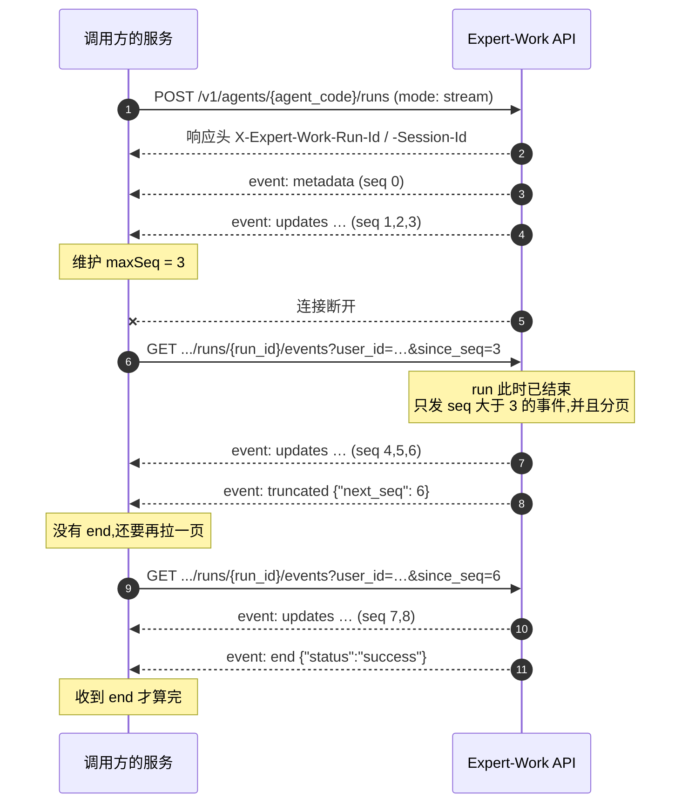

# 3 读懂 SSE 流

一次 Agent run 的执行过程，服务端以 SSE（Server-Sent Events）的形式推送给客户端。本章说明一次 run 会推送哪些事件、每个事件里有哪些字段、客户端拿到之后该做什么，以及连接中断后如何接回去。

3.5 给出一份可以直接使用的接收器骨架。

全章示例统一使用下列值。`{agent_code}` 在本章保持占位符形式，实际调用时替换成调用方自己的 Agent 编码。

| 占位符 | 本章使用的值 | 说明 |
|---|---|---|
| `{user_id}` | `u-123` | 发起这次 run 的终端用户 id |
| `{run_id}` | `67262572-5470-41a4-800d-592762ec679d` | 这次 run 的 id |
| 会话 id | `9f2c1a44-6d3b-4f18-9a70-2b5c8e1d0c37` | 请求体里的字段名是 `session_id`，SSE 事件里的字段名是 `thread_id`，两者是同一个值 |

## 3.1 一次 run 的事件流概览

`POST /v1/agents/{agent_code}/runs` 的请求体里带 `mode: "stream"` 时，响应体本身就是这条 SSE 流，不需要再调用其它接口。

下面是一次 run 的事件顺序。为了看清顺序，这里只保留了 `event:` 行；每个事件的 `data` 里有什么，见 3.4。

``` [事件流片段]
event: metadata      ← run 开始,事件里带 run_id 和会话 id
event: updates       ← 一个步骤完成:召回长期记忆
event: updates       ← 一个步骤完成:读取工作区文件
event: token         ← 模型开始逐字生成,一步之内有几十到上千个
event: token
event: token
event: updates       ← 模型这一步完成:决定调用一个工具
event: updates       ← 工具这一步完成:带回工具的执行结果
event: token         ← 下一步开始生成
event: token
event: updates       ← 模型这一步完成:给出最终答案
event: updates       ← 最后一个步骤完成:写回长期记忆
event: end           ← 流结束,事件里带这次 run 的最终状态
```

`token` 只在模型生成答案的那一步产生，模型之前的准备步骤只产生 `updates`。

一个 Agent 有哪些准备步骤，由租户管理员在管理控制台的配置决定。上面这个示例配置了长期记忆召回和工作区读取，所以流的开头是一个 `metadata` 加两个 `updates`；两项都没有配置的 Agent 从模型这一步直接开始，第一个 `token` 可以紧跟在 `metadata` 之后。**客户端不要假设流的开头有固定数量的 `updates`。**

整条流分三段：

1. 开场——一个 `metadata`，给出这次 run 的两个 id。
2. 中间——`token` 与 `updates` 交替出现，轮数取决于这次 run 走了几步；其间还可能出现 `plan`、`worker`、`guard`、`compaction`、`approval`、`retry`、`error`。
3. 收尾——一个 `end`，给出这次 run 的最终状态。

这三段里每次都会出现的只有 `metadata` 和 `end` 两个事件，`end` 的唯一例外是续传被分页截断，见 [3.6 断线重连与续传](#_3-6-断线重连与续传)。其余事件取决于这次 run 实际发生了什么：没有调用工具就没有工具那一步的 `updates`，没有触及限制就没有 `guard`。**客户端不要把「某个事件一定会到达」写进代码。**

## 3.2 事件的格式

本节说明每个事件在传输上的样子。其中会用到一个词：**续传**指断线重连之后，服务端把客户端未收到的那一段事件重新发送，操作步骤见 [3.6 断线重连与续传](#_3-6-断线重连与续传)。

### 一个事件三行

每个事件都是标准的 SSE 格式：一行 `id:`、一行 `event:`、一行 `data:`，最后用一个空行表示这个事件结束。

``` [事件流片段]
id: 1755229352138-0
event: metadata
data: {"run_id":"67262572-5470-41a4-800d-592762ec679d","thread_id":"9f2c1a44-6d3b-4f18-9a70-2b5c8e1d0c37"}

```

- `id:` 是事件的序号行，**不是每个事件都有**，见下文「带 id 的事件与断线续传」。
- `event:` 是事件名，取值见 3.3。
- `data:` 是一个 JSON 对象，始终在一行之内，不会跨行。

### 心跳行

心跳用来维持连接，并让客户端判断连接是否还活着。

- 谁发：服务端通过当前这条 SSE 连接发出。实时连接都会发，即 `mode: "stream"` 的响应流、`mode` 为 `stream` 的审批决策（`POST /v1/agents/{agent_code}/runs/{run_id}:decide`，见 [4.2 审批决策](./run-control#_4-2-审批决策)）的续跑事件流，以及 run 未结束时的事件接口（`GET /v1/agents/{agent_code}/runs/{run_id}/events`，见 [3.6 断线重连与续传](#_3-6-断线重连与续传)）；run 已结束后的事件续传不发，因为续传一次性返回、不会挂起等待。
- 什么时候发：连接上连续 15 秒没有任何事件时发一行；有事件时不发，任何一个事件都会把这个计时重新归零。
- 内容：一行以冒号开头的注释，不带 `event:` 和 `data:`，不占序号，断线后也不会补发。

``` [事件流片段]
: heartbeat

```

客户端的处理方式：

1. 解析时忽略以 `:` 开头的行，不要按事件处理，也不要按 JSON 解析。
2. 收到心跳不要改动续传位置，也就是重连时要传的 `since_seq` 参数（见 [3.6](#_3-6-断线重连与续传)）；心跳不参与它的计算。
3. 把它当作连接存活的信号。服务端没有规定「多久没有数据就算断开」；建议客户端把读超时设为 45 秒，也就是三个心跳周期，超时后按 3.6 的方式重连。3.5 的接收器示例使用的就是这个值，网络条件较差时可以调大。

### 带 id 的事件与断线续传

`id:` 的格式见下一节。

只有「run 本身发生的事」带 `id:`。服务端会记录这些事件，因此能够续传；其它事件不记录、不续传。

| 类别 | 事件 | 断线后会续传 |
|---|---|---|
| 带 `id:` | `metadata`、`updates`、`plan`、`worker`、`guard`、`compaction`、`approval`、`retry`、`error` | 会 |
| 不带 `id:` | `token`、`end`、`gap`、`truncated` | 不会 |

不带 `id:` 的四个事件，各自的原因：

- `token` 是模型逐字输出的即时预览。断线期间的 `token` 不会补发，完整内容以 `updates` 为准。
- `end` 是一条流自己的结束标记。重连之后会收到新的一个。
- `gap` 与 `truncated` 描述的是这条连接的状况，不是 run 的事件。

### 从 id 里取 seq

`id:` 由两段组成，中间用一个 `-` 连接：前半段是服务端的毫秒时间戳，后半段是 `seq`。

``` [事件流片段]
id: 1755229352138-0
      ↑ 毫秒时间戳    ↑ seq
```

`seq` 是这个事件在这次 run 里的序号，从 `0` 开始，也是续传参数 `since_seq` 唯一合法的取值来源（见 3.6）。不带 `id:` 的事件没有 `seq`，不参与续传位置的计算。

取 `seq` 时按**最后一个** `-` 切分，不要按第一个：

```js [示例代码]
// 前半段是纯数字时间戳,本身不含 "-";按最后一个 "-" 切分更稳妥
function seqOf(id) {
  if (!id) return null;                       // 没有 id: 行的事件不参与续传位置
  const n = Number(id.slice(id.lastIndexOf("-") + 1));
  return Number.isInteger(n) ? n : null;      // 格式不符合预期时按没有 seq 处理
}
```

::: warning 不要用完整的 id 字符串做去重键
`id` 的毫秒段在两次连接上不保证一致：实时连接和续传是两次独立读取服务端时钟，同一个事件的毫秒段可能相差 1 毫秒。这种情况不常见，但确实会发生。

去重键、幂等键，以及与调用方自己系统里记录的对应关系，都只使用 `seq`。使用完整的 `id` 字符串会让同一个事件被当成两个处理，而且这类问题是间歇性的，难以复现。
:::

## 3.3 事件一览

下表按事件在流里实际出现的先后排列。`token` 排在 `updates` 之前是就一步之内而言的：模型先逐字输出，这一步才产出 `updates`。第一个 `token` 出现在流的第几位，取决于这个 Agent 有几个准备步骤（见 3.1）——准备步骤只产生 `updates`，都排在第一个 `token` 之前。

最后两个事件描述的是这条连接的状况，不是 run 发生的事，所以排在顺序之外，它们只在断线重连或续传时出现。

每个事件的 `data` 有哪些字段，以 3.4 对应小节为准。

| 事件 | 出现时机 | 客户端处理 |
|---|---|---|
| [`metadata`](#metadata) | run 开始时，一次 | 保存 `run_id` 和会话 id，重连和下一轮对话都要用 |
| [`token`](#token) | 模型逐字生成时，多次 | 作为打字机预览显示，不作为状态依据 |
| [`updates`](#updates) | 每个步骤完成时，一次 | 用它重建对话内容与工具调用的显示 |
| [`plan`](#plan) | Agent 创建或修改计划时；run 开始时会话已有计划也发一次 | 用它整个替换本地保存的计划，渲染任务列表 |
| [`worker`](#worker) | Agent 委托子任务时，开始 / 每步 / 结束各一次 | 在对应的工具调用下方展示子任务进度 |
| [`guard`](#guard) | 平台的限制预警或触发时 | 显示「已到上限」的提示，不按错误显示 |
| [`compaction`](#compaction) | 上下文过长被自动压缩时 | 显示一句「已自动整理历史」的提示 |
| [`approval`](#approval) | run 停下等待人工审批时 | 立刻保存这条事件，并显示审批界面 |
| [`retry`](#retry) | 遇到平台可以自动重试的失败时 | 显示「正在重试」，不要中断处理、不要自行重连 |
| [`error`](#error) | run 失败时 | 按失败显示 |
| [`end`](#end) | 流正常收尾时，最后一个 | 按 `status` 的四个取值分别处理 |
| [`gap`](#gap) | 有一段事件在这条连接上取不到时 | 标记这段缺失，继续处理后面的事件 |
| [`truncated`](#truncated) | 续传的一页装不下时 | 用它给出的 `next_seq` 拉下一页，流尚未结束 |

::: warning 收到不认识的事件名时忽略它
上表列出的是当前会遇到的 13 个事件，事件名是开放取值，平台后续可能新增。把未知事件写成异常分支的客户端，会在平台新增事件的那一天失败。正确做法是查不到处理函数就跳过这一个事件，继续读流。
:::

## 3.4 每个事件怎么处理

下面十一个小节的顺序与 3.3 的表一致，`gap` 与 `truncated` 放在 3.6。每个小节按同一顺序展开：什么时候发 → `data` 字段 → 示例 → 客户端怎么处理。

`updates` 与 `worker` 两节多几个小节：`updates` 多出「messages 里的两种消息」「工具调用与结果的配对」「工具结果文本的还原」三节，`worker` 的 `data` 随 `kind` 变化，三种 `kind` 各占一节。

本章的示例代码都是原生 JavaScript，共用下面这一段，后面不再重复：

```js [示例代码的公共定义]
const $ = (sel) => document.querySelector(sel);
const esc = (s) => String(s).replace(/[<&]/g, (c) => (c === "<" ? "&lt;" : "&amp;"));

// 客户端自己的界面状态,每个示例只使用其中一部分
const store = {
  runId: null, sessionId: null,
  plan: null,              // 当前计划,收到 plan 事件整段覆盖
  steps: new Map(),        // 步骤编号 → 这一步的预览文本
  toolCalls: new Map(),    // tool_call_id → 这次工具调用的显示区块
  workers: new Map(),      // worker_id → 这个子任务的事件列表
};
```

### metadata

#### 什么时候发

服务端在 run 创建之后立即通过当前这条 SSE 连接发出，是整条流的第一个事件，只发一次。客户端要做的是把事件里的两个 id 保存下来：取消 run、提交审批决策、断线重连、下一轮对话都需要它们。

#### data 字段

| 字段 | 类型 | 说明 |
|---|---|---|
| `run_id` | string | 这次 run 的 id，格式是 UUID。取消 run、查询审批、断线重连都要用它 |
| `thread_id` | string | 这段会话的 id，格式是 UUID。下一轮对话把它填进请求体的 `session_id`，两个字段名指的是同一个值 |

#### 示例

``` [事件流片段]
id: 1755229352138-0
event: metadata
data: {"run_id":"67262572-5470-41a4-800d-592762ec679d","thread_id":"9f2c1a44-6d3b-4f18-9a70-2b5c8e1d0c37"}
```

#### 客户端怎么处理

这个事件没有可显示的内容，但**两个 id 必须保存下来**，后面的接口都要用。

```js [示例代码]
function onMetadata(data) {
  store.runId = data.run_id;
  store.sessionId = data.thread_id;

  // 保存到本地,页面刷新后可以接回同一个 run
  localStorage.setItem("lastRunId", data.run_id);
  localStorage.setItem("sessionId", data.thread_id);

  // 取得 run_id 之后才能启用取消按钮
  $("#cancel-btn").disabled = false;
  $("#status").textContent = "运行中…";
}
```

同样这两个值也出现在响应头 `X-Expert-Work-Run-Id` 与 `X-Expert-Work-Session-Id` 里。响应头先于事件到达，能读到响应头时优先使用响应头；跨源调用未暴露响应头时以这个事件为准。

### token

#### 什么时候发

模型逐字生成答案的过程中，服务端把已脱敏的片段一段段推送到当前这条连接，一步之内会发很多次。只有实时连接有 `token`：断线重连之后，断连期间的 `token` 不会补发。

下面四种情况下一个 `token` 都不会出现，决定权分别在四个不同的角色：

- 调用方：这次 run 使用 `mode: "queue"`，响应是 202，本身不是 SSE 流；要取得逐字预览只能在 run 未结束时接上[事件接口](#_3-6-断线重连与续传)，run 结束后的续传不发 `token`。
- 平台：这次回答命中了缓存，没有真正调用模型。
- 模型：这个模型不支持流式输出。
- 租户管理员：他为这个 Agent 开启了输出内容的整体安全审查，模型答完要先整体判定再放行，因此没有逐字输出。

因此，**打字机效果是可选增强，不能作为唯一的显示路径**。客户端必须能在一个 `token` 都收不到的情况下，只依靠 `updates` 完整显示整轮对话。

#### data 字段

`data` 里带哪些字段随 `channel` 变化，下表在说明里注明。

| 字段 | 类型 | 说明 |
|---|---|---|
| `step` | integer | 这一小段属于第几步，与 `updates` 里 `agent` 这一键的 `step_count` 是同一个编号。取值从 `1` 开始。三种 `channel` 都有 |
| `channel` | string | 这一小段属于哪条内容通道。取值：`content`（答案正文）/ `reasoning`（模型的思考过程，只有推理类模型有，走独立的一路）/ `tool_args`（模型开始发起一次工具调用）。只有这三个取值 |
| `text` | string | 已经过内容安全脱敏的文本片段，可能是空串。只有 `content` 和 `reasoning` 带此字段 |
| `tool_index` | integer | 这是本步里第几个并行的工具调用，从 `0` 开始。只有 `tool_args` 带此字段 |
| `name` | string | 工具名。同一个 `tool_index` 只发一次，即第一次出现这个调用的时候。只有 `tool_args` 带此字段 |

`tool_args` 只给出这次调用的序号和工具名，没有参数内容，完整参数出现在这一步的 `updates` 里。客户端可以先显示工具卡，也就是界面上代表这次工具调用的那张卡片，先只放工具名和一个等待指示，参数等 `updates` 到达后再填入。

#### 示例

``` [事件流片段]
event: token
data: {"step":1,"channel":"content","text":"好的,我先"}

event: token
data: {"step":1,"channel":"reasoning","text":"用户要我先写文件再读回来"}

event: token
data: {"step":1,"channel":"tool_args","tool_index":0,"name":"write_file"}
```

#### 客户端怎么处理

把 `token` 当作纯预览：按 `step` 累积成打字机效果，同一个 `step` 的 `updates` 到达后整段替换。

```js [示例代码]
function onToken(data) {
  if (data.channel === "tool_args") {
    // 先显示工具卡的外壳,参数等 updates 到达后再填入
    $("#timeline").insertAdjacentHTML("beforeend",
      `<div class="tool-card pending" data-idx="${data.tool_index}">
         调用 ${esc(data.name)}<span class="spinner"></span>
       </div>`);
    return;
  }
  // content 与 reasoning 分别累积,按 step 分组
  const key = `${data.step}:${data.channel}`;
  store.steps.set(key, (store.steps.get(key) ?? "") + data.text);

  const box = $(`#step-${data.step}-${data.channel}`) ?? (() => {
    $("#timeline").insertAdjacentHTML("beforeend",
      `<div id="step-${data.step}-${data.channel}" class="${data.channel}"></div>`);
    return $(`#step-${data.step}-${data.channel}`);
  })();
  box.textContent = store.steps.get(key);   // 逐字显示
}
```

::: warning 不要用 token 重建状态
一次 run 里 `token` 事件的数量通常远多于 `updates`，而且断连期间的 `token` 一个也补不回来，重连之后只会收到新产生的。

界面的真实状态必须由 `updates` 重建，`token` 只用于视觉预览。
:::

::: warning 内容被安全策略拦下时 updates 会推翻已经累积的预览
`updates` 里的内容才是经过完整输出安全审查的最终结果。如果这一步被安全策略拦下，`updates` 里会是一段拒答文案。

拿到 `updates` 时直接整段覆盖同一步累积的预览，不要把两者拼接显示，否则用户会同时看到被拦下的内容和拒答文案。
:::

### updates

#### 什么时候发

run 的每一个步骤完成时，服务端通过当前这条连接发出一次。它是这一步的最终结果：对话气泡、工具卡、步数都以它为准重建。

#### data 字段

`data` 是一个 JSON 对象。每个键表示「这一步由谁完成」，键对应的值是这一步的产出。

```js [data 的结构]
{ "agent": { "messages": [ … ], "step_count": 1, "_duration_ms": 2140 } }
//  ↑ 这一步由谁完成    ↑ 这一步的产出
```

键的取值：

| 键 | 由谁完成 | 出现时机 |
|---|---|---|
| `agent` | 模型：生成回答，或决定调用工具 | 每次 run 都有 |
| `tools` | 工具：执行模型发起的调用 | 模型调用了工具时 |
| `memory_recall` | 平台：召回相关的长期记忆 | Agent 开启了长期记忆 |
| `workspace_ingest` | 平台：读取工作区文件 | Agent 接入了工作区 |
| `planner` | 平台：生成或更新计划 | Agent 使用「先规划再执行」模式 |
| `reflect` | 平台：对结果做自检 | Agent 配置了反思环节 |
| `memory_writeback` | 平台：把值得记住的内容写回长期记忆 | Agent 开启了记忆回写 |

一个 Agent 会出现哪些键，由租户管理员在管理控制台的配置决定。平台后续可能新增键；客户端遇到不认识的键应忽略，不要报错。

三条处理规则：

- 一个事件通常只有一个键；存在并行分支时会有多个。请遍历全部键，不要只取第一个。
- 键对应的值可能是 `null`，表示这一步没有产出（平台的辅助步骤常常如此）。读取 `messages` 前先判断是否为 `null`。
- 值里除下表三个字段之外的键是平台内部使用的，请忽略。

值的字段（值不为 `null` 时）：

| 字段 | 类型 | 说明 |
|---|---|---|
| `messages` | array | 这一步新产生的消息，可能为空数组。每一项的结构见下文「messages 里的两种消息」 |
| `step_count` | integer | 这一步的编号，从 1 开始。只有 `agent` 这一键的值带此字段 |
| `_duration_ms` | integer | 距上一个 `updates` 事件经过的毫秒数，非负整数（第一个 `updates` 从 run 开始算起）。每个不为 `null` 的值都带这个字段，`token` 等其它事件不重置这个计时 |

#### messages 里的两种消息

数组里的每一项按 `type` 分两种。

##### type 为 ai 的消息

由 `agent` 这一步产出，是模型这一步的结果。

| 字段 | 类型 | 说明 |
|---|---|---|
| `content` | string | 这一步的文本产出。空串是正常的：这一步只发起工具调用时就是空串，既不表示异常，也不表示回答结束 |
| `tool_calls` | array | 这一步发起的工具调用，每一项是 `{name, args, id}`，可能为空数组。空数组表示这一步不再调用工具 |
| `response_metadata.finish_reason` | string | 模型给出的停止原因，由模型厂商原样透传。开放取值，并且在一部分模型上整个字段不存在；当前常见取值见下表 |
| `usage_metadata` | object | 这一步的 token 用量，可以直接用于用量展示 |
| `additional_kwargs.reasoning_content` | string | 模型的思考过程原文。不是每个模型都有，也不保证长期存在，不要作为结构化字段依赖 |

`finish_reason` 当前常见的取值：

| 取值 | 含义 |
|---|---|
| `stop` | 模型认为这一步已经说完 |
| `tool_calls` | 模型这一步要调用工具，还要继续下一步 |
| `length` | 输出被这次调用的最大长度截断 |
| `content_filter` | 被模型厂商自己的内容策略拦下 |
| `stream_idle_timeout` | 由平台附加的取值：流式读取长时间没有新内容，平台主动结束了这次流式读取 |

遇到未列出的取值照常显示，不要报错。另有两条判据不要混用：

- 判断这一轮对话是否结束，看 `end` 事件的 `status`，不要看 `finish_reason`，后者可能整个不存在。
- 判断这一步是否还要继续，看 `tool_calls` 是否为空数组。

##### type 为 tool 的消息

由 `tools` 这一步产出，是工具的执行结果。

| 字段 | 类型 | 说明 |
|---|---|---|
| `name` | string | 工具名 |
| `tool_call_id` | string | 与同一次调用的 `ai.tool_calls[].id` 相等。用法见下文「工具调用与结果的配对」 |
| `content` | string | 工具执行结果的文本。带有防注入包装，直接显示是乱码，还原方法见下文「工具结果文本的还原」 |
| `status` | string | 这次工具调用的结果。取值：`success`（工具正常返回，这是默认值）/ `error`（这次调用失败或被平台拦下）。只有这两个取值 |
| `artifact` | object | 工具产出的结构化数据，结构随工具而定，也可能整个字段不存在。能够解析就使用，不能解析就忽略 |
| `additional_kwargs.duration_ms` | integer | 这个工具本身执行了多少毫秒 |

`status` 为 `error` 时，客户端不需要按成因分支，统一按「这一步的工具调用失败」显示。常见成因有四类，排查时可以对照：

1. 平台的安全策略拦下了这次调用。
2. 工具本身执行时报错。
3. 模型给出的参数没有通过这个工具的参数校验。
4. 这次调用需要人工审批，审批被拒绝。

#### 示例

模型这一步产出的第一条消息：

```json [updates 里 agent 这一步的第一条消息]
{
  "content": "",
  "additional_kwargs": {
    "reasoning_content": "先写文件,再读回来确认内容。",
    "expert_work_created_at": "2026-08-15T03:42:32.138398+00:00",
    "expert_work_run_id": "67262572-5470-41a4-800d-592762ec679d"
  },
  "response_metadata": {"finish_reason": "tool_calls", "model_name": "glm-5.2"},
  "type": "ai",
  "name": null,
  "id": "19bad813-1cf0-4b2c-8f4a-6c9d0e7a5b31",
  "tool_calls": [
    {"name": "write_file", "args": {"path": "note.txt", "content": "hello"}, "id": "call_de58e676916d442d925bff27", "type": "tool_call"}
  ],
  "invalid_tool_calls": [],
  "usage_metadata": {
    "input_tokens": 6027, "output_tokens": 178, "total_tokens": 6205,
    "input_token_details": {"cache_read": 5952}, "output_token_details": {"reasoning": 156}
  }
}
```

紧接着，工具这一步产出的第一条消息：

```json [updates 里 tools 这一步的第一条消息]
{
  "content": "«UNTRUSTED nonce=8f3a2c1e»\nWrote▁ 5▁ bytes▁ to▁ note.txt\n«/UNTRUSTED nonce=8f3a2c1e»",
  "additional_kwargs": {"duration_ms": 1848},
  "response_metadata": {},
  "type": "tool",
  "name": "write_file",
  "id": "89479877-2a51-4e6b-b0c3-1d8f7a4e2c95",
  "tool_call_id": "call_de58e676916d442d925bff27",
  "artifact": {"path": "note.txt", "content_hash": "aded7388c0f1b2a34d5e6f708192a3b4c5d6e7f8091a2b3c4d5e6f7081920a3b4", "size": 5},
  "status": "success"
}
```

`content` 里的 `nonce=8f3a2c1e` 是平台为每条消息各自随机生成的值，示例里的取值只用于说明，客户端按任意值匹配、不要写死，还原方法见下文「工具结果文本的还原」。

某一步没有产出时，这个键对应的值是 `null`：

``` [事件流片段]
event: updates
data: {"workspace_ingest":null}
```

#### 工具调用与结果的配对

界面把「调用」和「结果」连成一条，只能依靠这一对 id：上面 `ai` 消息里 `tool_calls[].id` 是 `call_de58e676916d442d925bff27`，`tool` 消息里 `tool_call_id` 是同一个值，两者是同一次工具调用的两半。

`tool_calls` 是数组，一个模型步骤可以发起多个并行调用。**配对时按 id 逐个对应，不要按数组下标对应。**

#### 工具结果文本的还原

`tool` 消息的 `content` 经过防注入包装，直接显示的话，用户看到的是夹着围栏和特殊字形的乱码：

``` [工具结果的原文]
«UNTRUSTED nonce=8f3a2c1e»
Wrote▁ 5▁ bytes▁ to▁ note.txt
«/UNTRUSTED nonce=8f3a2c1e»
```

包装分两部分：

1. 围栏——前后各包一层 `«UNTRUSTED nonce=…»` 与 `«/UNTRUSTED nonce=…»`。里面的随机串由平台每次生成，**不要把它写死在代码里，也不要根据它的取值做任何判断**，用正则匹配任意值即可。
2. 空白标记——每一段连续空白被替换成一个 U+2581 字形（`▁`）加一个空格。所以 `Wrote 5 bytes to note.txt` 变成了 `Wrote▁ 5▁ bytes▁ to▁ note.txt`。

还原分三步：

```js [示例代码]
const OPEN = /«UNTRUSTED nonce=[^»]*»\n?/g;
const CLOSE = /\n?«\/UNTRUSTED nonce=[^»]*»/g;

function unwrapToolResult(raw) {
  const wrapped = OPEN.test(raw);              // 围栏在不在本身是有用的信号
  OPEN.lastIndex = 0;                          // test 用了 /g,用完要归零
  const text = raw.replace(OPEN, "").replace(CLOSE, "")
                  .replace(/▁/g, "");          // 只删字形,后面那个空格保留
  return { text, untrusted: wrapped };
}
```

这个还原是有损的：原文里的换行在标记空白时也变成了 `▁ `，删掉字形之后剩下的是一个空格，**原文的换行无法恢复**。

::: warning 来自外部的标记不要丢
围栏在不在，意味着这段内容是否来自外部、是否可信。建议像上面的示例那样，在还原之前先记一个标志位。

界面上给这类内容加一个「来自外部工具」的角标，不要只留下还原后的文本。
:::

#### 客户端怎么处理

按 `type` 分流：`ai` 消息显示成对话气泡，`tool` 消息按 `tool_call_id` 找到对应的工具卡填入。

```js [示例代码]
function onUpdates(data) {
  for (const produced of Object.values(data)) {   // 遍历全部键
    if (produced === null) continue;              // 这一步没有产出
    for (const msg of produced.messages ?? []) {
      if (msg.type === "ai") {
        // 这一步的最终文本,直接覆盖 token 累积的预览
        const step = produced.step_count;
        const box = $(`#step-${step}-content`);
        if (box) box.textContent = msg.content;
        // 每个工具调用先占一张卡,用 id 作为键
        for (const call of msg.tool_calls ?? []) {
          $("#timeline").insertAdjacentHTML("beforeend",
            `<div class="tool-card" id="tc-${call.id}">
               <b>${esc(call.name)}</b>
               <pre>${esc(JSON.stringify(call.args, null, 2))}</pre>
               <div class="result">执行中…</div>
             </div>`);
          store.toolCalls.set(call.id, $(`#tc-${call.id}`));
        }
      } else if (msg.type === "tool") {
        // 结果填回同 id 的那张卡,不要按数组下标配对
        const card = store.toolCalls.get(msg.tool_call_id);
        if (!card) continue;
        const { text, untrusted } = unwrapToolResult(msg.content);
        card.classList.toggle("failed", msg.status !== "success");
        card.querySelector(".result").textContent =
          (untrusted ? "[来自外部工具] " : "") + text;
      }
    }
  }
}
```

### plan

#### 什么时候发

Agent 在这次 run 里创建或修改了计划时，服务端通过当前这条连接发一次，内容是修改后的整份计划。另外，run 开始时如果这段会话已经有计划（上一轮留下的），服务端会在 `metadata` 之后、第一个步骤之前先发一次，内容是当前这份计划。

计划是会话级的：同一段会话里后续的 run 沿用它并继续修改。是否使用计划由 Agent 自行决定，简单任务通常没有这个事件。

#### data 字段

| 字段 | 类型 | 说明 |
|---|---|---|
| `goal` | string | 计划要达成的目标，一句话 |
| `steps` | array | 有序的步骤列表，每一项的字段见下表 |

`steps` 的每一项：

| 字段 | 类型 | 说明 |
|---|---|---|
| `id` | string | 步骤标识，同一份计划内唯一 |
| `description` | string | 这一步做什么 |
| `status` | string | 执行状态。取值：`pending`（未开始）/ `in_progress`（进行中）/ `completed`（已完成） |

#### 示例

``` [事件流片段]
id: 1755229384902-9
event: plan
data: {"goal":"给客户 C-1024 出一份续约建议","steps":[{"id":"1","description":"查客户档案","status":"completed"},{"id":"2","description":"分析近半年工单","status":"in_progress"},{"id":"3","description":"出建议","status":"pending"}]}
```

#### 客户端怎么处理

每一条 `plan` 都是完整的计划，不是增量。收到就用它整个替换本地保存的那份，以最新一条为准；不要按 `id` 做合并，也不要把多条事件的 `steps` 拼接。断线续传会重放这些事件，按上面的规则处理天然幂等。

```js [示例代码]
function onPlan(data) {
  store.plan = data;                      // 整段覆盖,以最新一条为准
  const done = data.steps.filter((s) => s.status === "completed").length;
  $("#plan").innerHTML =
    `<div class="plan">
       <div class="plan-title">${esc(data.goal)}(${done}/${data.steps.length})</div>
       ${data.steps.map((s) => `<div class="step ${s.status}">${esc(s.description)}</div>`).join("")}
     </div>`;
}
```

### worker

#### 什么时候发

子任务是 Agent 把一部分工作交给一个子任务去做的机制。委托由模型自己发起：它调用了一个会派生子任务的工具，可能是 Agent 配置里声明的静态子 Agent 工具，也可能是内建的动态派子任务工具。子任务开始执行后，服务端把它的开始、每一步、结束各推送一次到当前这条连接。

三条需要知道的事实：

- 「每一步」是子任务自己的步。子任务每完成一个步骤发一条 `kind` 为 `update` 的事件，与父 run 走到第几步无关。
- 配对依靠 `parent_tool_call_id`。子任务就是那一次工具调用的执行体，所以这个值与 `updates` 里 `ai.tool_calls[].id` 相同，客户端据此把子时间线（工具卡下方展示子任务进展的那一段）挂到对应的工具卡下面。
- 委托层级是 1 到 3 层，平台的硬上限是 3 层。

`worker` 不是与 `updates` 并列的另一套结果通道，而是把 Agent 的内部动作展示出来。**一个步骤的最终结果仍然只以 `updates` 为准。**

客户端要做的是显示，另加两条容错规则：

- 没有收到 `kind` 为 `start` 的事件时，忽略这个子任务后续的 `update` 与 `end`。3.5 的示例代码在这里直接返回，是有意的。
- `kind` 为 `end` 的事件不保证一定到达：子任务异常终止时不发，那张卡会一直停在「运行中」。父 run 的 `end` 到达时，把所有还没收尾的子任务卡标为「结果未知」。

#### data 字段

每个 `worker` 事件都带同一组外层字段，其中 `data` 的结构再按 `kind` 分。

| 字段 | 类型 | 说明 |
|---|---|---|
| `worker_id` | string | 这个子任务实例的唯一标识 |
| `parent_worker_id` | string 或 null | 委托出这个子任务的上一级子任务。`depth` 为 `1` 时恒为 `null`，表示直接挂在主 run 下；`depth` 大于 `1` 时是上一级的 `worker_id` |
| `parent_tool_call_id` | string 或 null | 触发这个子任务的那次工具调用的 id，与 `updates` 里 `ai.tool_calls[].id` 相同。客户端把子时间线挂到对应工具卡下面，依靠的就是这个字段 |
| `label` | string | 这个子任务的可读标签。取值随产生路径而定，见下表 |
| `agent_ref` | string | 这个子任务使用的是哪个 Agent。取值随产生路径而定，见下表 |
| `depth` | integer | 委托层级。取值 `1` / `2` / `3`，直接挂在主 run 下的是 `1`，平台硬上限是 `3`；界面按 `depth` 计算缩进时可以照这个上界排版 |
| `kind` | string | 这条事件属于子任务的哪个阶段。取值：`start`（子任务开始）/ `update`（子任务完成了一步）/ `end`（子任务结束）。只有这三个取值 |
| `wseq` | integer | 这个子任务自己的序号，从 `0` 开始：`0` 是 `start`，中间是 `update`，最后一个是 `end`。它不是 SSE 的 `seq`，见下面的提示 |
| `data` | object | 随 `kind` 变化的部分，三种结构见下面三节 |

`label`、`agent_ref` 与 `start` 里的 `role` 由子任务的产生路径成套决定，两条路径的取值不会混合出现：

| 产生路径 | `label` | `agent_ref` | `start` 里的 `role` |
|---|---|---|---|
| 静态子 Agent | 这个子 Agent 的工具名 | 形如 `{name}@{version}`，即子 Agent 名加版本号 | 恒为 `null` |
| 动态派子任务 | 恒为 `spawn_worker` | 形如 `dynamic:{role}`；模型没有给出角色时是 `dynamic:general` | 模型自己写的一段自由文本，开放取值；内容为空白时是 `null` |

因此，`role` 不为 `null` 的子任务一定来自动态派子任务这条路径。

::: warning wseq 不是 SSE 的 seq
`wseq` 是单个子任务自己的序号，作用域只在这个子任务内部；同一次 run 里不同子任务的 `wseq` 各自独立计数，互不相干。

断线重连与去重只使用事件的 `seq`（见 3.2），`wseq` 不参与。
:::

#### kind 为 start 时的 data

| 字段 | 类型 | 说明 |
|---|---|---|
| `task_excerpt` | string | 委托给这个子任务的任务描述摘要。上限 500 字符，被截断时末尾补一个 `…`，所以最长是 501 个字符 |
| `role` | string 或 null | 这个子任务的角色。取值见上面的产生路径表 |
| `max_steps` | integer | 这个子任务允许执行的最大步数，正整数 |

#### kind 为 update 时的 data

| 字段 | 类型 | 说明 |
|---|---|---|
| `node` | string | 这一步由谁完成。取值与 [`updates` 的键](#updates)相同 |
| `_duration_ms` | integer | 距这个子任务上一个事件经过的毫秒数，非负整数 |
| `step_count` | integer | 到这一步为止的步数，正整数。只有 `node` 为 `agent` 的事件带此字段 |
| `messages` | array | 这一步新产生消息的摘要，不是 `updates` 里的原样消息。每一项的结构见下文 |

`messages` 里的每一项都是摘要，字段名带 `_excerpt` 后缀，超出上限的部分被截掉、末尾补一个 `…`。三个上限是：正文 500 字符、工具参数 200 字符、工具结果 500 字符；补上的 `…` 也算一个字符，所以截断后的长度是 501 / 201 / 501，按长度做校验时要算上它。

摘要按 `type` 分三种结构：

- `ai`——`{type, content_excerpt}`；只有这一步真的发起了工具调用时，才多一个 `tool_calls: [{name, args_excerpt}]`。
- `tool`——`{type, name, tool_result_excerpt}`；沙箱执行类工具还多一个 `exec: {exit_code, timed_out, stdout_excerpt, stderr_excerpt}`。
- 其余 `type`——`{type, content_excerpt}`。

`_excerpt` 字段没有去掉防注入包装。显示给用户之前要按上文「工具结果文本的还原」处理，做法完全相同。

#### kind 为 end 时的 data

| 字段 | 类型 | 说明 |
|---|---|---|
| `outcome` | string | 这个子任务结束时的结果。取值：`success`（正常执行完成）/ `max_steps`（把自己的步数预算用完，这是部分结果而不是失败，父 Agent 会带着这份部分进展继续推理）/ `cancelled`（执行中被取消）。只有这三个取值 |
| `iteration_used` | integer | 实际用掉的步数，非负整数 |
| `llm_call_count` | integer | 这个子任务内部发起的模型调用次数，非负整数 |
| `wall_clock_ms` | integer | 这个子任务从开始到结束的墙钟耗时，单位毫秒，非负整数 |

这三个 `outcome` 覆盖的是正常收尾的三种情况。子任务因为未捕获的异常终止时，平台不发这条事件，这个子任务就此没有后续事件；客户端的处置方式见本节「什么时候发」的第二条容错规则。

#### 示例

下面三条来自动态派子任务这条路径：`label` 是 `spawn_worker`、`agent_ref` 是 `dynamic:researcher`、`role` 是模型自己写的 `researcher`，三个字段成套对应。静态子 Agent 那条路径上，这三个值分别是子 Agent 的工具名、`{name}@{version}` 和 `null`。

``` [事件流片段]
id: 1755229358102-6
event: worker
data: {"worker_id":"wk-7c31","parent_worker_id":null,"parent_tool_call_id":"call_de58e676916d442d925bff27","label":"spawn_worker","agent_ref":"dynamic:researcher","depth":1,"kind":"start","wseq":0,"data":{"task_excerpt":"检索 2026 年国内新能源汽车出口数据,汇总成三条要点","role":"researcher","max_steps":12}}

id: 1755229361540-7
event: worker
data: {"worker_id":"wk-7c31","parent_worker_id":null,"parent_tool_call_id":"call_de58e676916d442d925bff27","label":"spawn_worker","agent_ref":"dynamic:researcher","depth":1,"kind":"update","wseq":1,"data":{"node":"agent","_duration_ms":3438,"step_count":1,"messages":[{"type":"ai","content_excerpt":"我先查一下海关总署的公开数据。","tool_calls":[{"name":"http_request","args_excerpt":"{\"url\": \"https://example.com/report\"}"}]}]}}

id: 1755229372881-9
event: worker
data: {"worker_id":"wk-7c31","parent_worker_id":null,"parent_tool_call_id":"call_de58e676916d442d925bff27","label":"spawn_worker","agent_ref":"dynamic:researcher","depth":1,"kind":"end","wseq":2,"data":{"outcome":"success","iteration_used":2,"llm_call_count":2,"wall_clock_ms":14779}}
```

#### 客户端怎么处理

把子任务的时间线挂到 `parent_tool_call_id` 对应的那张工具卡下面。

```js [示例代码]
// w 是这个事件 data 的整体,即上表列出的外层字段;w.data 是随 kind 变化的部分
function onWorker(w) {
  if (w.kind === "start") {
    const host = store.toolCalls.get(w.parent_tool_call_id) ?? $("#timeline");
    host.insertAdjacentHTML("beforeend",
      `<div class="worker" id="wk-${w.worker_id}" style="margin-left:${w.depth * 16}px">
         <b>${esc(w.label)}</b> <span class="agent">${esc(w.agent_ref)}</span>
         <div class="lines"></div><div class="tail">运行中…</div>
       </div>`);
    store.workers.set(w.worker_id, $(`#wk-${w.worker_id}`));
    return;
  }
  const box = store.workers.get(w.worker_id);
  if (!box) return;                                    // 没收到 start 就忽略后续

  if (w.kind === "update") {
    for (const m of w.data.messages ?? []) {
      const raw = m.content_excerpt ?? m.tool_result_excerpt ?? "";
      const { text } = unwrapToolResult(raw);          // 摘要同样要还原
      box.querySelector(".lines").insertAdjacentHTML("beforeend",
        `<div class="line">${esc(m.name ?? m.type)}: ${esc(text)}</div>`);
    }
  } else if (w.kind === "end") {
    box.querySelector(".tail").textContent =
      `${w.data.outcome} · ${w.data.iteration_used} 步 · ${w.data.wall_clock_ms} ms`;
  }
}
```

### guard

#### 什么时候发

平台的三道限制预警或者真正触发时，服务端发一次到当前这条连接。三道限制是：步数上限、token 预算（这里的 token 指模型用量单位，不是 `token` 事件）、连续多步没有实质进展。

- 上限由谁设定：步数上限和无进展上限来自这个 Agent 的配置，token 预算由平台为这次 run 设定。调用方都不能修改，需要调整要联系租户管理员。
- 触发之后发生了什么：平台给模型追加一条收尾指令，并且这一步不再提供任何工具，模型只能直接作答。用户仍然会拿到一段完整回答，只是后续推理被截断。
- 客户端要做什么：按「已到上限」的提示显示，不要按错误显示；也不要据此判定这次 run 成功，最终状态以 `end` 的 `status` 为准。

#### data 字段

| 字段 | 类型 | 说明 |
|---|---|---|
| `kind` | string | 这条事件是预警还是已经触发。取值：`tripped`（限制触发，平台已经收尾）/ `warning`（预警，尚未触发）。只有这两个取值 |
| `guard` | string | 是哪一道限制。取值：`max_steps`（步数上限）/ `token_budget`（token 预算）/ `no_progress`（连续多步没有实质进展）。只有这三个取值 |
| `detail` | object | 这道限制当前的两个数值，字段名随 `guard` 变化，见下表 |

`detail` 里的字段：

| `guard` 取值 | `detail` 字段 | 类型 | 说明 |
|---|---|---|---|
| `max_steps` | `steps` | integer | 已经执行的步数 |
| `max_steps` | `max` | integer | 这个 Agent 配置的步数上限 |
| `token_budget` | `spent` | integer | 这棵委托树累计消耗的 token |
| `token_budget` | `limit` | integer | 平台为这次 run 设定的 token 预算 |
| `no_progress` | `streak` | integer | 连续多少步没有实质进展 |
| `no_progress` | `max` | integer | 允许的连续无进展步数上限 |

三道限制的 `tripped` 出自同一个判断，因此同一步可能一次到达两条或三条 `tripped`，客户端不要假设一轮只有一条。

三道限制里只有 `token_budget` 会发 `warning`：用量达到预算 80% 时发一次，整棵委托树只发一次。`max_steps` 与 `no_progress` 当前只有 `tripped`，没有预警，不要写一个等待它们预警的分支，那个分支不会被触发。`warning` 比 `tripped` 轻，只表示接近上限，不代表任何收尾动作已经发生。

「不按错误显示」只适用于 `guard` 事件本身。`guard` 为 `max_steps` 的那一路收尾之后，这次 run 在 `end` 事件里的 `status` 仍然是 `error`。**run 成功还是失败，以 `end` 的 `status` 为准。**

#### 示例

``` [事件流片段]
id: 1755229380117-14
event: guard
data: {"kind":"warning","guard":"token_budget","detail":{"spent":81920,"limit":102400}}

id: 1755229391663-21
event: guard
data: {"kind":"tripped","guard":"max_steps","detail":{"steps":32,"max":32}}
```

#### 客户端怎么处理

按提示样式显示，不要按错误样式显示。

```js [示例代码]
const GUARD_TEXT = {
  max_steps:    (d) => `已执行 ${d.steps} 步,达到上限 ${d.max} 步`,
  token_budget: (d) => `已用 ${d.spent} token,预算 ${d.limit}`,
  no_progress:  (d) => `连续 ${d.streak} 步没有实质进展(上限 ${d.max})`,
};

function onGuard(data) {
  const detail = (GUARD_TEXT[data.guard] ?? (() => ""))(data.detail);
  const tripped = data.kind === "tripped";
  $("#timeline").insertAdjacentHTML("beforeend",
    `<div class="notice ${tripped ? "warn" : "hint"}">
       ${tripped ? "本轮已由平台收尾" : "接近上限"}:${esc(detail)}
     </div>`);
  // 样式用「提示」而不是「错误」:这不是失败
}
```

### compaction

#### 什么时候发

上下文过长时，平台自动把早于当前请求的历史对话压缩成一段摘要；这个动作发生时，服务端发一次到当前这条连接。压缩由平台自动进行，没有人工介入，调用方也没有开关可以控制。

客户端要做的只有一件事：给用户一句轻提示。不要做成模态弹窗，长会话里它会反复出现。

#### data 字段

| 字段 | 类型 | 说明 |
|---|---|---|
| `passes` | integer | 这次压缩成功完成了几轮摘要。取值是正整数；一轮都没有成功时整个事件不发 |
| `tokens_before` | integer | 压缩前的上下文大小，是估算值，非负整数 |
| `tokens_after` | integer | 压缩后的上下文大小，是估算值，非负整数，与 `tokens_before` 采用同一种估算方式 |
| `summary_chars` | integer | 结果里那条摘要的字符数，非负整数；没有摘要时是 `0` |

这四个数只用于提示。`tokens_before` 与 `tokens_after` 都是按字符数折算出来的估算值，既不是计费依据，也不是模型返回的真实用量，真实用量在 `updates` 里 `ai` 消息的 `usage_metadata` 中。正因为是两次估算，两者相减可能是负数：要显示「节省了多少」，先把下界夹住，下面的示例使用的是 `Math.max(0, …)`，否则用户会看到「节省约 -37 token」。

#### 示例

``` [事件流片段]
id: 1755229384902-16
event: compaction
data: {"passes":1,"tokens_before":18420,"tokens_after":6103,"summary_chars":2048}
```

#### 客户端怎么处理

压缩不影响这一轮能不能答完，但更早的对话细节会被摘要替代，给用户一句轻提示即可。

```js [示例代码]
function onCompaction(data) {
  // 两个数都是估算值,相减可能是负数,必须夹住下界
  const saved = Math.max(0, data.tokens_before - data.tokens_after);
  $("#timeline").insertAdjacentHTML("beforeend",
    `<div class="notice hint">
       对话较长,已自动整理历史记录(节省约 ${saved} token)
     </div>`);
  // 不要做成模态弹窗,长会话里它会反复出现
}
```

### approval

#### 什么时候发

run 走到人工审批点、停下等待人决策时，服务端发一次到当前这条连接。发出这个事件之后，流以 `end` 收尾，`status` 是 `paused`。

谁决定要审批，有两条路径，`reason_kind` 用来区分：

- 平台：这个工具被 Agent 的策略列为强制审批，`reason_kind` 是 `policy_gate`。
- Agent 自己：它在执行过程中主动要人补充信息或者做决定，对应另外四个 `reason_kind`。

平台不会主动通知任何人。对外 API 没有待审批列表接口，**这个事件是调用方得知有待审批的唯一渠道**：漏掉它就等于永久错过这次审批，直到它超时被自动拒绝。因此客户端必须做三件事：

1. 收到后立刻把整条事件持久化，不要只放在内存里，也不要只显示在界面上。
2. 在 `timeout_at` 之前调用 [4.2 审批决策](./run-control#_4-2-审批决策) 提交决策。
3. 不要按错误显示。批准或拒绝之后，这一轮对话还会继续。

决策窗口是 `timeout_at` 减 `requested_at`。这个窗口由 Agent 配置决定，默认 24 小时，可配范围是 60 秒到 7 天（604800 秒）。**不要把 24 小时写死在代码里**，按事件里的 `timeout_at` 计算。

超过 `timeout_at` 之后，后台会把这条审批按「拒绝」处理，之后 run 按被拒绝的方式续跑或终止，两种后果见 [4.2 审批决策](./run-control#_4-2-审批决策)。平台不会为超时再发一个事件，客户端只能主动发现：

- 用 [5.4 run 列表](./query#_5-4-run-列表) 查看那个 run 的最终状态；
- 或者照常提交一次决策，拿到 `409 APPROVAL_CONFLICT` 即说明它已经被决定过。

#### data 字段

| 字段 | 类型 | 说明 |
|---|---|---|
| `run_id` | string | 这次 run 的 id，格式是 UUID |
| `thread_id` | string | 这段会话的 id，格式是 UUID。下一轮对话把它填进请求体的 `session_id`，两个字段名指的是同一个值 |
| `request_id` | string | 这条审批请求的 id，界面上用它区分和去重多条审批。提交决策的请求体不接受这个字段，传了会返回 422 |
| `node` | string | 提出这次审批请求的步骤。恒为 `tools`，审批都由执行工具的那一步提出，客户端不需要按它分支 |
| `reason_kind` | string | 为什么要审批。五个取值见下表 |
| `action_summary` | string | 一句话说明在等待批准什么，可以直接显示给用户 |
| `proposed_args` | object | 待批准的工具调用参数，键随这个工具而定。审批时可以修改，改法见 [4.2 审批决策](./run-control#_4-2-审批决策) |
| `requested_at` | string | 发起这次审批的时间，ISO-8601 时间串 |
| `timeout_at` | string | 这次审批的超时时间点，ISO-8601 时间串。超过这个时间点会被后台按「拒绝」处理 |
| `binding_digest` | string | 参数绑定摘要，平台用来校验参数没有被篡改。客户端不需要处理，原样忽略即可 |

`reason_kind` 的五个取值分成两类，来源和后果都不同：

| `reason_kind` | 提出方 | 含义 | 拒绝后的后果 |
|---|---|---|---|
| `policy_gate` | 平台 | 这个工具被 Agent 的策略列为强制审批 | 整个 run 终止 |
| `missing_info` | Agent 自己 | 它缺信息，要人补充 | run 继续执行，Agent 拿到「被拒绝」这个结果后自己调整 |
| `ambiguous_requirement` | Agent 自己 | 需求有歧义，要人澄清 | run 继续执行，同上 |
| `approach_choice` | Agent 自己 | 要人在几种做法里选一个 | run 继续执行，同上 |
| `risk_confirmation` | Agent 自己 | 高风险动作要人确认 | run 继续执行，同上 |

这五个取值就是全集。Agent 即使传了平台不认识的字符串，平台也会把它归到 `risk_confirmation`，流上不会出现第六个取值，**客户端不需要写防御性分支**。

上表最后一列正是这个字段的用途：`reason_kind` 是客户端在提交决策之前唯一能据以判断「拒绝会不会直接终结这次 run」的字段。

`policy_gate` 这一行还有一点容易误判：被拒绝之后 run 终止，但续跑流的 `end.status` 仍然是 `success`，平台没有「已拒绝」这个最终状态。两种后果的完整说明见 [4.2 审批决策](./run-control#_4-2-审批决策)。

#### 示例

``` [事件流片段]
id: 1755229394215-23
event: approval
data: {"run_id":"67262572-5470-41a4-800d-592762ec679d","thread_id":"9f2c1a44-6d3b-4f18-9a70-2b5c8e1d0c37","request_id":"apr_5f3a91c2e7b04d68","node":"tools","reason_kind":"policy_gate","action_summary":"即将向 finance@example.com 发送一封含转账明细的邮件","proposed_args":{"to":"finance@example.com","subject":"2026 年 8 月对账单","body":"附件为本月对账明细。"},"requested_at":"2026-08-15T03:43:14.215000+00:00","timeout_at":"2026-08-16T03:43:14.215000+00:00","binding_digest":"9b1f3c7a5d2e8046b3f19c7e5a2d84061f3c7a5d2e8046b3f19c7e5a2d840612"}
```

#### 客户端怎么处理

显示一个审批界面，把 `action_summary` 和 `proposed_args` 摆给用户看。**不要按错误显示**，批准或拒绝之后，这一轮对话还会继续。

```js [示例代码]
function onApproval(data) {
  const deadline = new Date(data.timeout_at).toLocaleString();
  $("#timeline").insertAdjacentHTML("beforeend",
    `<div class="approval" id="apr-${data.request_id}">
       <b>需要确认</b>
       <p>${esc(data.action_summary)}</p>
       <pre>${esc(JSON.stringify(data.proposed_args, null, 2))}</pre>
       <small>逾期自动拒绝:${esc(deadline)}</small>
       <button data-d="approve">同意</button>
       <button data-d="reject">拒绝</button>
     </div>`);

  $(`#apr-${data.request_id}`).addEventListener("click", (e) => {
    const decision = e.target.dataset.d;
    if (!decision) return;
    // 提交决策的接口见 4.2,定位靠 run_id,不传 request_id
    submitApproval(data.run_id, decision);
  });
}
```

决策接口的参数、`modified_args` 怎么修改参数、决策之后 run 怎么继续，见 [4.2 审批决策](./run-control#_4-2-审批决策)。

### retry

#### 什么时候发

run 遇到一次平台认为可以自动重试的失败时，服务端先发一条这个事件到当前这条连接，然后等待一段时间自行重来。

重试由服务端完成，**客户端不需要也不应该因此重连或者重发请求**。客户端要做的是给一句「正在重试」的轻提示，已经显示的内容不要清空。这不是最终状态：重试成功的话 run 会照常执行完。

#### data 字段

| 字段 | 类型 | 说明 |
|---|---|---|
| `attempt` | integer | 这是第几次重试。恒为 `1`，同一次 run 最多自动重试一次，所以一次 run 里最多只有一条 `retry` |
| `error_class` | string | 触发这次重试的错误类型名。当前只有一个取值 `AllProvidersExhaustedError`，含义是这次调用把这个 Agent 配置的模型供应商挨个试过一遍，全都失败。平台以后可能把更多错误类型纳入自动重试，遇到未列出的取值照常显示即可 |
| `backoff_s` | number | 这次重试之前会等待多少秒。默认 `10.0`，平台可配，取值范围是 `1.0` 到 `120.0`。因为只重试一次，所以没有指数退避，也没有抖动 |

#### 示例

``` [事件流片段]
id: 1755229366410-8
event: retry
data: {"attempt":1,"error_class":"AllProvidersExhaustedError","backoff_s":10.0}
```

#### 客户端怎么处理

给一个「正在重试」的轻提示即可，**不要中断处理，也不要清空已经显示的内容**。

```js [示例代码]
function onRetry(data) {
  $("#timeline").insertAdjacentHTML("beforeend",
    `<div class="notice hint" id="retry-${data.attempt}">
       遇到临时故障,${data.backoff_s} 秒后自动重试(第 ${data.attempt} 次)
     </div>`);
  $("#status").textContent = "重试中…";

  // 倒计时只用于显示,不要据此做任何重连动作:重试由服务端完成
  let left = Math.ceil(data.backoff_s);
  const tick = setInterval(() => {
    if (--left <= 0) return clearInterval(tick);
    $(`#retry-${data.attempt}`).textContent = `重试中…${left} 秒`;
  }, 1000);
}
```

### error

#### 什么时候发

run 执行失败时，服务端发一次到当前这条连接，紧接着是 `status` 为 `error` 的 `end`。

反过来不成立：run 被取消时不会有这个事件，只会有一个 `status` 为 `interrupted` 的 `end`。**不要把「没收到 `error` 就是成功」写进代码**，最终判据永远是 `end` 的 `status`。

#### data 字段

| 字段 | 类型 | 说明 |
|---|---|---|
| `message` | string | 失败原因的文本描述，供排查使用，不适合直接显示给终端用户 |
| `name` | string | 服务端给这次失败的错误类型名。开放取值，会随平台演进变化；当前唯一保证语义的取值是 `MaxStepsExceededError`，表示步数预算耗尽，同时一定会有一条 `guard` 为 `max_steps`、`kind` 为 `tripped` 的事件。不要按它写分支，只用它做日志和上报 |

#### 示例

``` [事件流片段]
id: 1755229402778-27
event: error
data: {"message":"step budget exhausted: 32 of 32 steps used","name":"MaxStepsExceededError"}
```

#### 客户端怎么处理

`message` 是供排查使用的原始文本，**不适合直接显示给终端用户**；界面上给一句自己的文案，把原文收进「详情」里。

```js [示例代码]
function onError(data) {
  $("#timeline").insertAdjacentHTML("beforeend",
    `<div class="notice error">
       这次没能完成,可以重新提问。
       <details><summary>技术详情</summary>
         <code>${esc(data.name)}: ${esc(data.message)}</code>
       </details>
     </div>`);
  $("#status").textContent = "已失败";
  $("#cancel-btn").disabled = true;
}
```

HTTP 层的错误码（4xx / 5xx、限流、配额）是另一回事，见 [8 错误码总表](./errors)。

### end

#### 什么时候发

流正常收尾时，服务端发一次到当前这条连接，**永远是最后一个事件**，发完连接就关闭。它是判断这次 run 结果的唯一权威事件。

唯一的例外是续传被分页截断：那一页以 `truncated` 收尾，不发 `end`，见 3.6。

#### data 字段

| 字段 | 类型 | 说明 |
|---|---|---|
| `status` | string | 这次 run 的最终状态。四个取值见下表，这是全集：平台在发这个事件之前，会把任何不在这四个取值里的内部状态强制归为 `error` |
| `run_id` | string | 这次 run 的 id，格式是 UUID |

`status` 的四个取值：

| 取值 | 含义 | 客户端处理 |
|---|---|---|
| `success` | 正常执行完成 | 显示最终回答 |
| `paused` | 停在人工审批点等待决策。这不是失败，批准或拒绝之后这一轮对话还会继续 | 显示审批界面，前面的 `approval` 事件已经给了全部信息；不要按错误显示 |
| `interrupted` | run 被中断，例如调用方主动取消。取消不会另外发 `error` 事件 | 按「已取消」处理，不必重试 |
| `error` | 执行失败。三种情况都归在这里：执行出错、超时，以及步数用尽 | 按失败处理，细节见 [8 错误码总表](./errors) |

步数用尽这一路最容易误判：`guard` 那一节说 `tripped` 不是错误，指的是不要把那条 `guard` 当成崩溃报出来，用户仍会拿到一段完整回答；但这次 run 是被平台停下的、没有正常执行到底，所以在 `end` 里算 `error`。两句话不矛盾——**run 成功还是失败，以这里的 `status` 为准。**

`end` 的四个取值是由平台内部的结束原因收敛而来的：内部的「被取消」和「中断」都归为 `interrupted`，内部的「超时」和「步数用尽」都归为 `error`。run 记录里的状态（见 [5.4 run 列表](./query#_5-4-run-列表)）分得比这四个细，所以同一次 run 在两个地方看到不同的字样是正常的。

#### 示例

``` [事件流片段]
event: end
data: {"status":"success","run_id":"67262572-5470-41a4-800d-592762ec679d"}
```

#### 客户端怎么处理

四个状态各走各的分支，**不要合并成「成功 / 失败」两个分支**，那样 `paused` 会被误报成失败。

```js [示例代码]
function onEnd(data) {
  $("#cancel-btn").disabled = true;
  switch (data.status) {
    case "success":
      $("#status").textContent = "已完成";
      break;
    case "paused":                       // 不是失败:等待审批,对话还会继续
      $("#status").textContent = "等待审批";
      $(".approval")?.scrollIntoView();
      break;
    case "interrupted":
      $("#status").textContent = "已取消";
      break;
    default:                             // "error",以及将来未列出的取值
      $("#status").textContent = "已失败";
  }
  return true;                           // 通知外层循环:流结束了,不要再重连
}
```

## 3.5 建议的接收器骨架

本节给出一份可以直接使用的接收器：先把字节流切成事件，再分发给 3.4 的处理函数，断线后按 3.6 的方式接回去。

### 为什么不用 EventSource

浏览器内置的 `EventSource` 设置不了请求头，而这套 API 的每个请求都必须带 `Authorization`。因此要用 `fetch` 取得响应，再自行解析 `response.body` 这个 `ReadableStream`。

自行解析还有两个好处：能读到响应头，例如 `X-Expert-Work-Run-Id`；能自己控制读超时。

### 把字节流切成事件

动手之前先记住两条，与语言无关：

- **按一整条事件切，不要逐行处理。** 一条事件有 `id:` / `event:` / `data:` 好几行，必须累积到一个空行才算完整；逐行单独处理会把一条事件拆散。
- **不要用「读固定字节数」的读法**，例如 `read(1024)`。SSE 走的是分块传输，很多语言的 HTTP 客户端为了凑够指定的字节数，会在已经到手的数据不够时反复等待下一个分块。这条连接一旦读超时，已经到手但不满指定字节数的数据会被整个丢弃；即使不超时，表现也是「`stream` 模式不流式、界面累积够一批才一次性显示」，容易被误判成平台的问题。

正确的写法有两种：按行读（`readline()` 这一类，一行到手就返回），或者像下面这样把每次拿到的分块解码后查找空行。两种都不会为了凑长度而阻塞。第 10 章的 Python 示例用的是前者。

```js [SSE 解析器]
const DEC = new TextDecoder();

// 把 fetch 响应的字节流切成一个个 {id, event, data} 对象
async function* parseSse(res, readTimeoutMs) {
  const reader = res.body.getReader();
  let buf = "";
  try {
    for (;;) {
      // 自设读超时:服务端在 run 结束之前不会主动关闭连接,默认的「无限等待」不可用。
      // 45 秒 = 3 个心跳周期(心跳间隔 15 秒),见 3.2;这是建议值,不是协议规定
      let timer;
      const chunk = await Promise.race([
        reader.read(),
        new Promise((_, rej) => { timer = setTimeout(() => rej(new Error("read-timeout")), readTimeoutMs); }),
      ]).finally(() => clearTimeout(timer));

      if (chunk.done) return;
      buf += DEC.decode(chunk.value, { stream: true });

      let cut;
      while ((cut = buf.indexOf("\n\n")) >= 0) {        // 空行表示一个事件结束
        const block = buf.slice(0, cut);
        buf = buf.slice(cut + 2);
        const ev = { id: null, event: null, data: "" };
        for (const line of block.split("\n")) {
          if (line.startsWith(":")) continue;           // 心跳等注释行,跳过
          const i = line.indexOf(":");
          const field = line.slice(0, i);
          const value = line.slice(i + 1).replace(/^ /, "");
          if (field === "id") ev.id = value;
          else if (field === "event") ev.event = value;
          else if (field === "data") ev.data += value;
        }
        if (ev.event) yield ev;
      }
    }
  } finally {
    // 读超时抛出、或调用方收到 end 提前跳出时,都要关闭连接
    reader.cancel().catch(() => {});
  }
}
```

### 分发事件与维护续传位置

```js [接收器骨架]
const HANDLERS = {                       // 每个处理函数见 3.4
  metadata: onMetadata, token: onToken, updates: onUpdates, plan: onPlan,
  worker: onWorker, guard: onGuard, compaction: onCompaction, approval: onApproval,
  retry: onRetry, error: onError, gap: onGap,
};

let maxSeq = -1;                         // 续传位置:见过的最大 seq
const handled = new Set();               // 去重:已经处理过的 seq

// 读一条流直到它结束,返回值告诉外层要不要再来一次
async function consume(res, readTimeoutMs = 45_000) {   // 45 秒 = 3 个心跳周期,见 3.2
  for await (const ev of parseSse(res, readTimeoutMs)) {
    let data;
    try { data = JSON.parse(ev.data); }
    catch { continue; }                  // data 不是 JSON:按 3.3 的说明忽略
    if (ev.event === "end") { onEnd(data); return { finished: true }; }
    if (ev.event === "truncated") return { finished: false, since: data.next_seq };

    const seq = seqOf(ev.id);            // seqOf 见 3.2
    if (seq !== null) {
      if (handled.has(seq)) continue;    // 重连会重发,按 seq 精确去重
      handled.add(seq);
      maxSeq = Math.max(maxSeq, seq);    // 续传位置取最大值,不是「最后一个」
    }
    (HANDLERS[ev.event] ?? (() => {}))(data);   // 不认识的事件:忽略,不要抛错
  }
  return { finished: false, since: maxSeq };    // 连接断了,从续传位置接回去
}

// 执行完一次 run:发起 → 读流 → 断了就重连 / 截断了就翻页,直到收到 end
// body 里要写 mode: "stream",POST 的响应体才是 SSE 流
async function runToEnd({ base, agentCode, userId, key, body }) {
  // 先清空:下面这些是模块级状态,不重置的话第二次调用会读到上一次 run 的
  // 续传位置和 run_id(响应头读不到时那个 ?? 兜底就会兜到错的 run 上)
  store.runId = null; store.sessionId = null;
  store.steps.clear(); store.toolCalls.clear(); store.workers.clear();
  maxSeq = -1; handled.clear();

  const first = await fetch(`${base}/v1/agents/${agentCode}/runs`, {
    method: "POST",
    headers: { Authorization: `Bearer ${key}`, "Content-Type": "application/json" },
    body: JSON.stringify(body),
  });
  // 先看 HTTP 状态:403 / 422 / 429 的响应体是 JSON 错误,不是 SSE 流。
  // 不看就会一路走到下面的「取不到 run_id」,把真正的原因盖掉
  if (!first.ok) throw new Error(`发起 run 失败 ${first.status}: ${await first.text()}`);

  let r;
  try {
    r = await consume(first);            // 第一条流同样会读超时或断开,也要处理
  } catch {
    r = { finished: false, since: maxSeq };
  }
  // 跨源调用时这个响应头可能读不到(服务端未暴露),兜底用 metadata 保存的那个
  const runId = first.headers.get("X-Expert-Work-Run-Id") ?? store.runId;

  for (let round = 0; !r.finished; round++) {
    if (!runId) throw new Error("取不到 run_id,无法重连");
    if (round > 200) throw new Error("重连与翻页次数超过上限,停下来告警");
    // maxSeq 还是 -1 说明一个带 id 的事件都没收到,此时必须不带 since_seq,
    // 传 -1 会被服务端判 422,然后这个循环会空转到上限
    const cursor = r.since >= 0 ? `&since_seq=${r.since}` : "";
    const url = `${base}/v1/agents/${agentCode}/runs/${runId}/events`
      + `?user_id=${encodeURIComponent(userId)}${cursor}`;
    try {
      // 重连打的是这条 GET,不是重新 POST /runs,后者会开启新的一轮 run
      r = await consume(await fetch(url, { headers: { Authorization: `Bearer ${key}` } }));
    } catch {
      r = { finished: false, since: maxSeq };   // 网络抖动或读超时,原地再来
    }
  }
  return runId;
}
```

这份骨架已经覆盖了 3.6 的全部要点：自设读超时、按最大 seq 维护续传位置、按 seq 精确去重、`truncated` 自动翻页、不认识的事件忽略、循环有上限。

提交审批决策（见 [4.2 审批决策](./run-control#_4-2-审批决策)）之后，平台开的是一个新的 `run_id`，不是把原来那个接着执行。因此不要用旧 `run_id` 重连：从响应头 `X-Expert-Work-Run-Id` 取新的那个，然后从上面循环里 `consume(await fetch(url))` 那一步进入，续传位置重新从头计算，`maxSeq` 记得清空。

## 3.6 断线重连与续传

### 什么时候需要续传

三种情况：

1. **`mode: "queue"` 的 run**——`POST` 直接返回 `202`，没有流，两种模式的差别见 [2.4 stream 还是 queue](./chat#_2-4-stream-还是-queue)。要读取事件需要调用下面这条接口。
2. **流式连接中途断了**——网络抖动、代理超时，或者客户端自己的读超时。
3. **run 已经结束，需要把事件重新过一遍**——例如归档留存、页面刷新后恢复现场。

三种情况调的是同一条接口：

```bash [请求]
curl -N "https://<your-domain>/v1/agents/{agent_code}/runs/{run_id}/events?user_id=u-123&since_seq=42" \
  -H "Authorization: Bearer <key>"
```

查询参数两个：

| 参数 | 必填 | 说明 |
|---|---|---|
| `user_id` | 是 | 发起这次 run 的那个终端用户 id。传成别的值返回 `404` |
| `since_seq` | 否 | 续传位置，服务端只发 seq 严格大于它的事件。取值必须大于等于 `0`，负数返回 `422`；不带它的后果见下面的提示 |

响应头两个：`X-Expert-Work-Stream-Mode` 说明这次是实时还是续传，取值见下文「续传的两种情形」；`X-Expert-Work-Next-Seq` 只在续传被分页截断时出现，取值与 `truncated` 事件的 `next_seq` 相同。

::: warning 这条接口对未结束的 run 是长连接
打在一个未结束的 run 上时，它会一直挂着，直到那个 run 走到最终状态才返回。这是「实时接进去」的应有之义，不是卡死。但服务端不会替客户端设上限：run 执行多久，连接就开多久；run 因为排队一直没有被执行，连接就一直不返回。

因此客户端必须自行设置一个读超时（3.5 的骨架里是 `readTimeoutMs`），阈值按 [3.2 心跳行](#心跳行)给出的建议值 45 秒设定。
:::

::: danger 重连打的是 GET 不是重新 POST
读超时之后要做的是重新发起同一条 `GET .../runs/{run_id}/events`，并带上续传位置。

不要重新调 `POST /v1/agents/{agent_code}/runs`。那不是重连，那会开启新的一轮 run，调用方手上会多出一个 `run_id` 和一份互不相干的回答。
:::

只需要粗粒度知道 run 是否结束、不想挂着等待时，不必调这条接口：调 `GET /v1/agents/{agent_code}/sessions?user_id={user_id}`，看每一项的 `running` 布尔字段即可。

### 整体流程



四步：

1. 从响应头 `X-Expert-Work-Run-Id` / `X-Expert-Work-Session-Id`，或者第一个 `metadata` 事件里取得 `run_id` 和会话 id，尽早保存。
2. 边接收边维护一个续传位置，取值是见过的最大 seq。
3. 连接断了，就带着这个续传位置重新调上面那条 `GET`。
4. **一直重连到收到 `end` 为止。** 收到 `truncated` 不算结束。

`since_seq` 的语义是开区间：服务端只发 seq 严格大于它的事件，客户端传回去的那一个不会重复发送。

::: warning 重连一定要带 since_seq
不带不会报错，但服务端会把这个 run 从第 0 个事件起整个重发一遍。长 run 上这意味着大量重复事件，而且可能触发下面的分页。
:::

### 续传的两种情形

这条接口有两种情形，由响应头 `X-Expert-Work-Stream-Mode` 区分，取值是 `live`（run 还在执行）或 `replay`（run 已经结束）。`since_seq` 在两种情形下都生效：

| 对比维度 | run 执行中 | run 已结束 |
|---|---|---|
| `since_seq` 的作用 | 先把它之后已经记录的事件补齐，再接上实时流。不带它就从第 0 个事件起把整个 run 重发一遍，再接实时流 | 只发送它之后的事件。不带它就从第 0 个事件起重发整个 run |
| 遇到记录空洞 | 补得上的稍后补发，所以事件会乱序到达；补不上的发一个 `gap` | 静默跳过，不发 `gap` |
| 分页 | 不分页，一直流到 run 结束 | 一页装不下时以 `truncated` 收尾 |
| 收尾 | `end` | `end`，或者 `truncated`（还有下一页） |
| 会不会有 `token` | 会，但只有客户端接上之后新产生的那些；断连期间的不会补发 | 不会 |

重连之后的界面状态应当以最近一个 `updates` 或 `metadata` 为准，不要试图拼回断连前的逐字预览。

### 续传位置的维护

**事件的到达顺序不保证等于 seq 递增顺序。** run 还在执行时，某些事件会被补发得比它后面的更晚，客户端实际收到的可能是：

```txt [实际到达顺序]
seq: 0, 1, 2, 5, 6, 3, 4, 7
```

因此续传位置要写成 `cursor = max(cursor, seq)`，而不是「记住最后一个事件的 seq」。按后者写，上面这个序列会让续传位置在收到 `4` 之后退回 `4`，重连时 `5` 和 `6` 会重复发送过来。

去重是另一回事，**不要拿续传位置当去重判据**。判断「这个事件是不是已经处理过」要按 seq 精确判断，记一个已处理 seq 的集合；不能写成「seq 小于等于续传位置就丢弃」，上面序列里的 `3` 和 `4` 的 seq 就低于当时的续传位置，那样写会误丢两个真实事件。

代价是：如果在收到 `3` 和 `4` 之前就断线重连（续传位置已经是 `6`），这两个事件在新连接上就补不回来了。要求一个都不漏时，等 run 走到最终状态之后做一次完整续传，即不带 `since_seq`。

### since_seq 的合法来源

合法来源只有两个：

- 服务端发送过的某个事件 `id:` 里的 `seq`；
- `truncated` 的 `next_seq`，或响应头 `X-Expert-Work-Next-Seq`。

**这两个之外没有第三个来源**：不要自行计算、不要自行加一、不要用客户端本地的消息条数去凑。

::: warning 超出范围的 since_seq 不会报错
传一个超出范围的值，服务端不返回错误，而是什么都不发。两种情形的表现还不一样：

- run 还在执行时，客户端只会收到心跳，以及它走到最终状态时的那个 `end`；
- run 已经结束时，连心跳都没有，流立刻返回一个 `end` 就关闭。

两种都看起来像「这个 run 没有任何事件」，非常难查。
:::

这是有意的设计，不是漏掉了校验。事件的记录是异步批量进行的，记录的尾部本来就合法地落后于实时流，服务端无法区分「客户端传了一个错误的值」和「这几条还没有记录完」；在这里做钳制反而会把已经发送过的事件再发一遍。所以规则是：服务端按客户端给出的续传位置如实发送，续传位置的正确性由客户端保证。

### gap

#### 什么时候发

只在 run 还在执行时发。有一段事件在这条连接上取不到了，服务端发一个 `gap` 说明是哪一段。

run 已经结束时的续传遇到记录空洞是静默跳过的，不会有 `gap`。

#### data 字段

| 字段 | 类型 | 说明 |
|---|---|---|
| `from` | integer | 取不到的第一个 seq，非负整数 |
| `to` | integer | 取不到的最后一个 seq，非负整数，不小于 `from`。区间两端都包含 |

两条要点：

- 服务端内部有几种不同原因会产生 `gap`，但在流上完全同形，客户端不需要区分，处置方式都一样。
- 连续的缺口会被合并成一条 `gap`，所以一条 `gap` 可能覆盖很大一段区间。`to - from + 1` 这个数字在极端情况下会很大，不宜直接摆在主界面上，收进「详情」里更稳妥。

#### 示例

``` [事件流片段]
event: gap
data: {"from":3,"to":7}
```

#### 客户端怎么处理

```js [示例代码]
const missing = [];                      // 记录下来,不要只打一条日志

function onGap(data) {
  missing.push([data.from, data.to]);
  $("#timeline").insertAdjacentHTML("beforeend",
    `<div class="notice hint">
       有 ${data.to - data.from + 1} 条中间过程在这条连接上没有取到,
       不影响最终结果。
     </div>`);
  // 继续处理后面的事件,不要中断,也不要重置已经显示好的内容
}
```

`gap` 不代表这些事件不存在：多数情况下它们只是当时还没有记录完成（事件的持久化是异步批量进行的），或者已经滚出了服务端的实时缓冲。**run 结束后重新发起一次不带 `since_seq` 的完整续传，通常能完整取到。**

`gap` 没有 `id:` 行，服务端不记录它，它也不参与续传位置的计算。

::: tip 什么时候该校验 seq 连续性
run 还在执行时不要校验：补发的事件可能乱序到达，连续性要等流结束之后再算。完整续传上可以校验，而且一旦发现跳号，就是真的缺失——一次完整续传（不带 `since_seq`）返回的 seq 应当是连续的，出现跳号意味着那几条从来没有被记录，而这种情形不会发送 `gap`。

因此，对于要求事件一条不缺的用途，例如归档留存，连续性校验是唯一的探测手段，应当做。发现跳号时那段内容确实已经取不回来了，应当据此在调用方自己的记录里标注缺失，而不是当成正常噪声忽略。
:::

### truncated

#### 什么时候发

只在 run 已经结束时发。续传一次只返回一页，这一页装不下时，流以 `truncated` 收尾，并且不发 `end`。

一页的事件条数有上限，但这个上限平台可能会调整，所以不要把任何具体数字写死。判断依据永远是「有没有收到 `truncated`」，不是「这一页收了多少条」。

#### data 字段

| 字段 | 类型 | 说明 |
|---|---|---|
| `next_seq` | integer | 下一次请求应当原样传回去的 `since_seq`，非负整数 |

同一个值也在响应头 `X-Expert-Work-Next-Seq` 里，事件和响应头一定同时给出，取值一定一致。两处都给，是因为中间代理会剥掉它不认识的响应头，而响应体里的事件不会被剥掉。能读到响应头的客户端直接用响应头，读不到的以事件为准，两条都实现最稳妥。

#### 示例

``` [事件流片段]
event: truncated
data: {"next_seq":499}
```

对应的两次请求：

```bash [请求]
# 第一页
curl -N "https://<your-domain>/v1/agents/{agent_code}/runs/{run_id}/events?user_id=u-123" \
  -H "Authorization: Bearer <key>"
# 末尾是 event: truncated / data: {"next_seq":499}

# 第二页:把 next_seq 原样当 since_seq 传回去
curl -N "https://<your-domain>/v1/agents/{agent_code}/runs/{run_id}/events?user_id=u-123&since_seq=499" \
  -H "Authorization: Bearer <key>"
```

#### 客户端怎么处理

`truncated` 本身没有可显示的内容，它触发的是「再拉一页」这个动作，3.5 的骨架已经实现了。

```js [示例代码]
// 在 consume() 里:收到 truncated 就带 next_seq 再来一次,不要当作流结束
if (ev.event === "truncated") {
  $("#status").textContent = "正在加载更多历史…";
  return { finished: false, since: JSON.parse(ev.data).next_seq };
}
```

::: warning truncated 不是终点
那一页里没有 `end`，也就没有最终 `status`，不循环拉完就无从知道这次 run 是成功、被取消，还是在等待审批。把 `truncated` 当成流结束会静默丢掉后面所有事件。

同时，给翻页循环加一个上限。不要写一个理论上能无限拉下去的循环，超过设定的页数上限就告警，不要默默空转。
:::

带同一个 `Idempotency-Key` 重试 `POST .../runs`（`mode: "stream"`）时，拿到的是同一份续传输出，同样会截断。但 `POST .../runs` 的请求体和查询参数里都没有 `since_seq`，原样重发这个 `POST` 只会一直拿回同一个第一页。这种情况下翻页必须换成 `GET /v1/agents/{agent_code}/runs/{run_id}/events?user_id={user_id}&since_seq={next_seq}`，其中 `run_id` 从响应头 `X-Expert-Work-Run-Id` 取。
