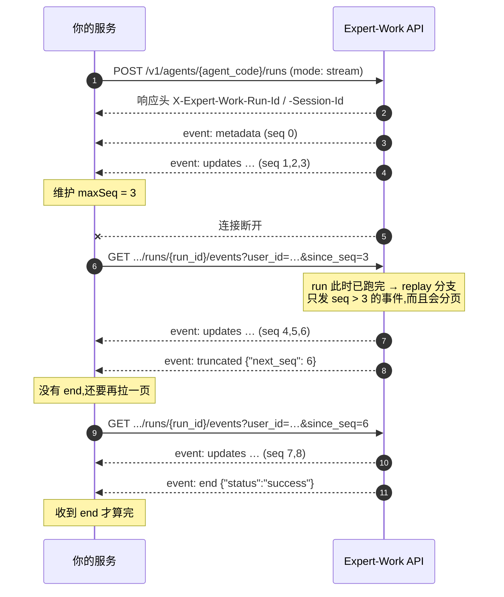

# 3 读懂 SSE 流

这一章是给写前端 / 写对接程序的人看的:一次 Agent run 会推给你哪些事件、每个事件里有什么、界面拿到它该做什么，以及连接断了怎么接回去。

读完这一章，你应该能独立写出一个能跑完整 run 的接收器。3.5 给了一份可以直接抄的骨架。

全章示例统一用这几个值:

| 占位 | 本章示例值 |
|---|---|
| `{agent_code}` | 你的 Agent 编码，路径里原样填 |
| `{user_id}` | `u-123` |
| `{run_id}` | `67262572-5470-41a4-800d-592762ec679d` |
| 会话 id(`thread_id` / `session_id`) | `9f2c1a44-6d3b-4f18-9a70-2b5c8e1d0c37` |

## 3.1 先看一眼:一次 run 的事件流长什么样

`mode: "stream"` 的 `POST /v1/agents/{agent_code}/runs`，**响应体本身就是这条 SSE 流**——不用再调别的接口。

下面是一次真实 run 的事件顺序。为了一眼看清顺序，这里**只保留了 `event:` 行**——每个事件的 `data` 里有什么，是 3.4 的内容。

``` [事件流片段]
event: metadata      ← run 开始了。记下 run_id 和会话 id
event: updates       ← 一个节点跑完了(记忆召回)。这一步的权威结果
event: updates       ← 又一个节点跑完了(工作区读入)
event: token         ← agent 节点开始了,模型正在逐字生成。几十到上千个
event: token
event: token
event: updates       ← agent 节点跑完:模型这一步要调一个工具
event: updates       ← tools 节点跑完:工具的执行结果
event: token         ← 下一步又开始生成了
event: token
event: updates       ← agent 节点跑完:这次是最终答案
event: updates       ← 最后一个节点跑完(记忆回写)
event: end           ← 流结束。data 里带这次 run 的最终状态
```

注意 `token` 出现的位置:它只在 `agent` 节点跑的时候产生，`agent` 之前的准备节点只发 `updates`。

不过**准备节点有几个、有没有，取决于这个 Agent 怎么配**:上面这个示例配了记忆召回和工作区读入,所以流的开头是 `metadata` 加两个 `updates`;两样都没配的 Agent 直接从 `agent` 节点开始跑，第一个 `token` 可以紧跟在 `metadata` 后面。**别按「开头一定有几个 `updates`」写代码。**

整条流是三段:

1. **开场**——一个 `metadata`，告诉你这次 run 的身份。
2. **中间**——`token` 和 `updates` 反复交替，交替几轮取决于 Agent 要走几步。中途还可能插进 `worker` / `guard` / `compaction` / `approval` / `retry` / `error`。
3. **收尾**——一个 `end`，带最终状态。

::: tip 只有两种事件是每次都有的
`metadata` 和 `end` 一定出现(`end` 只有一个例外，见 3.6 的回放分页)。其余全部取决于这次 run 实际发生了什么——没调工具就没有 `tools` 节点的 `updates`，没触发护栏就没有 `guard`。**不要把「某个事件一定会来」写进代码。**
:::

## 3.2 事件的格式

### 一个事件三行

每个事件都是标准 SSE 格式:一行 `id:`、一行 `event:`、一行 `data:`，最后一个空行作为结束标记。

``` [事件流片段]
id: 1755229352138-0
event: metadata
data: {"run_id":"67262572-5470-41a4-800d-592762ec679d","thread_id":"9f2c1a44-6d3b-4f18-9a70-2b5c8e1d0c37"}

```

- `id:`——**不是每个事件都有**，见下面那张表。
- `event:`——事件名。就是 3.3 表里那一列。
- `data:`——一个 JSON 对象。**永远是一行**，不会跨行。

### 心跳是注释行，不是事件

连接活着的时候，服务端大约每 15 秒发一行心跳:

``` [事件流片段]
: heartbeat

```

它以冒号开头，是 SSE 规范里的注释行，**没有 `event:` 也没有 `data:`**。解析时直接跳过以 `:` 开头的行。

心跳的用处是判活:**一段时间里连心跳都没收到，就该认为这条连接已经断了**，按 3.6 重连。

### 哪些事件有 `id:`、能不能回放

| 这一类 | 有 `id:` | 断线重连能拿回来吗 | 有哪些 |
|---|---|---|---|
| run 的事件 | 有 | 能 | `metadata` / `updates` / `worker` / `guard` / `compaction` / `approval` / `retry` / `error` |
| 一次性预览 | 无 | **不能**——断连期间那些补不回来 | `token` |
| 流的终止标记 | 无 | 每条流各自重新发一个 | `end` |
| 这条连接的状况 | 无 | — | `gap` / `truncated` |

后三类没有 `id:` 的原因各不相同:

- `token` 是一次性预览，不落库、不占序号。
- `end` 是流的终止标记，每条流(包括每次重连、每一页回放)自己生成一个，不是 run 身上某个被记录下来的事件。
- `gap` / `truncated` 描述的是**这条连接**的状况，不是 run 身上发生的事。

**这三类都不参与断线重连的游标计算。**

### 从 `id:` 里取 `seq`

`id:` 由两段组成，中间用一个 `-` 连接:前半段是服务端的毫秒时间戳，后半段是 `seq`。

``` [事件流片段]
id: 1755229352138-0
      ↑ 毫秒时间戳    ↑ seq
```

`seq` 是这个事件在这次 run 里的序号，**从 `0` 开始**，也是断线重连时 `since_seq` 参数**唯一合法的取值来源**(见 3.6)。

取 `seq` 请按**最后一个** `-` 切分，别按第一个:

```js [渲染示例]
// 前半段是纯数字时间戳、本身不含 "-",但别赌这一点 —— 按最后一个 "-" 切最稳
function seqOf(id) {
  if (!id) return null;                       // 没有 id: 的事件,不参与游标
  const n = Number(id.slice(id.lastIndexOf("-") + 1));
  return Number.isInteger(n) ? n : null;      // 形状不认识就当没有 seq
}
```

::: warning 不要拿完整的 id 字符串当键
id 里的**毫秒段不保证两次一致**:实时连接和回放是两次独立取的服务端时钟，同一个事件可能相差 1 毫秒(实测约千分之一的事件会这样，机器越忙比例越高)。

要做去重键、幂等键、或者跟自己系统里的记录对应，**一律只用 `seq`**，别用整个 id 字符串——否则同一个事件会被当成两个处理，而且这种问题是间歇性的、很难复现。
:::

## 3.3 事件一览(按出现顺序)

下表按事件在流里**实际出现的先后**排。每一行的详细说明见 3.4 对应小节。

| `event:` | 什么时候出现 | `data` 里有什么 | 前端该做什么 | 有 `id:` |
|---|---|---|---|---|
| `metadata` | run 开始时，一次 | run 的身份:`run_id` + 会话 id | 存下来，重连和续聊都要用 | 有 |
| `token` | 模型逐字生成时，很多次 | 一小段文本 + 它属于第几步 | 打字机预览，**别当状态** | 无 |
| `updates` | 每个节点跑完，一次 | 这一步的权威结果(消息、步数) | 用它重建对话与工具卡 | 有 |
| `worker` | Agent 委托子任务时，开始 / 每步 / 结束各一次 | 子任务的身份与进展 | 在对应的工具卡下挂一条子时间线 | 有 |
| `guard` | 平台护栏预警或触发时 | 哪道护栏、当前数值 | 提示「已到上限」，**不是报错** | 有 |
| `compaction` | 上下文过长被自动压缩时 | 压缩前后的 token 数 | 给一句「已自动整理历史」的提示 | 有 |
| `approval` | run 停在人工审批节点时 | 要批什么、参数、超时时间 | 弹审批界面 | 有 |
| `retry` | 遇到可重试的失败时 | 第几次重试、等多久 | 提示「正在重试」，别中断 | 有 |
| `error` | run 失败时 | 失败原因文本 | 按失败展示 | 有 |
| `end` | 流正常收尾时，最后一个 | 这次 run 的最终状态 | 按状态四选一收尾 | 无 |

下面两个**不是 run 身上发生的事**，而是**这条连接**的状况说明，所以不排在上面的顺序里。它们只在断线重连 / 回放时才会遇到，详见 3.6:

| `event:` | 什么时候出现 | `data` 里有什么 | 前端该做什么 | 有 `id:` |
|---|---|---|---|---|
| `gap` | 有一段事件在这条连接上补不到了 | 补不到的 seq 区间 | 标记这段缺失，继续处理后面的 | 无 |
| `truncated` | 回放一页装不下 | 下一页的起点 | 拿它翻下一页，**流还没结束** | 无 |

::: warning 收到不认识的 `event:`,忽略它,不要报错
上面两张表列的是当前会遇到的事件类型，**不是穷举**——平台演进会新增新的 `event:`。把「未知事件」写成异常分支的对接程序，会在平台加一种事件的那天集体挂掉。正确做法是查不到处理函数就跳过这一个事件、继续读流。
:::

## 3.4 每个事件怎么处理

十个小节顺序与 3.3 的表一致，每个小节都是同一个模板:**什么时候发** → **`data` 字段** → **完整示例** → **前端怎么渲染**。

渲染示例都是原生 JavaScript，共用下面这三样，后面不再重复:

```js [渲染示例的公共约定]
const $ = (sel) => document.querySelector(sel);
const esc = (s) => String(s).replace(/[<&]/g, (c) => (c === "<" ? "&lt;" : "&amp;"));

// 界面自己的状态。每个示例只动其中一部分
const store = {
  runId: null, sessionId: null,
  steps: new Map(),        // step 编号 → 这一步的预览文本
  toolCalls: new Map(),    // tool_call_id → 工具卡的 DOM 节点
  workers: new Map(),      // worker_id  → 子时间线的 DOM 节点
};
```

### metadata

#### 什么时候发

run 一开始就发，**整条流的第一个事件**，只发一次。

#### `data` 字段

| 字段 | 类型 | 说明 |
|---|---|---|
| `run_id` | string(UUID) | 这次 run 的 id。取消、查审批、断线重连都要用它 |
| `thread_id` | string(UUID) | 这段会话的 id。下一轮对话把它填进请求体的 `session_id` |

#### 完整示例

``` [事件流片段]
id: 1755229352138-0
event: metadata
data: {"run_id":"67262572-5470-41a4-800d-592762ec679d","thread_id":"9f2c1a44-6d3b-4f18-9a70-2b5c8e1d0c37"}
```

#### 前端怎么渲染

这个事件不产生可见内容，但**必须存下来**——后面所有接口都要用这两个 id。

```js [渲染示例]
function onMetadata(data) {
  store.runId = data.run_id;
  store.sessionId = data.thread_id;

  // 存进本地,刷新页面也能接回同一个 run
  localStorage.setItem("lastRunId", data.run_id);
  localStorage.setItem("sessionId", data.thread_id);

  // 现在才可以让「取消」按钮可点 —— 之前没有 run_id 可取消
  $("#cancel-btn").disabled = false;
  $("#status").textContent = "运行中…";
}
```

同样两个值也在响应头 `X-Expert-Work-Run-Id` / `X-Expert-Work-Session-Id` 里。响应头先到，所以**能读响应头就优先读响应头**;读不到(比如跨源调用没 expose)就以这个事件为准。

### token

#### 什么时候发

模型逐字生成答案的过程中，发很多次。**只有实时连接才有**——断线重连之后，之前的 `token` 不会重发给你。

什么时候一个 `token` 都没有:`mode: "queue"` 的 run、命中缓存的回答、不支持流式的模型，以及开启了输出结果二次判定的 Agent。这些情况下只有步级的 `updates`。开启结构化输出的 run 仍然会为主候选结果发 `token`(只有需要纠错重发的那一次不走流式)。

#### `data` 字段

`channel` 决定这个事件里还有哪些字段。

| `channel` | 是什么 | 除 `step` / `channel` 外还有 |
|---|---|---|
| `content` | 答案正文的一小段 | `text`(string) |
| `reasoning` | 模型思考过程的一小段，只有推理类模型有 | `text`(string) |
| `tool_args` | 模型开始发起一次工具调用 | `tool_index`(int)、`name`(string) |

| 字段 | 类型 | 说明 |
|---|---|---|
| `step` | int | 这一小段属于第几步。**从 `1` 开始**，与 `updates` 里 `agent` 节点的 `step_count` 是同一个编号 |
| `channel` | string | 见上表，三值 |
| `text` | string | 已经过内容安全脱敏的文本片段。只有 `content` / `reasoning` 有 |
| `tool_index` | int | 第几个并行工具调用。只有 `tool_args` 有 |
| `name` | string | 工具名。只有 `tool_args` 有，而且**同一个 `tool_index` 只发一次** |

::: warning 工具的调用参数不会流式吐出来
`tool_args` 只告诉你「第几个调用、叫什么名字」，**没有参数内容**。完整参数只出现在后面那个权威的 `updates` 里。界面上可以先把工具卡的壳画出来(显示工具名 + 转圈)，参数等 `updates` 到了再填。
:::

#### 完整示例

``` [事件流片段]
event: token
data: {"step":1,"channel":"content","text":"好的,我先"}

event: token
data: {"step":1,"channel":"reasoning","text":"用户要我先写文件再读回来"}

event: token
data: {"step":1,"channel":"tool_args","tool_index":0,"name":"write_file"}
```

#### 前端怎么渲染

把 `token` 当**纯预览**:按 `step` 累积成打字机效果，等同一个 `step` 的 `updates` 到了就整段替换掉。

```js [渲染示例]
function onToken(data) {
  if (data.channel === "tool_args") {
    // 先把工具卡的壳画出来,参数等 updates 到了再填
    $("#timeline").insertAdjacentHTML("beforeend",
      `<div class="tool-card pending" data-idx="${data.tool_index}">
         调用 ${esc(data.name)}<span class="spinner"></span>
       </div>`);
    return;
  }
  // content / reasoning 各攒各的,按 step 分桶
  const key = `${data.step}:${data.channel}`;
  store.steps.set(key, (store.steps.get(key) ?? "") + data.text);

  const box = $(`#step-${data.step}-${data.channel}`) ?? (() => {
    $("#timeline").insertAdjacentHTML("beforeend",
      `<div id="step-${data.step}-${data.channel}" class="${data.channel}"></div>`);
    return $(`#step-${data.step}-${data.channel}`);
  })();
  box.textContent = store.steps.get(key);   // 逐字长出来
}
```

::: danger 别拿 `token` 重建状态
真栈实测三个场景的事件条数:

| 场景 | `updates` | `token` |
|---|---|---|
| 简单问答 | 4 | 58 |
| 工具调用 | 8 | 146 |
| 分两步 | 6 | 954 |

`token` 占九成以上，而且**断连期间那些一个也补不回来**(重连之后只会收到新产生的)。界面的真实状态必须由 `updates` 重建，`token` 只做视觉预览。

还有一层:`updates` 里的内容才是过了完整输出安全审查的最终结果。如果这一步被安全策略拦了，`updates` 里会是拒答文案——**直接覆盖你攒的预览**，不要把两者拼在一起显示。
:::

### updates

#### 什么时候发

每当图里的一个节点跑完，发一次。**这是这一步权威的最终结果**——界面该拿它来重建交互过程。

#### `data` 字段

`data` 的最外层是一个对象:键是**节点名**，值是这个节点这一步的**写入**。**一个事件通常只有一个节点键。**

```js [data 的骨架]
{ "agent": { "messages": [ … ], "step_count": 1, "_duration_ms": 2140 } }
//  ↑节点名   ↑节点写入
```

节点写入(非 `null` 时)里对接方只需要读三个字段:

| 字段 | 类型 | 说明 |
|---|---|---|
| `messages` | array | 这一步新产出的消息，可能是空数组。形状见下面「`messages[]` 里的两种消息」 |
| `step_count` | int | 这一步的编号，**从 `1` 开始**。只出现在 `agent` 节点的写入里，`tools` 节点没有 |
| `_duration_ms` | int | 距**上一个 `updates`** 过去了多少毫秒(第一个 `updates` 是距 run 开始)。**`token` 和其它事件不会重置这个计时。** 平台注入，每个**非 `null`** 的节点写入都有 |

节点写入里还有别的通道，都是内部调度用的、不保证稳定。列在这里只是免得你以为自己漏读了:

- `agent` 节点——`escalate_next`、`last_plan_goal`、`no_progress_streak`、`step_count_refund_pending`、`tool_failures`
- `tools` 节点——`step_count_refund_pending`
- `memory_recall` 节点——`recalled_memories`

::: danger 节点写入可能整个是 `null`——这是第一天就会踩到的坑
真栈实测三个场景全部出现过:

``` [事件流片段]
event: updates
data: {"workspace_ingest":null}

event: updates
data: {"memory_writeback":null}
```

客户端**不能**拿到节点名就直接往下取 `.messages`——先判断整个节点写入是不是 `null`，再取 `messages`。真栈三个场景里，`workspace_ingest` 和 `memory_writeback` 每次都是整体 `null`。
:::

::: warning 节点名不是固定枚举
真栈见过的节点名:`memory_recall`、`workspace_ingest`、`agent`、`tools`、`memory_writeback`(出现顺序大致是 `memory_recall` → `workspace_ingest` → `agent` → `tools` / `agent` 交替若干次 → `memory_writeback`)。还有一些节点按 Agent 配置才会注册、才会出现，不必列全。

**遇到不认识的节点名，忽略这个事件就好，不要报错**——节点词表会随平台演进变化。
:::

#### `messages[]` 里的两种消息

数组里每一项按 `type` 分两种。

**`type: "ai"`**——来自 `agent` 节点，是模型这一步的产出。

| 字段 | 类型 | 说明 |
|---|---|---|
| `content` | string | 这一步的文本产出。**空串是正常的**——这一步只发工具调用时就是空，别当异常或「答完了」 |
| `tool_calls` | array | 这一步发起的工具调用，每项 `{name, args, id}` |
| `response_metadata.finish_reason` | string | `"tool_calls"`(还要继续下一步)/ `"stop"`(这一步已经答完) |
| `usage_metadata` | object | 这一步的 token 用量，可以直接拿来做用量展示 |
| `additional_kwargs.reasoning_content` | string | 模型的思维链原文。**不保证每个模型都有，也不保证长期存在**，别当结构化字段依赖 |

**`type: "tool"`**——来自 `tools` 节点，是工具的执行结果。

| 字段 | 类型 | 说明 |
|---|---|---|
| `name` | string | 工具名 |
| `tool_call_id` | string | 配对键，见下面「配对」 |
| `content` | string | 工具执行结果的文本。**经过防注入包装，直接渲染是乱码**，还原方法见下 |
| `status` | string | 执行状态。实测 `"success"`;非 `"success"` 即为这一步工具失败，具体取值不在这里穷举 |
| `artifact` | object | 工具产出的结构化数据，**形状按工具而定**——有就用，不认识就忽略 |
| `additional_kwargs.duration_ms` | int | 这个工具本身跑了多久(毫秒) |

#### 完整示例

一个 `agent` 节点的 `updates`(真实载荷，B 场景):

```json [updates 里 agent 节点的第一条消息]
{
  "content": "",
  "additional_kwargs": {
    "reasoning_content": "The user wants me to create a file called probe_note.txt in the workspace with content \"hello-probe\", then read it back and tell them what the content is. Let me do both the write and read. Since I want to write then read, these are dependent (I should write first, then read). Actually, the read depends on the write being complete, so I should do them sequentially. But actually, write_file is atomic and returns immediately, so I can do the write and then the read. Let me do the write first.\n\nActually, the instructions say if there are no dependencies between calls, make them in the same block. But here the read depends on the write being done first. So I should do them sequentially.\n\nLet me write the file first.",
    "expert_work_created_at": "2026-08-15T03:42:32.138398+00:00",
    "expert_work_run_id": "67262572-5470-41a4-800d-592762ec679d"
  },
  "response_metadata": {"finish_reason": "tool_calls", "model_name": "glm-5.2"},
  "type": "ai",
  "name": null,
  "id": "19bad813-1cf0-4b2c-8f4a-6c9d0e7a5b31",
  "tool_calls": [
    {"name": "write_file", "args": {"path": "probe_note.txt", "content": "hello-probe"}, "id": "call_de58e676916d442d925bff27", "type": "tool_call"}
  ],
  "invalid_tool_calls": [],
  "usage_metadata": {
    "input_tokens": 6027, "output_tokens": 178, "total_tokens": 6205,
    "input_token_details": {"cache_read": 5952}, "output_token_details": {"reasoning": 156}
  }
}
```

紧接着那个 `tools` 节点的 `updates`(真实载荷，B 场景):

```json [updates 里 tools 节点的第一条消息]
{
  "content": "«UNTRUSTED nonce={random}»\nWrote▁ 11▁ bytes▁ to▁ probe_note.txt\n«/UNTRUSTED nonce={random}»",
  "additional_kwargs": {"duration_ms": 1848},
  "response_metadata": {},
  "type": "tool",
  "name": "write_file",
  "id": "89479877-2a51-4e6b-b0c3-1d8f7a4e2c95",
  "tool_call_id": "call_de58e676916d442d925bff27",
  "artifact": {"path": "probe_note.txt", "content_hash": "aded7388c0f1b2a34d5e6f708192a3b4c5d6e7f8091a2b3c4d5e6f7081920a3b4", "size": 11},
  "status": "success"
}
```

#### 配对:`ai.tool_calls[].id` ↔ `tool.tool_call_id`

界面把「调用」和「结果」连成一条，**只能靠这一对 id**:上面 `ai` 消息里 `tool_calls[].id` 是 `call_de58e676916d442d925bff27`，下面 `tool` 消息里 `tool_call_id` 是同一个值——它们是同一次工具调用的两半。

`tool_calls` 是数组，理论上一次 `agent` 步可以有多个并行调用(真栈三个场景实测都只有一个，没观察到并行的例子)。**配对时按 id 逐个对，不要按数组下标对。**

#### 工具结果的文本要先还原

`tool` 消息的 `content` 是防注入包装过的，直接显示，用户看到的就是夹着围栏和奇怪字形的乱码:

``` [工具结果的原文]
«UNTRUSTED nonce={random}»
Wrote▁ 11▁ bytes▁ to▁ probe_note.txt
«/UNTRUSTED nonce={random}»
```

包装分两部分:

1. **围栏**——前后包一层 `«UNTRUSTED nonce=…»` / `«/UNTRUSTED nonce=…»`。里面那个随机串由平台每次生成，**不要把它写死在代码里，也不要基于它的取值做任何判断**，用正则匹配任意值即可。
2. **空白标记**——每一段连续空白被替换成一个 U+2581 字形(`▁`)加一个空格。所以 `Wrote 11 bytes to probe_note.txt` 变成了 `Wrote▁ 11▁ bytes▁ to▁ probe_note.txt`。

还原是三步，可以直接抄:

```js [渲染示例]
const OPEN = /«UNTRUSTED nonce=[^»]*»\n?/g;
const CLOSE = /\n?«\/UNTRUSTED nonce=[^»]*»/g;

function unwrapToolResult(raw) {
  const wrapped = OPEN.test(raw);              // 围栏在不在,本身是有用信号
  OPEN.lastIndex = 0;                          // test 用了 /g,用完要归零
  const text = raw.replace(OPEN, "").replace(CLOSE, "")
                  .replace(/▁/g, "");          // 只删字形,后面那个空格留着
  return { text, untrusted: wrapped };
}
```

::: warning 还原是有损的,而且「来自外部」这个信号别丢
原文里的换行在标记空白时也变成了 `▁ `，删掉字形之后剩下的是一个空格——**原文的换行拿不回来**。

围栏在不在意味着这段内容来自外部、不可信。建议像上面那样**在还原之前先记一个标志位**，界面上给这类内容加一个「来自外部工具」的角标，而不是只留下还原后的文本。
:::

#### 前端怎么渲染

按 `type` 分流:`ai` 消息渲染成对话气泡，`tool` 消息按 `tool_call_id` 找到对应的工具卡填进去。

```js [渲染示例]
function onUpdates(data) {
  for (const [node, writes] of Object.entries(data)) {
    if (writes === null) continue;                 // 节点写入可能整个是 null
    for (const msg of writes.messages ?? []) {
      if (msg.type === "ai") {
        // 这一步的最终文本 —— 直接覆盖 token 攒的预览
        const step = writes.step_count;
        const box = $(`#step-${step}-content`);
        if (box) box.textContent = msg.content;
        // 每个工具调用先占一张卡,用 id 当键
        for (const call of msg.tool_calls ?? []) {
          $("#timeline").insertAdjacentHTML("beforeend",
            `<div class="tool-card" id="tc-${call.id}">
               <b>${esc(call.name)}</b>
               <pre>${esc(JSON.stringify(call.args, null, 2))}</pre>
               <div class="result">执行中…</div>
             </div>`);
          store.toolCalls.set(call.id, $(`#tc-${call.id}`));
        }
      } else if (msg.type === "tool") {
        // 结果回填到同 id 的那张卡 —— 不要按数组下标配对
        const card = store.toolCalls.get(msg.tool_call_id);
        if (!card) continue;
        const { text, untrusted } = unwrapToolResult(msg.content);
        card.classList.toggle("failed", msg.status !== "success");
        card.querySelector(".result").textContent =
          (untrusted ? "[来自外部工具] " : "") + text;
      }
    }
  }
}
```

### worker

#### 什么时候发

Agent 把一部分工作委托给子任务(worker)时——比如子 agent、并行执行的子任务——子任务的**开始 / 每一步 / 结束**各发一次。

`worker` 不是与 `updates` 平行的另一套结果通道，而是把 Agent 的内部动作暴露出来给界面展示用的。**「这一步的权威结果」仍然只认 `updates`。**

#### `data` 字段

每个 `worker` 事件都带同一组信封字段，`data` 的形状再按 `kind` 分:

| 字段 | 类型 | 说明 |
|---|---|---|
| `worker_id` | string | 这个 worker 实例的唯一标识 |
| `parent_worker_id` | string \| null | 委托出这个 worker 的上一级 worker。直接挂在主 run 下(不是由另一个 worker 委托出来的)时是 `null` |
| `parent_tool_call_id` | string \| null | 触发这个 worker 的那次工具调用的 id，与 `updates` 里 `ai.tool_calls[].id` 是同一种值。**界面把子任务的时间线挂到对应的工具卡下面，靠的就是这个字段** |
| `label` | string | 这个子任务的人类可读标签 |
| `agent_ref` | string | 这个 worker 用的是哪个 Agent |
| `depth` | int | 委托层级，数值越大说明委托嵌套得越深 |
| `kind` | string | `start` / `update` / `end`，决定 `data` 的形状 |
| `wseq` | int | 这个 worker 自己的序号，见下面的警告 |
| `data` | object | 按 `kind` 而定，见下面三张表 |

`kind: "start"` 的 `data`:

| 字段 | 类型 | 说明 |
|---|---|---|
| `task_excerpt` | string | 委托给这个 worker 的任务描述(摘要，上限 500 字符) |
| `role` | string \| null | 这个 worker 的角色。没指定角色时是 `null` |
| `max_steps` | int | 这个 worker 允许执行的最大步数 |

`kind: "update"` 的 `data`:

| 字段 | 类型 | 说明 |
|---|---|---|
| `node` | string | 触发这次更新的节点名，含义同 `updates` |
| `_duration_ms` | int | 距这个 worker 上一个事件过去了多少毫秒 |
| `step_count` | int | 到这一步为止的步数。**可选**，只在部分节点出现 |
| `messages` | array | 这一步新产出消息的**摘要**——不是 `updates` 那种原样消息，见下 |

`kind: "end"` 的 `data`:

| 字段 | 类型 | 说明 |
|---|---|---|
| `outcome` | string | 这个 worker 执行完的结果。取值不在这里穷举，遇到没见过的照常展示即可 |
| `iteration_used` | int | 实际用掉的步数 |
| `llm_call_count` | int | 这个 worker 内部发起的 LLM 调用次数 |
| `wall_clock_ms` | int | 这个 worker 从 `start` 到 `end` 的墙钟耗时(毫秒) |

::: warning `wseq` 不是 SSE 的 `seq`,不能拿它当重连游标
`wseq` 是**这一个 worker 自己的序号**，从 `0` 起数，作用域只在这个 worker 内部——同一次 run 里不同 worker 的 `wseq` 各自独立计数，互不相干。

它和 3.2 讲的、决定 `since_seq` 的那个 `seq` 是两回事:断线重连、去重仍然只认事件的 `seq`，`wseq` 不参与。
:::

::: warning `update` 里的 `messages` 是摘要,而且同样带着防注入包装
它长得像 `updates` 里的 `messages`，但**不是同一种东西**:每一项是摘要，字段名都带 `_excerpt` 后缀，超过上限的部分被截掉、末尾补一个 `…`。上限是正文 500 字符、工具参数 200 字符、工具结果 500 字符。

按 `type` 分三种形状:

- `type: "ai"` —— `{type, content_excerpt}`，另外**只在这一步真的发起了工具调用时**才多一个 `tool_calls: [{name, args_excerpt}]`
- `type: "tool"` —— `{type, name, tool_result_excerpt}`，沙箱执行类工具还多一个 `exec: {exit_code, timed_out, stdout_excerpt, stderr_excerpt}`
- 其它类型 —— `{type, content_excerpt}`

**这些 `_excerpt` 字段同样没有剥掉防注入包装**，渲染给人看之前要照上面 `updates` 那三步还原,做法完全一样。
:::

#### 完整示例

``` [事件流片段]
id: 1755229358102-6
event: worker
data: {"worker_id":"wk-7c31","parent_worker_id":null,"parent_tool_call_id":"call_de58e676916d442d925bff27","label":"检索行业报告","agent_ref":"researcher","depth":1,"kind":"start","wseq":0,"data":{"task_excerpt":"检索 2026 年国内新能源汽车出口数据,汇总成三条要点","role":"researcher","max_steps":12}}

id: 1755229361540-7
event: worker
data: {"worker_id":"wk-7c31","parent_worker_id":null,"parent_tool_call_id":"call_de58e676916d442d925bff27","label":"检索行业报告","agent_ref":"researcher","depth":1,"kind":"update","wseq":1,"data":{"node":"agent","_duration_ms":3438,"step_count":1,"messages":[{"type":"ai","content_excerpt":"我先查一下海关总署的公开数据。","tool_calls":[{"name":"http_request","args_excerpt":"{\"url\": \"https://example.com/report\"}"}]}]}}

id: 1755229372881-9
event: worker
data: {"worker_id":"wk-7c31","parent_worker_id":null,"parent_tool_call_id":"call_de58e676916d442d925bff27","label":"检索行业报告","agent_ref":"researcher","depth":1,"kind":"end","wseq":2,"data":{"outcome":"completed","iteration_used":2,"llm_call_count":2,"wall_clock_ms":14779}}
```

#### 前端怎么渲染

把子任务的时间线挂到 `parent_tool_call_id` 对应的那张工具卡下面。

```js [渲染示例]
// w 是这个事件的 data 整体 —— 也就是上面那张表里的信封,w.data 才是按 kind 分的部分
function onWorker(w) {
  if (w.kind === "start") {
    const host = store.toolCalls.get(w.parent_tool_call_id) ?? $("#timeline");
    host.insertAdjacentHTML("beforeend",
      `<div class="worker" id="wk-${w.worker_id}" style="margin-left:${w.depth * 16}px">
         <b>${esc(w.label)}</b> <span class="agent">${esc(w.agent_ref)}</span>
         <div class="lines"></div><div class="tail">运行中…</div>
       </div>`);
    store.workers.set(w.worker_id, $(`#wk-${w.worker_id}`));
    return;
  }
  const box = store.workers.get(w.worker_id);
  if (!box) return;                                    // start 没收到就忽略后续

  if (w.kind === "update") {
    for (const m of w.data.messages ?? []) {
      const raw = m.content_excerpt ?? m.tool_result_excerpt ?? "";
      const { text } = unwrapToolResult(raw);          // 摘要同样要还原
      box.querySelector(".lines").insertAdjacentHTML("beforeend",
        `<div class="line">${esc(m.name ?? m.type)}: ${esc(text)}</div>`);
    }
  } else if (w.kind === "end") {
    box.querySelector(".tail").textContent =
      `${w.data.outcome} · ${w.data.iteration_used} 步 · ${w.data.wall_clock_ms} ms`;
  }
}
```

### guard

#### 什么时候发

平台护栏预警或触发时。覆盖三类护栏:步数上限、token 预算、检测到没有实际进展。

#### `data` 字段

| 字段 | 类型 | 说明 |
|---|---|---|
| `kind` | string | `tripped`(护栏触发)/ `warning`(预警，还没真的触发) |
| `guard` | string | 哪一类护栏:`max_steps`(步数上限)/ `token_budget`(token 预算)/ `no_progress`(检测到没有实际进展) |
| `detail` | object | 具体数值，形状按 `guard` 而定 |

`detail` 的形状:

| `guard` | `detail` | 含义 |
|---|---|---|
| `max_steps` | `{steps, max}` | 已执行步数 / 步数上限 |
| `token_budget` | `{spent, limit}` | 已花费 token / token 预算上限 |
| `no_progress` | `{streak, max}` | 连续无进展的步数 / 允许的上限 |

::: tip 只有 `token_budget` 会发 `warning`
预警在用量达到预算 80% 时发一次，整棵委托树只发一次。`max_steps` 和 `no_progress` 今天**只有 `tripped`**，没有预警——别写一个「等 `max_steps` 的 warning」的分支，它永远不会来。
:::

#### 完整示例

``` [事件流片段]
id: 1755229380117-14
event: guard
data: {"kind":"warning","guard":"token_budget","detail":{"spent":81920,"limit":102400}}

id: 1755229391663-21
event: guard
data: {"kind":"tripped","guard":"max_steps","detail":{"steps":32,"max":32}}
```

#### 前端怎么渲染

::: warning `guard` 不是错误
收到 `kind: "tripped"` 意味着平台**主动把这一轮对话收了尾**(比如步数到了上限就不再往下执行)，不是执行出错崩溃。把它当错误处理、弹错误提示，是把一次正常的护栏收尾误报成了失败。

`kind: "warning"` 更轻，只是「快到上限了」，不代表任何收尾动作已经发生。
:::

```js [渲染示例]
const GUARD_TEXT = {
  max_steps:    (d) => `已执行 ${d.steps} 步,达到上限 ${d.max} 步`,
  token_budget: (d) => `已用 ${d.spent} token,预算 ${d.limit}`,
  no_progress:  (d) => `连续 ${d.streak} 步没有实质进展(上限 ${d.max})`,
};

function onGuard(data) {
  const detail = (GUARD_TEXT[data.guard] ?? (() => ""))(data.detail);
  const tripped = data.kind === "tripped";
  $("#timeline").insertAdjacentHTML("beforeend",
    `<div class="notice ${tripped ? "warn" : "hint"}">
       ${tripped ? "本轮已由平台收尾" : "接近上限"}:${esc(detail)}
     </div>`);
  // 注意:样式用「提示」而不是「错误」—— 这不是失败
}
```

### compaction

#### 什么时候发

上下文太长时，平台会自动把早于当前请求的历史对话压缩成摘要——这个动作发生时发一次。

#### `data` 字段

| 字段 | 类型 | 说明 |
|---|---|---|
| `passes` | int | 这次压缩执行了几轮 |
| `tokens_before` | int | 压缩前的 token 数 |
| `tokens_after` | int | 压缩后的 token 数 |
| `summary_chars` | int | 压缩后摘要文本的字符数 |

#### 完整示例

``` [事件流片段]
id: 1755229384902-16
event: compaction
data: {"passes":1,"tokens_before":18420,"tokens_after":6103,"summary_chars":2048}
```

#### 前端怎么渲染

这**不影响这次回答的正确性**，给用户一句轻提示就够了。

```js [渲染示例]
function onCompaction(data) {
  const saved = data.tokens_before - data.tokens_after;
  $("#timeline").insertAdjacentHTML("beforeend",
    `<div class="notice hint">
       对话较长,已自动整理历史记录(省下约 ${saved} token)
     </div>`);
  // 别做成模态弹窗 —— 长会话里它会反复出现
}
```

### approval

#### 什么时候发

run 走到人工审批节点、停下来等人决策时发一次。发完这个事件之后，流会以 `end` 收尾，`status` 是 `paused`。

#### `data` 字段

| 字段 | 类型 | 说明 |
|---|---|---|
| `run_id` | string(UUID) | 这次 run 的 id |
| `thread_id` | string(UUID) | 这段会话的 id |
| `request_id` | string | 这条审批请求的 id。**提交决策时要原样带回去** |
| `node` | string | 是哪个节点提出的审批请求 |
| `reason_kind` | string | 为什么要审批，五值:`policy_gate`(平台策略要求)/ `missing_info`(缺信息)/ `ambiguous_requirement`(需求有歧义)/ `approach_choice`(要在几种做法里选)/ `risk_confirmation`(高风险确认) |
| `action_summary` | string | 一句人话说明在等批什么。**直接显示给用户看** |
| `proposed_args` | object | 待批准的工具调用参数。审批时可以改，改法见 4.2 |
| `requested_at` | string | 发起审批的时间，ISO-8601 |
| `timeout_at` | string | 超时时间，ISO-8601。过了这个点会被自动拒绝 |
| `binding_digest` | string | 参数绑定摘要，平台内部用来校验参数没被篡改。**客户端不需要处理，原样忽略即可** |

#### 完整示例

``` [事件流片段]
id: 1755229394215-23
event: approval
data: {"run_id":"67262572-5470-41a4-800d-592762ec679d","thread_id":"9f2c1a44-6d3b-4f18-9a70-2b5c8e1d0c37","request_id":"apr_5f3a91c2e7b04d68","node":"tools","reason_kind":"policy_gate","action_summary":"即将向 finance@example.com 发送一封含转账明细的邮件","proposed_args":{"to":"finance@example.com","subject":"2026 年 8 月对账单","body":"附件为本月对账明细。"},"requested_at":"2026-08-15T03:43:14.215000+00:00","timeout_at":"2026-08-16T03:43:14.215000+00:00","binding_digest":"9b1f3c7a5d2e8046b3f19c7e5a2d84061f3c7a5d2e8046b3f19c7e5a2d840612"}
```

#### 前端怎么渲染

弹一个审批界面，把 `action_summary` 和 `proposed_args` 摆给用户看。**别当错误报**——批准或拒绝之后，这一轮对话还会继续。

```js [渲染示例]
function onApproval(data) {
  const deadline = new Date(data.timeout_at).toLocaleString();
  $("#timeline").insertAdjacentHTML("beforeend",
    `<div class="approval" id="apr-${data.request_id}">
       <b>需要你确认</b>
       <p>${esc(data.action_summary)}</p>
       <pre>${esc(JSON.stringify(data.proposed_args, null, 2))}</pre>
       <small>逾期自动拒绝:${esc(deadline)}</small>
       <button data-d="approve">同意</button>
       <button data-d="reject">拒绝</button>
     </div>`);

  $(`#apr-${data.request_id}`).addEventListener("click", (e) => {
    const decision = e.target.dataset.d;
    if (!decision) return;
    // 提交决策的接口见 4.2;request_id 要原样带回去
    submitApproval(data.run_id, data.request_id, decision);
  });
}
```

决策接口的参数、`modified_args` 怎么改参数、决策之后 run 怎么继续，见 [4.2 审批决策](./run-control#_4-2-审批决策)。

### retry

#### 什么时候发

run 遇到一次**可以重试**的失败(比如上游临时抽风)时发一条提示，然后等一段时间自动重来。这不是终局——重试成功的话 run 会照常跑完。

#### `data` 字段

| 字段 | 类型 | 说明 |
|---|---|---|
| `attempt` | int | 第几次重试，从 `1` 开始 |
| `error_class` | string | 触发这次重试的错误类型名 |
| `backoff_s` | number | 这次重试前会等多少秒 |

同一次 run **最多自动重试一次**，所以 `attempt` 今天只可能是 `1`。

#### 完整示例

``` [事件流片段]
id: 1755229366410-8
event: retry
data: {"attempt":1,"error_class":"ReadTimeout","backoff_s":10.0}
```

#### 前端怎么渲染

给一个「正在重试」的轻提示就好，**不要中断处理、不要把已经渲染的内容清空**。

```js [渲染示例]
function onRetry(data) {
  $("#timeline").insertAdjacentHTML("beforeend",
    `<div class="notice hint" id="retry-${data.attempt}">
       遇到临时故障,${data.backoff_s} 秒后自动重试(第 ${data.attempt} 次)
     </div>`);
  $("#status").textContent = "重试中…";

  // 倒计时纯粹是给用户看的,不要拿它做任何重连动作 —— 重试是服务端自己做的
  let left = Math.ceil(data.backoff_s);
  const tick = setInterval(() => {
    if (--left <= 0) return clearInterval(tick);
    $(`#retry-${data.attempt}`).textContent = `重试中…${left} 秒`;
  }, 1000);
}
```

### error

#### 什么时候发

run 执行失败时发一次，紧接着就是 `status` 为 `error` 的 `end`。

#### `data` 字段

| 字段 | 类型 | 说明 |
|---|---|---|
| `message` | string | 失败原因的文本描述 |
| `name` | string | 错误类型名。**取值不是固定枚举**，别按它写分支 |

#### 完整示例

``` [事件流片段]
id: 1755229402778-27
event: error
data: {"message":"step budget exhausted: 32 of 32 steps used","name":"MaxStepsExceededError"}
```

#### 前端怎么渲染

`message` 是给排查用的原始文本，**不适合直接摆给终端用户**;界面上给一句自己的话，把原文收进「详情」里。

```js [渲染示例]
function onError(data) {
  $("#timeline").insertAdjacentHTML("beforeend",
    `<div class="notice error">
       这次没能完成,可以重新问一次。
       <details><summary>技术详情</summary>
         <code>${esc(data.name)}: ${esc(data.message)}</code>
       </details>
     </div>`);
  $("#status").textContent = "已失败";
  $("#cancel-btn").disabled = true;
}
```

HTTP 层的错误码(4xx / 5xx、限流、配额)是另一回事，见 [8 错误码总表](./errors)。

### end

#### 什么时候发

流正常收尾时发，**永远是最后一个事件**，发完连接就关。

唯一的例外是回放被分页截断:那一页以 `truncated` 收尾、**不发 `end`**(见 3.6)。

#### `data` 字段

| 字段 | 类型 | 说明 |
|---|---|---|
| `status` | string | 这次 run 的最终状态，四值，见下表 |
| `run_id` | string(UUID) | 这次 run 的 id |

`status` 只有四个取值，这是全集:

| `status` | 含义 | 客户端该怎么做 |
|---|---|---|
| `success` | 正常跑完 | 展示最终回答 |
| `paused` | 停在人工审批节点，等人决策。**这不是失败**——批准或拒绝之后，这一轮对话还会继续 | 弹审批界面(前面那个 `approval` 已经给了全部信息)，**别当错误报** |
| `interrupted` | run 被中断，比如调用方主动取消 | 按「已取消」处理，不必重试 |
| `error` | 执行失败。**超时也归在这里**，没有单独的 timeout 值 | 按失败处理，细节查 [8 错误码总表](./errors) |

#### 完整示例

``` [事件流片段]
event: end
data: {"status":"success","run_id":"67262572-5470-41a4-800d-592762ec679d"}
```

#### 前端怎么渲染

四个状态各走各的分支，别把它们合并成「成功 / 失败」两分支——`paused` 会被误报成失败。

```js [渲染示例]
function onEnd(data) {
  $("#cancel-btn").disabled = true;
  switch (data.status) {
    case "success":
      $("#status").textContent = "已完成";
      break;
    case "paused":                       // 不是失败!等人审批,对话还会继续
      $("#status").textContent = "等待审批";
      $(".approval")?.scrollIntoView();
      break;
    case "interrupted":
      $("#status").textContent = "已取消";
      break;
    default:                             // "error",以及任何将来没见过的值
      $("#status").textContent = "已失败";
  }
  return true;                           // 告诉外层循环:流结束了,不要再重连
}
```

## 3.5 建议的接收器骨架

### 为什么不用 `EventSource`

浏览器内置的 `EventSource` **设不了请求头**，而这套 API 的每个请求都必须带 `Authorization`。所以要用 `fetch` 拿到响应，再自己解析 `response.body` 这个 `ReadableStream`。

自己解析还有两个好处:能读响应头(`X-Expert-Work-Run-Id` 等)，能自己控制读超时。

### 第一步:把字节流切成事件

```js [SSE 解析器]
const DEC = new TextDecoder();

// 把 fetch 响应的字节流切成一个个 {id, event, data} 对象
async function* parseSse(res, readTimeoutMs) {
  const reader = res.body.getReader();
  let buf = "";
  try {
    for (;;) {
      // 自设读超时:服务端在 run 跑完之前不会主动关连接,默认的「无限等」不能用
      let timer;
      const chunk = await Promise.race([
        reader.read(),
        new Promise((_, rej) => { timer = setTimeout(() => rej(new Error("read-timeout")), readTimeoutMs); }),
      ]).finally(() => clearTimeout(timer));

      if (chunk.done) return;
      buf += DEC.decode(chunk.value, { stream: true });

      let cut;
      while ((cut = buf.indexOf("\n\n")) >= 0) {        // 空行 = 一个事件结束
        const block = buf.slice(0, cut);
        buf = buf.slice(cut + 2);
        const ev = { id: null, event: null, data: "" };
        for (const line of block.split("\n")) {
          if (line.startsWith(":")) continue;           // 心跳等注释行,跳过
          const i = line.indexOf(":");
          const field = line.slice(0, i);
          const value = line.slice(i + 1).replace(/^ /, "");
          if (field === "id") ev.id = value;
          else if (field === "event") ev.event = value;
          else if (field === "data") ev.data += value;
        }
        if (ev.event) yield ev;
      }
    }
  } finally {
    // 读超时抛出、或调用方收到 end 提前跳出时,都要把连接关掉
    reader.cancel().catch(() => {});
  }
}
```

### 第二步:分发、维护游标、断了就接回去

```js [接收器骨架]
const HANDLERS = {                       // 每个处理函数见 3.4
  metadata: onMetadata, token: onToken, updates: onUpdates, worker: onWorker,
  guard: onGuard, compaction: onCompaction, approval: onApproval,
  retry: onRetry, error: onError, gap: onGap,
};

let maxSeq = -1;                         // 重连游标:见过的最大 seq
const handled = new Set();               // 去重:已经处理过的 seq

// 读一条流,直到它结束。返回值告诉外层要不要再来一次
async function consume(res, readTimeoutMs = 60_000) {
  for await (const ev of parseSse(res, readTimeoutMs)) {
    const data = JSON.parse(ev.data);
    if (ev.event === "end") { onEnd(data); return { finished: true }; }
    if (ev.event === "truncated") return { finished: false, since: data.next_seq };

    const seq = seqOf(ev.id);            // seqOf 见 3.2
    if (seq !== null) {
      if (handled.has(seq)) continue;    // 重连会重发,按 seq 精确去重
      handled.add(seq);
      maxSeq = Math.max(maxSeq, seq);    // 游标取最大值,不是「最后一个」
    }
    (HANDLERS[ev.event] ?? (() => {}))(data);   // 不认识的事件:忽略,别抛错
  }
  return { finished: false, since: maxSeq };    // 连接断了,从游标接回去
}

// 跑完一次 run:发起 → 读流 → 断了就重连 / 截断了就翻页,直到收到 end
// body 里要写 mode: "stream",POST 的响应体才是 SSE 流
async function runToEnd({ base, agentCode, userId, key, body }) {
  // 先清干净:下面这些是模块级状态,不重置的话第二次调用会读到上一次 run 的
  // 游标和 run_id(响应头读不到时那个 ?? 兜底就会兜到错的 run 上)
  store.runId = null; store.sessionId = null;
  store.steps.clear(); store.toolCalls.clear(); store.workers.clear();
  maxSeq = -1; handled.clear();

  const first = await fetch(`${base}/v1/agents/${agentCode}/runs`, {
    method: "POST",
    headers: { Authorization: `Bearer ${key}`, "Content-Type": "application/json" },
    body: JSON.stringify(body),
  });
  let r;
  try {
    r = await consume(first);            // 第一条流也要兜:它同样会读超时 / 断
  } catch {
    r = { finished: false, since: maxSeq };
  }
  // 跨源调用时这个响应头可能读不到(服务端没 expose),兜底用 metadata 存下的那个
  const runId = first.headers.get("X-Expert-Work-Run-Id") ?? store.runId;

  for (let round = 0; !r.finished; round++) {
    if (!runId) throw new Error("拿不到 run_id,无法重连");
    if (round > 200) throw new Error("重连/翻页次数超上限,停下来报警");
    // maxSeq 还是 -1 说明一个带 id 的事件都没收到 —— 此时必须不带 since_seq,
    // 传 -1 会被服务端判 422,然后这个循环会空转到上限
    const cursor = r.since >= 0 ? `&since_seq=${r.since}` : "";
    const url = `${base}/v1/agents/${agentCode}/runs/${runId}/events`
      + `?user_id=${encodeURIComponent(userId)}${cursor}`;
    try {
      // 重连打的是这条 GET,不是重新 POST /runs —— 那会开启新的一轮 run
      r = await consume(await fetch(url, { headers: { Authorization: `Bearer ${key}` } }));
    } catch {
      r = { finished: false, since: maxSeq };   // 网络抖动 / 读超时,原地再来
    }
  }
  return runId;
}
```

这份骨架已经覆盖了 3.6 讲的全部要点:自设读超时、按最大 seq 维护游标、按 seq 精确去重、`truncated` 自动翻页、不认识的事件忽略、循环有上限。

## 3.6 断线重连与回放分页

### 什么时候需要这一节

三种情况:

1. **`mode: "queue"` 的 run**——`POST` 直接返回 `202`，没有流(两种模式的差别见 [2.4 stream 还是 queue](./chat#_2-4-stream-还是-queue))。要看事件就得来这条接口。
2. **流式连接中途断了**——网络抖动、代理超时、客户端自己的读超时。
3. **run 已经跑完，想把事件重新过一遍**——比如归档、审计、页面刷新后恢复现场。

三种情况打的是同一条接口:

```bash [请求]
curl -N "https://<your-domain>/v1/agents/{agent_code}/runs/{run_id}/events?user_id=u-123&since_seq=42" \
  -H "Authorization: Bearer <key>"
```

`user_id` 必填，而且必须是发起这次 run 的那一个，否则 `404`。`since_seq` 可以不带(后果见下面的警告)，带的话必须 ≥ `0`，负数直接 `422`。

::: warning 这条接口对没跑完的 run 是长连接
打在一个还没结束的 run 上时，它会**一直挂着**，直到那个 run 走到终态才返回——这是「实时接进去」的应有之义，不是卡死。但**服务端不会替你设上限**:run 跑多久，连接就开多久;run 因为排队一直没被执行，连接就一直不返回。

所以客户端必须自己兜:设一个符合你业务的读超时(3.5 的骨架里是 `readTimeoutMs`)，超时后重新发起同一条 `GET` 重连，**而不是重新调 `POST .../runs`**——那会开启新的一轮 run。

只想粗粒度知道 run 结束没有、不想挂着等，调 `GET /v1/agents/{agent_code}/sessions?user_id={user_id}` 看每项的 `running` 布尔字段。
:::

### 整体流程



四步:

1. 从响应头(`X-Expert-Work-Run-Id` / `X-Expert-Work-Session-Id`)或第一个 `metadata` 事件里拿到 `run_id` 和会话 id，尽早存好。
2. 边收边维护一个游标:**你见过的最大 seq**。
3. 连接断了，就带这个游标重新打上面那条 `GET`。
4. **一直重连到收到 `end` 为止。** 收到 `truncated` 不算结束。

`since_seq` 的语义是**开区间**:服务端只发 seq **严格大于**它的事件，你传回去的那一个不会重复发给你。

::: danger 重连一定要带 `since_seq`
不带不会报错，但服务端会把这个 run **从第 0 个事件起整个重发一遍**。长 run 上这意味着一大堆重复事件，而且可能触发下面的回放分页。
:::

### 两条分支:live 与 replay

这条接口有两种情况，靠响应头 `X-Expert-Work-Stream-Mode` 区分。`since_seq` 在**两条分支上都生效**:

| | run 还在跑(`live`) | run 已经结束(`replay`) |
|---|---|---|
| `since_seq` | 生效——先把它之后已落库的事件补齐，再接上实时流 | 生效——只回放它之后的事件 |
| 不带 `since_seq` | **从第 0 个事件起**把整个 run 重发一遍，再接实时流 | **从第 0 个事件起**回放整个 run |
| 遇到落库空洞 | 补得上的晚一点补发给你(所以事件会乱序到达);补不上的发一个 `gap` | **静默跳过，不发 `gap`** |
| 分页 | 不分页，一直流到 run 结束 | 一页装不下时以 `truncated` 收尾 |
| 收尾 | `end` | `end`，或者 `truncated`(还有下一页) |
| 会不会有 `token` | **会**——但只有你接上之后新产生的那些;断连期间那些不会补给你 | 不会 |

重连后的界面状态应该以最近一个 `updates` / `metadata` 为准，**不要试图拼回断连前的逐字预览**。

### 游标怎么维护:用「见过的最大 seq」

**事件的到达顺序不保证等于 seq 递增顺序。** 实时分支上，某些事件会被补发得比它后面的更晚，你实际收到的可能是:

```txt [实际到达顺序]
seq: 0, 1, 2, 5, 6, 3, 4, 7
```

所以**重连游标**要写成 `cursor = max(cursor, seq)`，而不是「记住最后一个事件的 seq」。按后者写，上面这个序列会让你在收到 `4` 之后把游标退回 `4`，重连时 `5` `6` 就会重复发给你。

**去重是另一回事，别拿游标当去重判据。** 判断「这个事件我是不是已经处理过」要按 seq 精确判(记一个已处理 seq 的集合);**不能**写成「seq ≤ 游标就丢」——上面序列里的 `3` `4` seq 就低于当时的游标，那样写会把两个真实事件误丢。

代价是:如果你在收到 `3` `4` 之前就断线重连(游标已经是 `6`)，这两个事件在新连接上就补不回来了。**要一个都不落，等 run 走到终态之后做一次完整回放(不带 `since_seq`)。**

### `since_seq` 只能来自服务端发过的值

唯一合法的两个来源:

- 服务端发给过你的某个事件 `id:` 里的 `seq`;
- `truncated` 的 `next_seq`，或响应头 `X-Expert-Work-Next-Seq`。

**别自己算、别自己加一、别用你本地的消息条数去凑。**

::: danger 传一个超出范围的值,服务端不报错,而是安安静静什么都不发
两条分支的表现还不一样:

- run 还在跑时，你只会收到心跳，以及它走到终态时的那个 `end`;
- run 已经结束时，连心跳都没有——流立刻返回一个 `end` 就关掉。

两种都看起来像「这个 run 没有任何事件」，非常难查。

**这是有意的，不是漏掉了校验。** 事件的落库是异步批量进行的，落库的尾部本来就合法地落后于实时流，服务端分不清「客户端传了个错的值」和「这几个还没落盘」;在这里做钳制反而会把已经发过的事件再发一遍。所以口径是:服务端如实按你给的游标发，游标的正确性由客户端保证。
:::

### gap

#### 什么时候发

**只在 live 分支**。有一段事件在**这条连接**上补不到了，服务端发一个 `gap` 告诉你是哪一段。

replay 分支遇到落库空洞是**静默跳过**的，不会有 `gap`。

#### `data` 字段

| 字段 | 类型 | 说明 |
|---|---|---|
| `from` | int | 补不到的第一个 seq |
| `to` | int | 补不到的最后一个 seq。**闭区间，两端都含** |

服务端内部有几种不同原因会产生 `gap`，但 wire 上完全同形，客户端不需要区分——处置方式都一样。

#### 完整示例

``` [事件流片段]
event: gap
data: {"from":3,"to":7}
```

#### 前端怎么渲染

```js [渲染示例]
const missing = [];                      // 记下来,别只是打个日志

function onGap(data) {
  missing.push([data.from, data.to]);
  $("#timeline").insertAdjacentHTML("beforeend",
    `<div class="notice hint">
       有 ${data.to - data.from + 1} 条中间过程在这条连接上没取到,
       不影响最终结果。
     </div>`);
  // 关键:继续处理后面的事件,不要中断,也不要重置已经渲染好的内容
}
```

::: warning `gap` 不代表这些事件不存在
多数情况下它们只是当时还没落盘(事件的持久化是异步批量做的)，或者已经滚出了服务端的实时缓冲。**run 结束后重新发起一次不带 `since_seq` 的回放，通常能完整拿到。**

`gap` 没有 `id:`、不落库，不参与游标计算。
:::

::: tip 什么时候该校验 seq 连续性
- **实时流上不要校验。** 补发的事件可能乱序到达，连续性要等流结束后再算。
- **完整回放上可以校验，而且命中了就是真的少。** 一次完整回放(不带 `since_seq`)返回的 seq 应当是连续的;出现跳号意味着那几个**从来没有落盘**，而回放分支不会为此发 `gap`。

所以对归档 / 审计这类「一个都不能少」的场景，**连续性校验是你唯一的探测手段，该做**。发现跳号时那段内容确实已经拿不回来了，应当据此在你自己的记录里标注缺失，而不是当成正常噪声忽略。
:::

### truncated

#### 什么时候发

**只在 replay 分支**。回放一次只返回一页;这一页装不下时，流以 `truncated` 收尾，**并且不发 `end`**。

一页当前最多 500 个事件，但**别把这个数字写死**——判断依据永远是「有没有收到 `truncated`」，不是「这一页收了多少个」。

#### `data` 字段

| 字段 | 类型 | 说明 |
|---|---|---|
| `next_seq` | int | 下一次请求应当原样传回去的 `since_seq` |

同一个值也在响应头 `X-Expert-Work-Next-Seq` 里，**事件和响应头一定同时给，值一定一致**。

::: tip 为什么两处都给
中间代理会剥掉它不认识的响应头，而 body 里的事件不会被剥——信号放在流里比放在头里稳。能读到响应头的客户端直接用头，读不到的以事件为准，两条都实现最省心。
:::

#### 完整示例

``` [事件流片段]
event: truncated
data: {"next_seq":499}
```

对应的两次请求:

```bash [请求]
# 第一页
curl -N "https://<your-domain>/v1/agents/{agent_code}/runs/{run_id}/events?user_id=u-123" \
  -H "Authorization: Bearer <key>"
# → 末尾是 event: truncated / data: {"next_seq":499}

# 第二页:把 next_seq 原样当 since_seq 传回去
curl -N "https://<your-domain>/v1/agents/{agent_code}/runs/{run_id}/events?user_id=u-123&since_seq=499" \
  -H "Authorization: Bearer <key>"
```

#### 前端怎么渲染

`truncated` 本身没有可见内容，它触发的是**再拉一页**这个动作(3.5 的骨架已经实现了)。

```js [渲染示例]
// 在 consume() 里:收到 truncated 就带 next_seq 再来一次,不要当流结束
if (ev.event === "truncated") {
  $("#status").textContent = "正在加载更多历史…";
  return { finished: false, since: JSON.parse(ev.data).next_seq };
}
```

::: danger `truncated` 不是终点
那一页里没有 `end`，也就**没有最终 `status`**——不循环拉完，你根本不知道这次 run 是成功、被取消，还是在等审批。把 `truncated` 当成流结束会静默丢掉后面所有事件。

同时:**给翻页循环加一个上限**。别写一个理论上能无限拉下去的循环;超过你设的页数上限就报警，别默默转圈。
:::

::: warning 如果这个 `truncated` 是从 `POST .../runs` 的重试里收到的
带同一个 `Idempotency-Key` 重试 `POST .../runs`(`mode: "stream"`)时，拿到的是同一份回放实现的输出，**同样会截断**。但 `POST .../runs` 的请求体和查询参数里**都没有 `since_seq`**——原样重发那个 `POST` 只会永远拿回同一个第一页。

翻页必须换成 `GET /v1/agents/{agent_code}/runs/{run_id}/events?user_id={user_id}&since_seq={next_seq}`。`run_id` 从响应头 `X-Expert-Work-Run-Id` 里取。
:::
